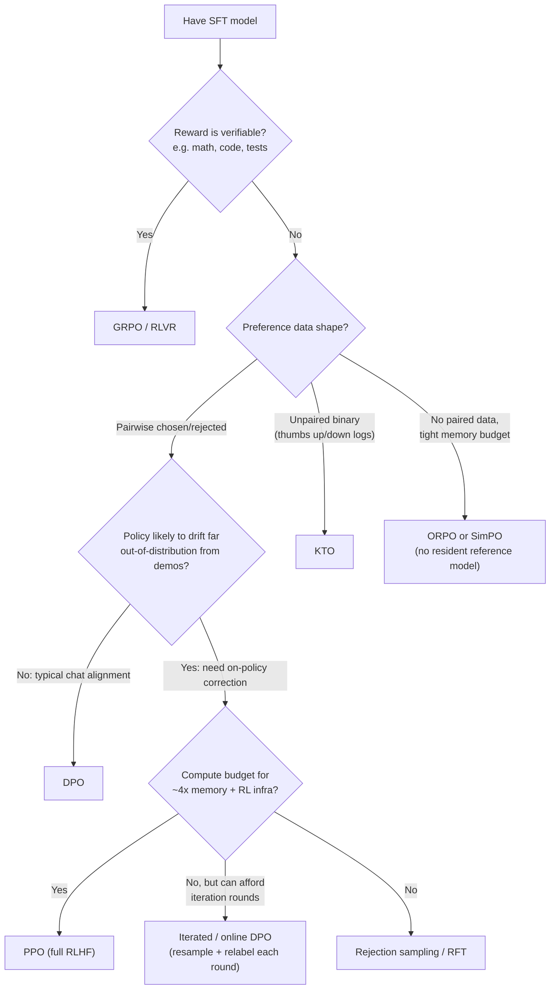

> **The decision:** given SFT-aligned demonstrations and some form of preference or reward signal, which algorithm turns that signal into policy weights. **Default for the 80% case (2026):** SFT then [[Concept - Direct Preference Optimization (DPO)]] — simple, stable, roughly SFT-cost, and it beats not doing preference optimization at all by a wide margin. Escalate past it only when the data shape or the quality ceiling demands it.

## Decision flow

## Tradeoff matrix

| Algorithm | Data needed | Resident models | Relative compute | Ceiling vs. DPO | On/off-policy | Failure mode if misapplied |
|---|---|---|---|---|---|---|
| SFT only | Demonstrations | 1 | 1x | Lowest — no comparative signal | n/a | Format-correct but doesn't rank quality |
| [[Concept - Direct Preference Optimization (DPO)]] | Pairwise prefs | 2 | ~1–1.5x | Baseline | Offline | Can't fix behaviors never in the demo/pref distribution |
| Iterated/online DPO | Pairwise prefs, resampled each round | 2 (+ sampler) | ~2–3x | Close to PPO | Semi-on-policy | Needs a relabeling pipeline (RM or judge) between rounds |
| [[Concept - The DPO Variant Family (IPO KTO ORPO SimPO)|KTO]] | Unpaired binary | 2 | ~1–1.5x | ≈ DPO on paired-equivalent data | Offline | Wastes signal if paired data already exists |
| ORPO | Pairwise prefs | 1 | ~1x (cheapest) | Slightly below DPO typically | Offline | No KL anchor — can drift further off-reference unnoticed |
| SimPO | Pairwise prefs | 1 | ~1x | ≈ DPO, better on length bias | Offline | No KL anchor; β/γ mistuning degrades quickly |
| [[Concept - PPO for Language Models|PPO]] (full [[Deep Dive - RLHF End to End]]) | Prefs → trained RM | 4 | ~4–10x | Highest achievable ceiling | On-policy | Least stable; reward hacking, KL blowup, value divergence |
| [[Concept - GRPO and RL with Verifiable Rewards]] | Verifiable reward (or RM) | 2–3 | ~2–4x | Highest for verifiable domains | On-policy | Reward gaming on non-verifiable proxies; entropy collapse |
| [[Concept - Rejection Sampling and Expert Iteration]] | RM/verifier-scored samples | 1 (+ scorer) | ~k× gen + 1× SFT | Below RL, above plain SFT | Iterative offline | Collapses on prompts where pass@k ≈ 0 |

## The details that flip the decision

- **Verifiable reward exists (math, code with unit tests, structured extraction) → skip the DPO family entirely and go straight to GRPO/RLVR.** A programmatic verifier is a higher-fidelity, non-overfittable signal than any learned reward model on that subset of tasks; DeepSeek-R1's pipeline and Tulu 3's RLVR stage both use exactly this branch. See [[Concept - GRPO and RL with Verifiable Rewards]].
- **Only unpaired good/bad logs exist (production thumbs-up/down, moderation flags) → KTO, not DPO.** Constructing artificial pairs from unpaired data throws away the imbalance information (ratio of good to bad) that KTO's separate desirable/undesirable weighting is built to use.
- **Memory is the binding constraint (small models, edge fine-tuning, many concurrent training jobs) → ORPO or SimPO.** Both drop the resident reference model, which is the single largest fixed memory cost after DPO's own baseline; the price is losing the KL anchor as an automatic overoptimization brake, so tighter monitoring of drift is needed in exchange.
- **The policy needs to change behaviors it currently never samples → offline methods hit a hard ceiling.** DPO (and its variants) can only reweight probability mass over responses already implicitly reachable near the reference distribution; correcting a systematic blind spot (e.g., a refusal pattern the SFT model never emits an alternative to) requires actually sampling new behavior on-policy — PPO, GRPO, or iterated/online DPO with fresh resampling each round.
- **Budget doesn't support full RLHF infrastructure but on-policy correction is still needed → iterated/online DPO is the pragmatic middle.** Llama-3 and Tulu 3 both ran multiple rounds of rejection sampling and/or DPO with fresh preference labels each round instead of standing up a PPO loop, closing much of the gap to full RL at a fraction of the systems complexity.
- **Distilling a stronger already-aligned model → this is usually just SFT (rejection sampling with k=1 against the teacher), not preference optimization at all.** If a stronger model's outputs are available directly, the fastest path is [[Concept - Knowledge Distillation]]-style SFT on its completions rather than running any comparative-preference algorithm.

## Connections

- [[Concept - Direct Preference Optimization (DPO)]] — the default answer this decision resolves to for the common case.
- [[Concept - PPO for Language Models]] — the on-policy alternative invoked when the policy needs to leave the demonstration distribution.
- [[Concept - GRPO and RL with Verifiable Rewards]] — the branch taken whenever a programmatic verifier is available.
- [[Concept - The DPO Variant Family (IPO KTO ORPO SimPO)]] — the finer-grained decision within the offline branch (data shape, memory budget).
- [[Reference - Post-Training Methods Comparison]] — the full lookup table this decision's tradeoff matrix is a condensed, action-oriented view of.
- [[Decision - Fine-Tuning vs RAG vs Prompting]] — the layer above this one: whether to touch weights at all before choosing how (domain 12, cross-domain).
- [[Concept - Rejection Sampling and Expert Iteration]] — the low-compute fallback branch when neither offline nor full-RL budget is available.
- [[Reference - Memory Math for Transformers]] — the underlying byte-accounting that explains the "resident models" column driving several branches here (domain 08, cross-domain).
- [[Concept - The Post-Training Pipeline]] — the surface-level map this decision sits inside, showing where preference optimization falls in the overall stack.

## Sources
- Rafailov et al. (2023) — Direct Preference Optimization. The closed-form derivation that makes the DPO branch of this decision possible.
- Ouyang et al. (2022) — InstructGPT. Establishes the SFT→RM→PPO baseline every other branch is compared against.
- Shao et al. (2024) — DeepSeekMath / GRPO. The verifiable-reward branch's algorithm and memory argument (no value model).
- Lambert et al. (2024) — Tulu 3. The open, reproducible evidence for the "DPO then RLVR, no PPO" pragmatic path.
- Touvron et al. (2023) / Meta AI (2024) — Llama 2 and Llama 3 post-training reports. The iterated rejection-sampling-plus-DPO recipe cited in the "budget-constrained on-policy" branch.
