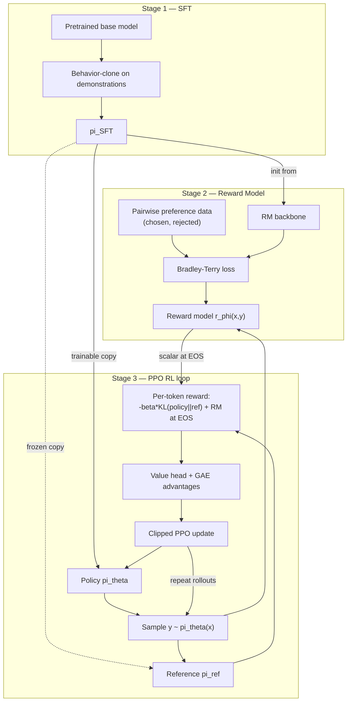

> **One-paragraph hook:** RLHF is the three-stage pipeline that turned raw pretrained-model rambling into ChatGPT-shaped assistants. Clone demonstrations with supervised learning, fit a scalar reward model on human comparisons, then run reinforcement learning against that reward while a KL penalty keeps the policy from wandering off into gibberish that fools the reward model. It's the most expensive and least stable stage of post-training: four models resident in GPU memory, and an on-policy RL loop against a non-stationary learned objective. DPO and GRPO exist as surgical removals of specific pieces of it, and you can't reason about what they trade away until you've traced the full loop.

## The mechanism

Stage 1 is [[Concept - Supervised Fine-Tuning (SFT)]]: behavior-clone a pretrained base model on curated (prompt, response) demonstrations to get a policy $\pi_{SFT}$ that at least follows instructions in the right format. Stage 2 trains a [[Concept - Reward Models|reward model]] $r_\phi(x,y)$ by fitting a Bradley-Terry model to pairwise human comparisons, $P(y_w \succ y_l) = \sigma(r_\phi(x,y_w) - r_\phi(x,y_l))$, minimizing $-\log\sigma(r_w - r_l)$ over chosen/rejected pairs. Stage 3 runs [[Concept - PPO for Language Models|PPO]] to maximize

$$\mathbb{E}_{x \sim D,\, y \sim \pi_\theta}\big[\, r_\phi(x,y) \,\big] - \beta \cdot \text{KL}\big(\pi_\theta(\cdot|x) \,\|\, \pi_{ref}(\cdot|x)\big)$$

where $\pi_{ref}$ is a frozen copy of $\pi_{SFT}$. Drop the [[Concept - KL Divergence]] term and PPO discovers that the fastest way to raise $r_\phi$ is to leave the distribution the reward model was trained on, where its scores stop meaning anything. Scheduling and estimating the term correctly gets its own note: [[Concept - KL Control in RLHF]].

Implementations fold the KL term into the per-token reward instead of applying it as a separate loss. Every non-terminal token gets $r_t = -\beta \log(\pi_\theta(y_t|\cdot)/\pi_{ref}(y_t|\cdot))$, and the reward model's scalar $r_\phi(x,y)$ is added at the final (EOS) token. So PPO sees a dense per-token signal instead of one scalar at the end of a possibly-800-token sequence, which gives [[Concept - PPO for Language Models|Generalized Advantage Estimation]] something to work with along the way.

## Architecture / walkthrough

Stage 3 keeps four models resident at once: the trainable policy, the frozen reference (for the KL term), the frozen reward model (to score rollouts), and a trained value/critic head (to compute advantages). That's roughly 4x the memory of a single model of that size, and it's the biggest reason RLHF costs more than SFT or DPO. [[Reference - Memory Math for Transformers]] has the per-parameter accounting; [[Concept - Data Parallelism and ZeRO]] covers how the memory gets sharded across a training cluster.

The loop: sample rollouts from the current policy, score each with the reward model, assemble the per-token reward above, compute GAE advantages, take 1–4 PPO epochs over the batch, repeat. Generation dominates wall-clock time because it's autoregressive decoding, one token at a time ([[Concept - Sampling and Decoding Parameters]] covers the knobs). So production RLHF stacks disaggregate a fast inference engine like [[Breakdown - vLLM]] from the training process instead of generating with the training framework's own forward pass. Colocated setups pay for an idle sampler during backward passes and an idle trainer during generation.

## In practice

InstructGPT (Ouyang et al. 2022) is the reference implementation. Human labelers preferred its 1.3B-parameter RLHF'd model over the 175B GPT-3 base model in head-to-head comparisons, and that result made RLHF the default post-training recipe industry-wide. The reward model was 6B parameters, larger than some of the policies it scored, because reward modeling from limited comparison data benefits from capacity like any small-data supervised task. Labelers ranked 4–9 completions per prompt, which expands combinatorially into $\binom{k}{2}$ pairwise comparisons for training the RM.

The lineage goes back to Christiano et al. (2017), "Deep reinforcement learning from human preferences," which established the reward-model-from-comparisons framing outside of language. Stiennon et al. (2020) applied the same recipe to summarization and is the direct ancestor of the InstructGPT pipeline. Anthropic's HH-RLHF (Bai et al. 2022) extended the target from helpfulness alone to helpfulness plus harmlessness, and introduced "online iterated RLHF": periodically retrain the reward model on fresh on-policy comparisons instead of training it once and freezing it. That slows how fast the policy can drift into regions the RM was never trained to score.

Open infrastructure for the loop includes TRL, TRLX, OpenRLHF, veRL, and NeMo-Aligner. All of them are built around the same four-model memory problem and generate/score/update loop. They differ mainly in how aggressively they disaggregate or colocate sampler and trainer, and how they shard the value and reward models across GPUs.

## Failure modes

The dominant failure is [[Concept - Reward Hacking]]. Reward climbs steadily while a held-out human or LLM-judge win rate stalls or falls, because the policy has found regions of output space where $r_\phi$ is miscalibrated, not regions of better output. It's distribution shift by construction: the reward model was fit on a static dataset, and PPO's whole job is to search for high-reward regions, which inevitably includes regions outside that dataset's support.

The second class is outright training instability. Value-function divergence, advantage explosion, or KL blowup collapses the policy into gibberish or a single repeated phrase (entropy collapse). Silent reward hacking and loud instability have different symptoms, root causes, and fixes, so they're cataloged separately and symptom-first in [[Gotchas - RLHF Training Instabilities]], with the diagnostic procedure in [[Playbook - Debugging an RLHF Run]].

## The non-obvious

The three stages don't contribute equally to capability. SFT sets the ceiling on format and the reference distribution everything else is anchored to. RL mostly reallocates probability mass the SFT policy already gives non-trivial likelihood; it doesn't teach new behavior. That's why DPO, GRPO, and rejection sampling can recover most of RLHF's practical benefit at a fraction of the cost, even though none of them runs true on-policy RL against a learned scalar reward. The hard, expensive part (a live rollout loop against a non-stationary reward with four models in memory) buys real but marginal gains over the simpler alternatives for most chat-alignment use cases. It clearly earns its cost only when the target behavior needs the policy pulled into regions its SFT and preference data never sampled.

## Evolution

[[Concept - Direct Preference Optimization (DPO)]] (2023) collapsed stages 2 and 3 into a single closed-form loss. It showed the KL-regularized optimum has an implicit reward expressible in terms of the policy itself, which removes the reward model and the RL loop entirely. [[Concept - GRPO and RL with Verifiable Rewards|GRPO]] (Shao et al. 2024, DeepSeekMath) kept the RL loop but dropped the value/critic model, replacing GAE with a group-normalized advantage computed from multiple samples per prompt. That roughly halves PPO's memory footprint.

RLVR removed the learned reward model wherever a programmatic verifier (unit tests, exact-match math answers) can stand in for human preference labels. [[Concept - Constitutional AI and RLAIF]] had already partly opened that door by substituting AI-generated preference labels for human ones. The RLVR line continues into [[Concept - Reasoning Training and Long Chain-of-Thought]], where DeepSeek-R1 showed that pure RL against verifiable rewards, with no SFT warm-start, can produce emergent long chain-of-thought reasoning.

What RLHF taught survives in all of these descendants: preferences carry information demonstrations can't express. Each successor is a targeted attempt to cut away its instability, cost, and reward hacking.

## Connections

- [[Concept - Supervised Fine-Tuning (SFT)]] — Stage 1; the policy initialization and frozen reference that every later stage is anchored to.
- [[Concept - Reward Models]] — Stage 2; the Bradley-Terry objective that turns human comparisons into the scalar signal PPO optimizes.
- [[Concept - PPO for Language Models]] — Stage 3's algorithm; the token-level MDP, clipped surrogate, and value head that make the RL loop work.
- [[Concept - KL Control in RLHF]] — governs the single most important dial in the objective; too low and the policy hacks, too high and nothing improves.
- [[Concept - Reward Hacking]] — the central pathology RLHF is vulnerable to precisely because it optimizes a learned proxy under distribution shift.
- [[Reference - Memory Math for Transformers]] — the per-parameter accounting behind why four resident models costs roughly 4x a single model's memory.
- [[Breakdown - vLLM]] — the fast sampler production RLHF stacks disaggregate from the trainer to avoid generation-bound idle time.
- [[Concept - Direct Preference Optimization (DPO)]] — the direct successor that collapses stages 2 and 3 into one offline loss.
- [[Concept - KL Divergence]] — the general-purpose divergence measure the KL-regularized objective is built from.
- [[Concept - Data Parallelism and ZeRO]] — how the four-model memory footprint gets sharded across a training cluster in practice.
- [[Concept - GRPO and RL with Verifiable Rewards]] — the successor that keeps the RL loop but removes the value model.
- [[Concept - Constitutional AI and RLAIF]] — replaces human preference labels with AI-generated ones inside the same three-stage skeleton.
- [[Concept - Sampling and Decoding Parameters]] — governs the rollout-generation step that dominates RLHF's wall-clock cost.
- [[Concept - Reasoning Training and Long Chain-of-Thought]] — where the RLVR line this pipeline evolved into produces emergent reasoning behavior.
- [[Gotchas - RLHF Training Instabilities]] — the symptom-first catalog of the reward-hacking and instability failures this pipeline is prone to.
- [[Playbook - Debugging an RLHF Run]] — the step-by-step procedure for diagnosing which of this pipeline's three stages is misbehaving.

## Sources

- Ouyang et al. (2022) — "Training language models to follow instructions with human feedback" (InstructGPT). The reference three-stage RLHF pipeline; the 1.3B-beats-175B result.
- Christiano et al. (2017) — "Deep reinforcement learning from human preferences." Establishes learning a reward model from pairwise comparisons.
- Stiennon et al. (2020) — "Learning to summarize from human feedback." Direct ancestor of the InstructGPT pipeline, applied to summarization.
- Bai et al. (2022) — "Training a Helpful and Harmless Assistant with RLHF" (Anthropic HH). Adds harmlessness and online iterated RLHF.
