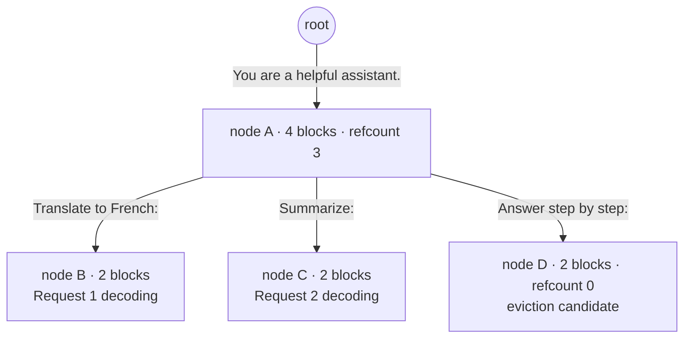

> SGLang is the serving runtime out of LMSYS Org and the UC Berkeley Sky Computing Lab, built around **RadixAttention** — a radix-tree KV cache that reuses *any* shared prefix across concurrent requests, not just a fixed system prompt — plus compressed-FSM structured decoding. It has become a default choice for serving DeepSeek-scale MoE models and shared-prefix, agentic workloads *(as of 2026)*.

## The headline numbers

Origin: Zheng et al., *"SGLang: Efficient Execution of Structured Language Model Programs"* (NeurIPS 2024), from the same lab lineage that produced [[Breakdown - vLLM]] and Chatbot Arena. The paper's headline claim was **up to 6.4x higher throughput** than existing systems (early vLLM, Guidance, LMQL) on structured-generation and agentic benchmarks at publication, driven almost entirely by RadixAttention's prefix reuse plus jump-forward decoding. Production adoption followed fast: SGLang was one of the engines recommended for day-0 deployment of DeepSeek-V3 and DeepSeek-R1 at their December 2024 / January 2025 releases, and has been used by xAI for parts of its serving infrastructure — evidence this moved from a research benchmark into fleet-scale production. Despite radically different internals from vLLM, it ships an OpenAI-compatible HTTP server, so adopting it doesn't require rewriting client code.

## How it actually works

A request enters through either the OpenAI-compatible API or SGLang's own frontend DSL (`sgl.gen`, `sgl.fork`, `sgl.join` — a Python-embedded language for expressing multi-call programs). Either way, the [[Concept - KV Cache]] is organized not as a flat per-request buffer but as a **radix tree**: each edge represents a run of tokens, each node holds a pointer to the paged physical KV blocks for that run (reusing the block-based layout [[Concept - PagedAttention]] introduced, now living in the GPU's [[Concept - GPU Memory Hierarchy]]), and a new request's prompt is walked down from the root to find its longest matching path. Only the tokens after the fork point need an actual prefill forward pass — everything before it is a pointer, not a recompute.

Because the match is structural rather than a single fixed-block hash, *any* two requests that diverge partway through a shared prefix — different few-shot examples after a common instruction, different questions over a common RAG context, different branches of a tree-search agent — automatically share everything up to their fork point. This generalizes [[Concept - Automatic Prefix Caching]]'s simplest form (content-hashing fixed-size blocks, as vanilla vLLM does it) to arbitrary-length, arbitrary-offset sharing. Eviction is LRU over tree *leaves*: nodes not currently referenced by any live request are candidates, freed oldest-first under memory pressure, while internal nodes with live children are protected — the same invariant an OS enforces when it won't unlink a directory with open file handles. A fork increments a reference count on the shared prefix's blocks and appends a new branch node rather than copying KV — copy-on-write, but driven by an explicit tree instead of a flat hash table.

For structured output, SGLang compiles a regex or JSON schema into a finite-state machine, the same approach [[Concept - Constrained Decoding]]'s FSM backends use — but it additionally identifies **forced transitions**: states from which only one token sequence is valid regardless of what the model would generate (the mandatory `": "` between a JSON key and value, a closing brace once the schema is satisfied). Those spans are emitted directly by the scheduler with zero model forward passes: **jump-forward decoding**. The KV cache itself can also be quantized (see [[Concept - KV Cache Quantization]]) to compound the tree's capacity win with a per-token memory reduction. Underneath both mechanisms, an **overlapped scheduler** runs CPU-side batch admission and KV-block bookkeeping concurrently with the previous iteration's GPU compute, so the host never leaves the accelerator idle — a targeted answer to the Python-scheduler overhead that early vLLM deployments hit at high request rates.

## The clever parts

1. **Radix tree instead of a flat prefix hash.** Matching on arbitrary-length shared paths, not fixed-size identical blocks, is what lets agent trees, RAG with varying context, and beam/tree search all benefit automatically instead of requiring an application to align prompts to block boundaries.
2. **Jump-forward decoding folds grammar into the scheduler.** Naive constrained decoding still pays a full forward pass for output that is 100% determined by the grammar; treating those spans as free cuts both latency and cost on structured-output-heavy workloads.
3. **LRU-over-leaves eviction with refcounting** gets correctness (never evict KV a live request is reading) for free from a data structure whose invariants already track ownership, instead of a separate garbage collector or manual TTL bookkeeping.
4. **Overlapped host/device scheduling**, designed in from the start rather than retrofitted, removes Python from the critical path.
5. **First-class MLA and expert-parallel kernels for DeepSeek-scale MoE.** Because DeepSeek-V3/R1 use Multi-head Latent Attention (see [[Concept - Multi-Head Attention Variants (MHA MQA GQA MLA)]]) and hundreds of routed experts (see [[Concept - MoE Inference and Expert Parallelism]]), SGLang shipped tuned kernels for both quickly — a large part of why it became a default for serving those models.
6. **A frontend DSL that maps program structure directly onto the cache.** `sgl.fork()` in application code becomes a literal fork in the radix tree; the programmer doesn't manage caching, the control flow does.

## What it got wrong / what's dated

The feature gap with vLLM that motivated early adoption has narrowed: both engines now support paged KV, continuous batching, speculative decoding, multi-LoRA, and fp8, so the choice is increasingly workload-shaped rather than a clean win either way — see [[Decision - Choosing an Inference Serving Framework]]. Radix-tree bookkeeping is not free: at very high prefix diversity (many nearly-unique prompts) the tree churns, eviction thrashes, and traversal/refcounting overhead can exceed a simpler flat cache's, so the technique's advantage concentrates in genuinely prefix-heavy workloads and disappears on mostly-unique text. And the DSL is a real second thing to learn: teams that only need an OpenAI-compatible endpoint get most of the runtime's benefit without touching it, but teams that want the explicit fork/join cache control have to adopt SGLang's programming model, not just its server.

## What to steal

Model KV reuse as a general prefix-sharing data structure (a tree, not a flat cache) so caching behavior generalizes to workloads you didn't design the cache for. Fold any decoding step that's fully determined by an external constraint (a grammar, a fixed template) into the scheduler so it costs zero model calls. And treat decoupling host-side scheduling from GPU execution as a first design principle rather than a later optimization pass.

## Connections
- [[Concept - Automatic Prefix Caching]] — RadixAttention is the general form of prefix caching; understand the block-hash version first.
- [[Concept - PagedAttention]] — RadixAttention reuses PagedAttention's block-based physical KV layout and copy-on-write sharing, adding a tree index on top.
- [[Concept - Constrained Decoding]] — jump-forward decoding is constrained decoding with the FSM's forced transitions executed for free.
- [[Breakdown - vLLM]] — SGLang's closest competitor and the system whose scheduler-overhead weaknesses it was designed around.
- [[Concept - KV Cache]] — the resource RadixAttention manages; read the memory math before the tree structure.
- [[Concept - Continuous Batching]] — SGLang's scheduler builds on the same iteration-level batching principle.
- [[Concept - MoE Inference and Expert Parallelism]] — why SGLang's DeepSeek/MoE kernel support matters for serving those models well.
- [[Concept - Multi-Head Attention Variants (MHA MQA GQA MLA)]] — SGLang's MLA-specific kernels are what gave it fast DeepSeek support.
- [[Decision - Choosing an Inference Serving Framework]] — the practical decision this breakdown feeds into.
- [[Concept - GPU Memory Hierarchy]] — cross-domain (08) grounding: the radix tree is ultimately a policy for managing this scarce resource.
- [[Concept - KV Cache Quantization]] — compounds with radix caching: a quantized KV cache lets the same tree hold more concurrent prefixes.

## Sources
- Zheng, L. et al. (2024) — *"SGLang: Efficient Execution of Structured Language Model Programs"* (NeurIPS 2024). Introduces RadixAttention and compressed-FSM jump-forward decoding.
- DeepSeek-AI (2024/2025) — DeepSeek-V3 and DeepSeek-R1 release documentation naming SGLang as a supported day-0 serving engine.
