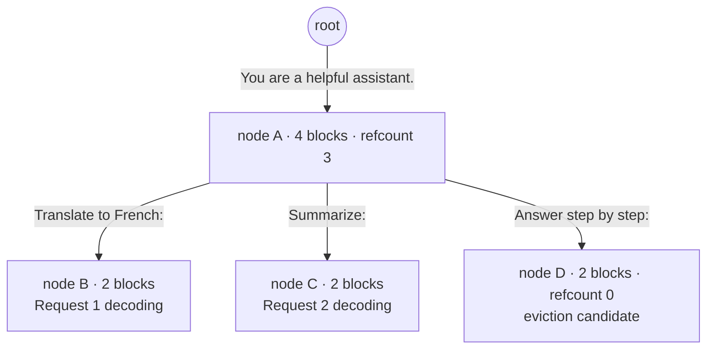

> SGLang is the serving runtime from LMSYS Org and the UC Berkeley Sky Computing Lab. Its core is **RadixAttention**, a radix-tree KV cache that reuses *any* shared prefix across concurrent requests (a fixed system prompt is only the simplest case), plus compressed-FSM structured decoding. It has become a default choice for serving DeepSeek-scale MoE models and shared-prefix, agentic workloads *(as of 2026)*.

## The headline numbers

Origin: Zheng et al., *"SGLang: Efficient Execution of Structured Language Model Programs"* (NeurIPS 2024), from the same lab lineage as [[Breakdown - vLLM]] and Chatbot Arena. The paper claimed **up to 6.4x higher throughput** than existing systems (early vLLM, Guidance, LMQL) on structured-generation and agentic benchmarks at publication. Nearly all of that came from RadixAttention's prefix reuse plus jump-forward decoding.

Production adoption followed fast. SGLang was one of the engines recommended for day-0 deployment of DeepSeek-V3 and DeepSeek-R1 at their December 2024 / January 2025 releases, and xAI has used it for parts of its serving infrastructure, so it has moved from research benchmark to fleet-scale production. The internals differ a lot from vLLM, but the OpenAI-compatible HTTP server means client code doesn't change.

## How it works

Requests come in through the OpenAI-compatible API or through SGLang's own frontend DSL (`sgl.gen`, `sgl.fork`, `sgl.join`), a Python-embedded language for multi-call programs. Either way, the [[Concept - KV Cache]] is stored as a **radix tree** instead of a flat per-request buffer. Each edge is a run of tokens. Each node points at the paged physical KV blocks for that run, reusing the block layout [[Concept - PagedAttention]] introduced, which lives in the GPU's [[Concept - GPU Memory Hierarchy]]. A new prompt is walked down from the root to find its longest matching path. Only tokens after the fork point get a real prefill forward pass; everything before it is a pointer.

Matching follows the tree, not a fixed-block hash, so *any* two requests that diverge partway through a shared prefix share everything up to the fork point: different few-shot examples after a common instruction, different questions over one RAG context, different branches of a tree-search agent. It generalizes the simplest form of [[Concept - Automatic Prefix Caching]] (content-hashing fixed-size blocks, as vanilla vLLM does) to sharing at arbitrary length and offset.

Eviction is LRU over tree *leaves*. Nodes no live request references are candidates and get freed oldest-first under memory pressure. Internal nodes with live children are protected, the same invariant an OS enforces when it won't unlink a directory with open file handles. A fork bumps the refcount on the shared prefix's blocks and appends a new branch node without copying KV: copy-on-write, driven by an explicit tree instead of a flat hash table.

For structured output, SGLang compiles a regex or JSON schema into a finite-state machine, as the FSM backends in [[Concept - Constrained Decoding]] do. It also finds **forced transitions**, states where only one token sequence is valid whatever the model would generate: the mandatory `": "` between a JSON key and value, or a closing brace once the schema is satisfied. The scheduler emits those spans directly with zero model forward passes. That's **jump-forward decoding**. The KV cache can also be quantized (see [[Concept - KV Cache Quantization]]), which stacks a per-token memory reduction on top of the tree's capacity win.

Under both sits an **overlapped scheduler**: CPU-side batch admission and KV-block bookkeeping run while the GPU computes the previous iteration, so the host never leaves the accelerator idle. It targets the Python-scheduler overhead early vLLM deployments hit at high request rates.

## The clever parts

1. **A radix tree in place of a flat prefix hash.** Matching arbitrary-length shared paths, instead of fixed-size identical blocks, means agent trees, RAG with varying context, and beam/tree search all benefit without the application having to align prompts to block boundaries.
2. **Jump-forward decoding moves the grammar into the scheduler.** Naive constrained decoding still pays a full forward pass for output the grammar has already 100% determined. Emitting those spans for free cuts latency and cost on structured-output-heavy workloads.
3. **LRU-over-leaves eviction with refcounting.** Never evicting KV a live request is reading comes free from a data structure whose invariants already track ownership. No separate garbage collector or manual TTL bookkeeping.
4. **Overlapped host/device scheduling** was in the design from the start instead of retrofitted, and it takes Python off the critical path.
5. **MLA and expert-parallel kernels for DeepSeek-scale MoE.** DeepSeek-V3/R1 use Multi-head Latent Attention (see [[Concept - Multi-Head Attention Variants (MHA MQA GQA MLA)]]) and hundreds of routed experts (see [[Concept - MoE Inference and Expert Parallelism]]). SGLang shipped tuned kernels for both quickly, and that's a large part of why it became a default for those models.
6. **The frontend DSL maps program structure onto the cache.** `sgl.fork()` in application code becomes a literal fork in the radix tree. The programmer doesn't manage caching; the control flow does.

## What it got wrong / what's dated

The feature gap with vLLM that drove early adoption has narrowed. Both engines now do paged KV, continuous batching, speculative decoding, multi-LoRA and fp8, so the choice is increasingly about workload shape. See [[Decision - Choosing an Inference Serving Framework]].

Radix-tree bookkeeping costs something. With very high prefix diversity (lots of nearly-unique prompts) the tree churns, eviction thrashes, and traversal and refcounting overhead can exceed what a simpler flat cache pays. The advantage is concentrated in prefix-heavy workloads and disappears on mostly-unique text.

The DSL is a second thing to learn. Teams that only need an OpenAI-compatible endpoint get most of the benefit without touching it; teams that want explicit fork/join cache control have to adopt SGLang's programming model as well as its server.

## What to steal

Model KV reuse as a general prefix-sharing data structure, a tree instead of a flat cache, so caching keeps working on workloads you didn't design it for. Any decoding step fully determined by an external constraint (a grammar, a fixed template) belongs in the scheduler, where it costs zero model calls. And decouple host-side scheduling from GPU execution as a first design principle, not as a later optimization pass.

## Connections
- [[Concept - Automatic Prefix Caching]] — RadixAttention is the general form of prefix caching; understand the block-hash version first.
- [[Concept - PagedAttention]] — RadixAttention reuses PagedAttention's block-based physical KV layout and copy-on-write sharing, adding a tree index on top.
- [[Concept - Constrained Decoding]] — jump-forward decoding is constrained decoding with the FSM's forced transitions executed for free.
- [[Breakdown - vLLM]] — SGLang's closest competitor and the system whose scheduler-overhead weaknesses it was designed around.
- [[Concept - KV Cache]] — the resource RadixAttention manages; read the memory math before the tree structure.
- [[Concept - Continuous Batching]] — SGLang's scheduler builds on the same iteration-level batching principle.
- [[Concept - MoE Inference and Expert Parallelism]] — why SGLang's DeepSeek/MoE kernel support matters for serving those models well.
- [[Concept - Multi-Head Attention Variants (MHA MQA GQA MLA)]] — SGLang's MLA-specific kernels are what gave it fast DeepSeek support.
- [[Decision - Choosing an Inference Serving Framework]] — the practical decision this breakdown feeds into.
- [[Concept - GPU Memory Hierarchy]] — cross-domain (08) grounding: the radix tree is ultimately a policy for managing this scarce resource.
- [[Concept - KV Cache Quantization]] — compounds with radix caching: a quantized KV cache lets the same tree hold more concurrent prefixes.

## Sources
- Zheng, L. et al. (2024) — *"SGLang: Efficient Execution of Structured Language Model Programs"* (NeurIPS 2024). Introduces RadixAttention and compressed-FSM jump-forward decoding.
- DeepSeek-AI (2024/2025) — DeepSeek-V3 and DeepSeek-R1 release documentation naming SGLang as a supported day-0 serving engine.
