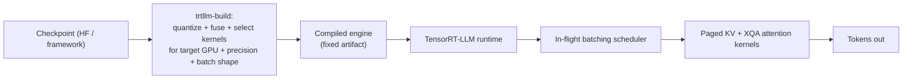

> TensorRT-LLM is NVIDIA's ahead-of-time compiled inference stack. [[Breakdown - vLLM]] interprets a model at serve time; TensorRT-LLM instead compiles a model + GPU + precision + batch-shape profile into a fused, kernel-selected engine *before* any traffic arrives. You give up iteration speed and get peak throughput and latency on NVIDIA hardware *(as of 2026)*.

## The headline numbers

NVIDIA open-sourced it in 2023. It sits on top of TensorRT (NVIDIA's general deep-learning inference compiler) and is typically deployed behind NVIDIA Triton Inference Server for production request routing and multi-model hosting.

Its precision ceiling is native fp8 (E4M3) [[Concept - Tensor Cores]] execution on Hopper (H100/H200) and native fp4 (NVFP4) on Blackwell (B200/GB200), plus fp8 KV cache (see [[Concept - FP8 and Low-Precision Inference]]). No other mainstream serving engine couples hardware and software this tightly. NVIDIA's own MLPerf Inference submissions, built on TensorRT-LLM, have topped the datacenter LLM categories in recent rounds *(as of 2026)*. That's the expected result of vendor-specific ahead-of-time compilation on vendor-specific silicon, and it tells you more about NVIDIA-tuned-for-NVIDIA than about serving efficiency in general.

The ceiling has an operational cost. Every model / GPU-generation / precision / max-batch-shape combination needs its own compiled engine. That build has historically taken minutes to tens of minutes, against vLLM's near-immediate startup from a checkpoint.

## How it works

A checkpoint (HF format or NVIDIA-native) goes through the `trtllm-build` pipeline. The graph is converted, weights are quantized to the target precision, and the builder searches the available fused kernels (attention, GEMM, activation, normalization) for the fastest implementation on the exact target GPU architecture and expected batch-shape range. Out comes a serialized **engine**: a fixed artifact, not a general-purpose model, which the TensorRT-LLM C++ runtime loads at serve time.

Serving runs **in-flight batching**, NVIDIA's name for the iteration-level scheduling described in [[Concept - Continuous Batching]], over paged KV blocks. Attention uses custom kernels (XQA) that extend the [[Deep Dive - FlashAttention]] lineage and are tuned per architecture generation.

For fleet-scale deployments across many GPUs, **NVIDIA Dynamo** (open-sourced 2025) runs [[Concept - Prefill-Decode Disaggregation]] on top of TensorRT-LLM engines. It keeps separate prefill and decode engine pools and handles KV transfer and routing between them. Other stacks leave each deployment team to build that pattern themselves.

## The clever parts

1. **Ahead-of-time compilation and kernel fusion.** The builder fuses op sequences (bias-add, activation, normalization, sometimes attention itself) into single custom CUDA kernels picked for the exact deployment target. A training-graph compiler does something similar, but here the compiled artifact *is* the deployment, not an optimization pass over a flexible runtime.
2. **Architecture-specific attention kernels (XQA).** Instead of one generic paged-attention kernel that runs everywhere, TensorRT-LLM ships attention implementations tuned per GPU generation and recovers MFU a cross-architecture kernel typically leaves on the table.
3. **fp8/fp4 fixed at build time.** Precision for weights and KV cache is set when the engine is built, so there's no runtime dispatch cost or fallback path. It's the serve-time version of the up-front commitment to a numerical format that [[Concept - Mixed Precision Training]] makes for a training run.
4. **Custom collective kernels for multi-GPU engines.** TensorRT-LLM ships its own [[Concept - All-Reduce and Collective Operations]] implementations tuned for its execution graph instead of relying purely on stock NCCL defaults. That shaves communication latency in tensor/pipeline-parallel engines.
5. **Speculative decoding compiled in.** Medusa heads and related schemes (see [[Concept - Self-Drafting Speculative Decoding (Medusa, EAGLE, Lookahead)]]) go into the same engine artifact as the base model, with no separate process orchestrated from Python.
6. **Dynamo makes a research pattern operational.** Shipping prefill-decode disaggregation as an orchestration layer, so teams don't each write their own KV-transfer plumbing, is a real systems contribution beyond the compiler.

## What it got wrong / what's dated

The build step is an operational tax. A new LoRA rank, a new max-batch-size ceiling or a new GPU generation each needs a fresh compiled engine, and that build-test-deploy loop is slow next to vLLM's "point at a checkpoint and go."

New open model architectures have historically landed in TensorRT-LLM weeks to months after vLLM or [[Breakdown - SGLang and RadixAttention]]. Supporting one means writing and validating new fused kernels; an interpreter only needs a new forward pass wired up.

The full stack (engine builder, Triton Inference Server, engine-repository versioning) is heavier to operate than a single pip-installable server, one case of the tradeoffs in [[Concept - Model Deployment Patterns for LLMs]]. And the peak-performance story only holds on NVIDIA. It buys nothing on AMD ROCm, Apple silicon or CPU targets, unlike engines built for portability.

## What to steal

When your deployment target and model are stable enough to amortize a build step, split "build once, serve many" compilation from serving; the same logic makes ahead-of-time compilation win in other latency-critical systems. When you control the stack down to the hardware generation, make precision a build-time decision baked into kernel selection instead of a runtime toggle. At fleet scale, physically separating prefill and decode capacity is worth doing even outside NVIDIA's stack. The general pattern is in [[Concept - Prefill-Decode Disaggregation]], and [[Decision - Choosing an Inference Serving Framework]] covers where TensorRT-LLM fits against the alternatives in practice.

## Connections
- [[Concept - Tensor Cores]] — the hardware unit TensorRT-LLM's kernel fusion and precision choices are built to saturate.
- [[Concept - FP8 and Low-Precision Inference]] — the format layer TensorRT-LLM implements natively at build time for both weights and KV cache.
- [[Concept - Continuous Batching]] — in-flight batching is TensorRT-LLM's name for this same mechanism.
- [[Concept - Prefill-Decode Disaggregation]] — the pattern NVIDIA Dynamo productizes on top of TensorRT-LLM engines.
- [[Breakdown - vLLM]] — the interpretive-runtime alternative TensorRT-LLM trades flexibility against for peak throughput.
- [[Breakdown - SGLang and RadixAttention]] — the other engine TensorRT-LLM typically lands new architectures behind, illustrating the AOT-compilation iteration-speed cost.
- [[Concept - All-Reduce and Collective Operations]] — cross-domain (08) grounding: TensorRT-LLM ships custom implementations tuned for its multi-GPU engines.
- [[Deep Dive - FlashAttention]] — cross-domain (08) grounding: the attention-kernel lineage TensorRT-LLM's XQA kernels extend for NVIDIA-specific hardware.
- [[Concept - Self-Drafting Speculative Decoding (Medusa, EAGLE, Lookahead)]] — Medusa-style heads compile directly into TensorRT-LLM engines rather than running as a separate process.
- [[Decision - Choosing an Inference Serving Framework]] — the practical decision this breakdown feeds into.
- [[Concept - Model Deployment Patterns for LLMs]] — cross-domain (16) grounding: the build/deploy tax TensorRT-LLM imposes is a specific instance of broader deployment-pattern tradeoffs.
- [[Concept - Mixed Precision Training]] — cross-domain (04) grounding: the training-side analogue of committing to a numerical format for a whole run, mirrored here at serve time.

## Sources
- NVIDIA (2023-2026) — TensorRT-LLM open-source repository and documentation; the primary source for the build pipeline and in-flight batching behavior described here.
- NVIDIA (2025) — Dynamo release documentation, the disaggregated serving orchestration layer for TensorRT-LLM (and other) engines.
