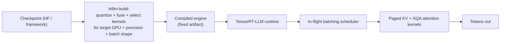

> TensorRT-LLM is NVIDIA's ahead-of-time compiled inference stack: instead of interpreting a model at serve time like [[Breakdown - vLLM]], it compiles a model + GPU + precision + batch-shape profile into a fused, kernel-selected engine *before* any traffic arrives, trading iteration speed for peak throughput and latency on NVIDIA hardware *(as of 2026)*.

## The headline numbers

Open-sourced by NVIDIA in 2023, built on top of TensorRT (NVIDIA's general deep-learning inference compiler) and typically deployed behind NVIDIA Triton Inference Server for production request routing and multi-model hosting. Its precision ceiling is native fp8 (E4M3) [[Concept - Tensor Cores]] execution on Hopper (H100/H200) and native fp4 (NVFP4) on Blackwell (B200/GB200) — see [[Concept - FP8 and Low-Precision Inference]] — plus fp8 KV cache, the tightest hardware-software coupling of any mainstream serving engine. NVIDIA's own MLPerf Inference submissions, built on TensorRT-LLM, have topped the datacenter LLM categories in recent rounds *(as of 2026)* — the expected result of vendor-specific ahead-of-time compilation running on vendor-specific silicon, though it says more about NVIDIA-tuned-for-NVIDIA than about generalizable serving efficiency. The operational cost of that ceiling: every model / GPU-generation / precision / max-batch-shape combination needs its own compiled engine, a build that has historically taken minutes to tens of minutes, versus vLLM's near-immediate startup from a checkpoint.

## How it actually works

A checkpoint (HF format or NVIDIA-native) goes through the `trtllm-build` pipeline: the graph is converted, weights are quantized to the target precision, and the builder searches over available fused kernels — attention, GEMM, activation, normalization — and picks the fastest implementation for the exact target GPU architecture and expected batch-shape range. The output is a serialized **engine**, a fixed artifact rather than a general-purpose model, loaded by the TensorRT-LLM C++ runtime at serve time. Serving then runs **in-flight batching** — NVIDIA's name for the same iteration-level scheduling as [[Concept - Continuous Batching]] — over paged KV blocks, with custom attention kernels (XQA) that extend the [[Deep Dive - FlashAttention]] lineage and are tuned per architecture generation.

For fleet-scale deployments spanning many GPUs, **NVIDIA Dynamo** (open-sourced 2025) orchestrates [[Concept - Prefill-Decode Disaggregation]] on top of TensorRT-LLM engines: separate prefill and decode engine pools, with Dynamo managing KV transfer and routing between them — productizing a pattern that other stacks leave to each deployment team to build themselves.

## The clever parts

1. **Ahead-of-time compilation and kernel fusion.** The builder fuses sequences of ops — bias-add, activation, normalization, sometimes attention itself — into single custom CUDA kernels chosen for the exact deployment target: the inference-serving analogue of what a training-graph compiler does, except here the compiled artifact *is* the deployment, not an optimization pass over a flexible runtime.
2. **Architecture-specific attention kernels (XQA).** Rather than one generic paged-attention kernel meant to run everywhere, TensorRT-LLM ships attention implementations tuned per GPU generation, extracting MFU a cross-architecture kernel typically leaves on the table.
3. **fp8/fp4 baked into the build, not bolted on.** Precision is fixed for both weights and the KV cache at build time, so there's no runtime dispatch cost or fallback path — mirroring, at serve time, the same up-front commitment to a numerical format that [[Concept - Mixed Precision Training]] makes for a training run.
4. **Custom collective kernels for multi-GPU engines.** TensorRT-LLM ships its own [[Concept - All-Reduce and Collective Operations]] implementations tuned for its execution graph rather than relying purely on stock NCCL defaults, shaving communication latency in tensor/pipeline-parallel engines.
5. **Speculative decoding fused into the build.** Medusa heads and related schemes (see [[Concept - Self-Drafting Speculative Decoding (Medusa, EAGLE, Lookahead)]]) compile into the same engine artifact as the base model, rather than being orchestrated as a separate process at the Python layer.
6. **Dynamo turns a research pattern into an operational one.** Productizing prefill-decode disaggregation as an orchestration layer, rather than leaving KV-transfer plumbing to each team, is a genuine systems contribution beyond the compiler itself.

## What it got wrong / what's dated

The build step is a real operational tax: a new LoRA rank, a new max-batch-size ceiling, or a new GPU generation each require a fresh compiled engine, and that build-test-deploy loop is slow next to vLLM's "point at a checkpoint and go." Historically, brand-new open model architectures land in TensorRT-LLM weeks to months after they land in vLLM or [[Breakdown - SGLang and RadixAttention]], because supporting a new architecture means writing and validating new fused kernels, not just wiring up a new forward pass in an interpreter. The full stack — engine builder, Triton Inference Server, engine-repository versioning — is a heavier operations surface than a single pip-installable server, a specific instance of the tradeoffs cataloged in [[Concept - Model Deployment Patterns for LLMs]]. And the peak-performance story is inherently NVIDIA-only: it buys nothing on AMD ROCm, Apple silicon, or CPU targets, unlike engines built for portability.

## What to steal

Separate "build once, serve many" compilation from serving when your deployment target and model are stable enough to amortize a build step — the same logic that makes ahead-of-time compilation win in other latency-critical systems. Treat precision as a build-time decision baked into kernel selection, not a runtime toggle, when you control the full stack down to the hardware generation. And if you operate at fleet scale, physically separating prefill and decode capacity is worth adopting even outside NVIDIA's stack — see [[Concept - Prefill-Decode Disaggregation]] for the general pattern, and [[Decision - Choosing an Inference Serving Framework]] for where TensorRT-LLM fits against the alternatives in practice.

## Connections
- [[Concept - Tensor Cores]] — the hardware unit TensorRT-LLM's kernel fusion and precision choices are built to saturate.
- [[Concept - FP8 and Low-Precision Inference]] — the format layer TensorRT-LLM implements natively at build time for both weights and KV cache.
- [[Concept - Continuous Batching]] — in-flight batching is TensorRT-LLM's name for this same mechanism.
- [[Concept - Prefill-Decode Disaggregation]] — the pattern NVIDIA Dynamo productizes on top of TensorRT-LLM engines.
- [[Breakdown - vLLM]] — the interpretive-runtime alternative TensorRT-LLM trades flexibility against for peak throughput.
- [[Breakdown - SGLang and RadixAttention]] — the other engine TensorRT-LLM typically lands new architectures behind, illustrating the AOT-compilation iteration-speed cost.
- [[Concept - All-Reduce and Collective Operations]] — cross-domain (08) grounding: TensorRT-LLM ships custom implementations tuned for its multi-GPU engines.
- [[Deep Dive - FlashAttention]] — cross-domain (08) grounding: the attention-kernel lineage TensorRT-LLM's XQA kernels extend for NVIDIA-specific hardware.
- [[Concept - Self-Drafting Speculative Decoding (Medusa, EAGLE, Lookahead)]] — Medusa-style heads compile directly into TensorRT-LLM engines rather than running as a separate process.
- [[Decision - Choosing an Inference Serving Framework]] — the practical decision this breakdown feeds into.
- [[Concept - Model Deployment Patterns for LLMs]] — cross-domain (16) grounding: the build/deploy tax TensorRT-LLM imposes is a specific instance of broader deployment-pattern tradeoffs.
- [[Concept - Mixed Precision Training]] — cross-domain (04) grounding: the training-side analogue of committing to a numerical format for a whole run, mirrored here at serve time.

## Sources
- NVIDIA (2023-2026) — TensorRT-LLM open-source repository and documentation; the primary source for the build pipeline and in-flight batching behavior described here.
- NVIDIA (2025) — Dynamo release documentation, the disaggregated serving orchestration layer for TensorRT-LLM (and other) engines.
