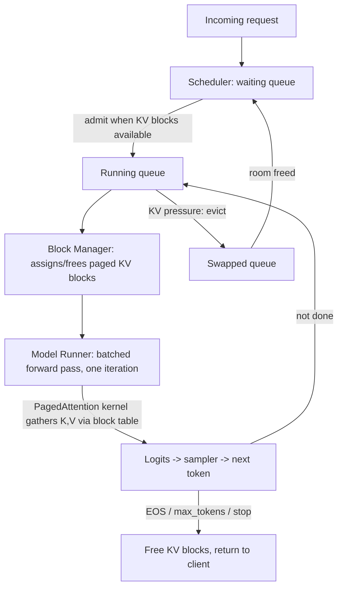

> vLLM is the open-source LLM serving engine that came out of UC Berkeley's Sky Computing Lab with the [[Concept - PagedAttention|PagedAttention]] paper (Kwon et al., SOSP 2023). It's now the most widely deployed open serving engine, ships an OpenAI-compatible API server, and backs a large share of open-model API providers *(as of 2026)*. It didn't introduce a new model architecture. Its authors saw that LLM serving was limited by memory *management* more than kernel arithmetic, and fixed that with a virtual-memory-style allocator paired with iteration-level scheduling.

## The headline numbers

The original PagedAttention paper measured **60-80% of the KV cache region wasted** to internal and external fragmentation in the serving stacks of the time (HuggingFace `generate`, NVIDIA FasterTransformer, early TGI). All of them pre-allocated a contiguous buffer sized for `max_seq_len` per request. Paging that allocation into fixed blocks cut waste to **under 4%**. Add continuous batching and you got roughly **2-4x the throughput** of the previous generation of serving stacks at launch, which reset the field's baseline within about a year (see [[Lore - The KV Cache Fragmentation Crisis]]).

The V1 engine rewrite (2024-25) made [[Concept - Chunked Prefill]] the default scheduling mode and cut Python/host-side overhead with asynchronous scheduling. That closed much of the gap that had opened up against compiled engines.

## How it works

Every request goes through a **scheduler** with three logical queues: waiting, running, and swapped. On every decode iteration it picks which requests run this step. That's what [[Concept - Continuous Batching]] means inside vLLM. The batch isn't fixed until the longest sequence finishes; it gets rebuilt every step, taking in new arrivals and dropping finished requests, so the GPU never sits idle waiting on a straggler.

The **block manager** keeps admission cheap because KV is never allocated as one contiguous span per request. Each request's cache is split into fixed-size blocks (16 tokens by default) that can sit anywhere in a shared physical pool. A per-request block table maps logical block index to physical address. It's OS virtual-memory paging moved over directly; [[Concept - PagedAttention]] has the full mechanism.

Admitting a new request into a running iteration then means allocating a few blocks, an O(1) table update, instead of hunting for a contiguous free region. So continuous batching depends on paging. The two shipped together in the original vLLM release for that reason, and every major engine since has copied the pairing.

Since blocks are pointers into a shared pool, **copy-on-write sharing** comes free. Two sequences with the same prefix (a shared system prompt, beam-search candidates) point their block tables at the same physical blocks and fork only where they diverge. Do the same thing across requests and you have [[Concept - Automatic Prefix Caching]]: vLLM hashes KV blocks by token content, and any new request whose prefix matches existing blocks skips prefill for that span.

In V1, a long prefill no longer hogs a whole iteration. [[Concept - Chunked Prefill]] caps prefill at a per-iteration token budget (`max_num_batched_tokens`) and fills the rest of the budget with in-flight decode tokens. A newly admitted long-context request stops stalling everyone else's [[Concept - Latency, Throughput, and Cost in LLM Serving|inter-token latency]] for a full step.

## The clever parts

1. **OS paging, taken literally.** Logical block index / block table / physical block pool map onto virtual page number / page table / physical memory as the same data structure, not a loose analogy. That's how fragmentation fell from 60-80% to under 4% with no change to the attention math.
2. **Continuous batching and paged allocation as one design.** Iteration-level admission is cheap only because KV allocation is already non-contiguous. Continuous batching over contiguous KV still hits the fragmentation wall, so vLLM shipped both together.
3. **Prefix caching reuses the block-table machinery.** PagedAttention already needed copy-on-write for beam search. vLLM extended it into a general cross-request cache, getting a new capability out of the existing data structure with no new infrastructure.
4. **Fast day-0 model support.** The scheduler/block-manager core is separate from per-model forward-pass code, so new open model releases usually get vLLM support within days. That was a deliberate bet: for an open-source project's adoption, speed on model coverage matters as much as raw kernel throughput.
5. **Pluggable features.** Quantization backends (AWQ, GPTQ, fp8), [[Concept - Speculative Decoding]], guided/constrained decoding backends, and [[Concept - Multi-LoRA Serving|multi-LoRA]] adapter serving all plug into the same scheduler/block-manager core. You get one engine where these compose, instead of a matrix of forked special-purpose builds.

## What it got wrong / what's dated

The paged attention kernel has historically given up some raw per-step speed for its memory win. Gathering K,V from scattered physical blocks through the block table is less cache-friendly than a fused kernel reading a contiguous span. So vLLM's peak single-config throughput and latency have generally trailed a hand-compiled [[Breakdown - TensorRT-LLM|TensorRT-LLM]] engine on the same NVIDIA hardware. That's the price of skipping an ahead-of-time compilation step, which TensorRT-LLM uses for kernel fusion.

Python-level scheduler overhead also shows up at very high request rates; V1's async scheduling went partly after that. And since vLLM interprets instead of compiling, it can't fully match a purpose-built engine's fp8/fp4 tensor-core utilization on a frozen model at fleet scale. [[Decision - Choosing an Inference Serving Framework]] lays out the tradeoff.

## What to steal

Separate the logical view of a resource from its physical layout, and put a table in between. That turns allocation from a contiguous-region search (slow, fragmenting) into an O(1) pointer update (fast, no fragmentation). OS virtual memory works the same way; vLLM applied it to a different resource.

Second: make the **iteration** the unit of scheduling, not the request. A system that re-picks its batch every step will always out-utilize one that commits until completion.

And I'd treat prefix reuse as a *memory-sharing* problem (copy-on-write over a paged resource). It's a cleaner abstraction than bolting an *application-level cache* on top.

## Connections
- [[Concept - PagedAttention]] — the memory-management mechanism this breakdown's system is built around; read that note for the block-table internals in depth.
- [[Concept - Continuous Batching]] — the iteration-level scheduling vLLM implements, and the reason paged allocation was necessary in the first place.
- [[Concept - Chunked Prefill]] — the V1-era scheduling refinement that stops long prefills from stalling in-flight decode requests.
- [[Concept - Automatic Prefix Caching]] — the cross-request generalization of PagedAttention's copy-on-write block sharing, implemented as block-content hashing.
- [[Breakdown - SGLang and RadixAttention]] — the sibling engine that generalizes prefix reuse further via a radix tree, and vLLM's closest competitor on shared-prefix and structured-output workloads.
- [[Breakdown - TensorRT-LLM]] — the ahead-of-time-compiled alternative vLLM trades peak throughput/latency against for iteration speed and model coverage.
- [[Playbook - Tuning an LLM Serving Deployment]] — the operational procedure for tuning vLLM's concrete flags (`--gpu-memory-utilization`, `--max-num-batched-tokens`, etc.) against a real SLO.
- [[Concept - Multi-LoRA Serving]] — the adapter-multiplexing feature built on top of vLLM's shared scheduler/block-manager core.
- [[Concept - Speculative Decoding]] — one of the pluggable latency-reduction features vLLM's engine composes with its base scheduling loop.
- [[Lore - The KV Cache Fragmentation Crisis]] — the origin story: how bad pre-2023 KV waste was and how vLLM's launch re-standardized the field within about a year.
- [[Concept - GPU Memory Hierarchy]] — cross-domain (08) grounding for why HBM capacity, not FLOPs, is the resource PagedAttention was built to stop wasting.
- [[Deep Dive - LoRA]] — cross-domain (12) grounding for the adapter mechanism that vLLM's multi-LoRA serving multiplexes over a shared base model.

## Sources
- Kwon et al. (2023) — *Efficient Memory Management for Large Language Model Serving with PagedAttention* (SOSP 2023). The founding paper: the fragmentation measurement, the paged design, and the vLLM system it introduced.
- Yu et al. (2022) — *Orca: A Distributed Serving System for Transformer-Based Generative Models* (OSDI 2022). The iteration-level scheduling concept vLLM's continuous batching implements and extends.
