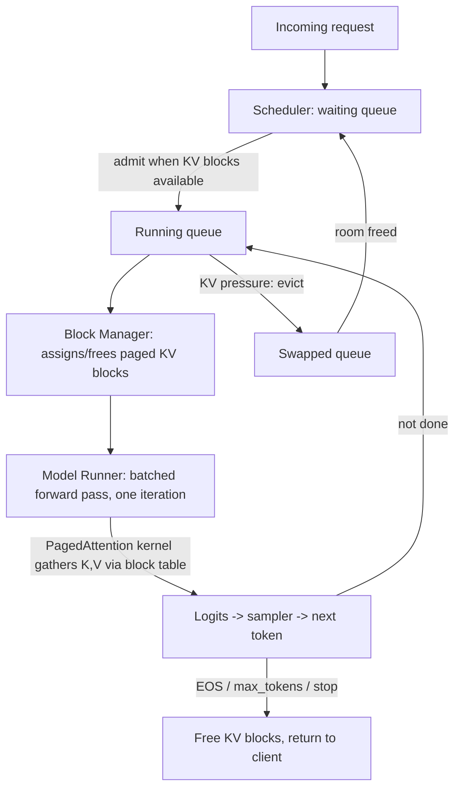

> vLLM is the open-source LLM serving engine born at UC Berkeley's Sky Computing Lab, introduced by the [[Concept - PagedAttention|PagedAttention]] paper (Kwon et al., SOSP 2023). It is now the most widely deployed open serving engine, exposing an OpenAI-compatible API server and backing a large share of open-model API providers *(as of 2026)*. Its contribution wasn't a new model architecture — it was recognizing that LLM serving's binding constraint was memory *management*, not kernel arithmetic, and fixing that with a virtual-memory-style allocator married to iteration-level scheduling.

## The headline numbers

The original PagedAttention paper measured **60-80% of the KV cache region wasted** to internal and external fragmentation in contemporaneous serving stacks (HuggingFace `generate`, NVIDIA FasterTransformer, early TGI), all of which pre-allocated a contiguous buffer sized for `max_seq_len` per request. Paging that allocation into fixed blocks cut waste to **under 4%**, and combined with continuous batching this delivered roughly **2-4x the throughput** of the prior generation of serving stacks at launch — a result that reset the field's baseline within about a year (see [[Lore - The KV Cache Fragmentation Crisis]]). vLLM's V1 engine rewrite (2024-25) made [[Concept - Chunked Prefill]] the default scheduling mode and reduced Python/host-side overhead via asynchronous scheduling, closing much of the gap that had opened up against compiled engines.

## How it actually works

A request entering vLLM moves through a **scheduler** that manages three logical queues — waiting, running, and swapped — and decides, every single decode iteration, exactly which requests execute this step. This iteration-level granularity is what [[Concept - Continuous Batching]] means concretely inside vLLM: rather than committing to a fixed batch until the longest sequence finishes, the scheduler re-forms the batch every step, admitting newly arrived requests and evicting completed ones without ever leaving the GPU idle waiting for a straggler.

The **block manager** is the layer that makes admission cheap: KV is never allocated as one contiguous span per request. Instead, each request's cache is split into fixed-size blocks (16 tokens by default), placed anywhere in a shared physical block pool, and tracked through a per-request block table mapping logical block index to physical address — see [[Concept - PagedAttention]] for the full mechanism, which is a direct transplant of OS virtual-memory paging. Because admitting a new request into a running iteration only requires allocating a few blocks (an O(1) table update) rather than finding a contiguous free region, paging is the structural precondition for continuous batching — the two techniques shipped together in the original vLLM release for exactly this reason, and every major engine since has adopted the pairing.

Blocks being pointers into a shared pool also gives **copy-on-write sharing** for free: two sequences with an identical prefix (a shared system prompt, beam-search candidates) point their block tables at the same physical blocks and only fork on divergence. This mechanism, generalized across requests rather than within one, is exactly [[Concept - Automatic Prefix Caching]] — vLLM hashes KV blocks by their token content so any new request whose prefix matches existing blocks skips prefill for that span entirely.

Under the V1 rewrite, long prefills no longer run as a single monopolizing iteration: [[Concept - Chunked Prefill]] slices a prefill into a bounded per-iteration token budget (`max_num_batched_tokens`) and interleaves the remaining budget with in-flight decode tokens, so a newly admitted long-context request no longer stalls every other user's [[Concept - Latency, Throughput, and Cost in LLM Serving|inter-token latency]] for a full step.

## The clever parts

1. **The OS-paging transplant, applied literally.** Treating logical block index / block table / physical block pool as virtual page number / page table / physical memory isn't a loose analogy in vLLM's design — it's the exact same data structure, and it's the reason fragmentation dropped from 60-80% to under 4% without any change to the attention math itself.
2. **Coupling continuous batching to paged allocation, not treating them as separable features.** Iteration-level admission is only cheap because KV allocation is already non-contiguous; a system with continuous batching but contiguous KV would still hit the fragmentation wall. vLLM shipped both together because one is load-bearing for the other.
3. **Prefix caching as a reuse of the same block-table machinery.** Rather than building a separate cache layer, vLLM extends the copy-on-write mechanism PagedAttention already needed for beam search into a general cross-request cache — new capability from the same data structure, not new infrastructure.
4. **Wide, fast day-0 model support.** vLLM's architecture separates the scheduler/block-manager core from per-model forward-pass code, which is why new open model releases typically get vLLM support within days — a deliberate ecosystem bet that iteration speed on model coverage matters as much as raw kernel throughput for an open-source project's adoption.
5. **Pluggable everything.** Quantization backends (AWQ, GPTQ, fp8), [[Concept - Speculative Decoding]], guided/constrained decoding backends, and [[Concept - Multi-LoRA Serving|multi-LoRA]] adapter serving are all plugged into the same scheduler/block-manager core rather than forked variants of the engine — one system that composes these features instead of a matrix of special-purpose builds.

## What it got wrong / what's dated

The paged attention kernel historically traded some raw per-step speed for its memory win: gathering K,V from scattered physical blocks via the block table is less cache-friendly than a fused kernel reading a contiguous span, so vLLM's peak single-config throughput and latency have generally trailed a hand-compiled [[Breakdown - TensorRT-LLM|TensorRT-LLM]] engine on the same NVIDIA hardware — the cost of vLLM's flexibility (no ahead-of-time compilation step) versus TensorRT-LLM's ahead-of-time kernel fusion. Python-level scheduler overhead also becomes visible at very high request rates, which is part of what the V1 rewrite's async scheduling targeted. And because vLLM interprets rather than compiles, it cannot fully match a purpose-built engine's fp8/fp4 tensor-core utilization on a frozen model at fleet scale — the tradeoff is explicit in [[Decision - Choosing an Inference Serving Framework]].

## What to steal

The core idea worth internalizing even outside vLLM: **separate the logical view of a resource from its physical layout**, and let a table mediate between them. That's what turns memory allocation from a contiguous-region search problem (slow, fragmenting) into an O(1) pointer update (fast, fragmentation-free) — the same trick that makes OS virtual memory work, applied to a completely different resource. The second idea worth stealing is treating **iteration**, not the request, as the unit of scheduling: a system that re-decides its batch composition every step rather than committing to one until completion will always out-utilize a system that can't. And prefix reuse as a *memory-sharing* problem (copy-on-write over a paged resource) rather than an *application-level cache* is a cleaner abstraction than bolting a separate cache layer on top.

## Connections
- [[Concept - PagedAttention]] — the memory-management mechanism this breakdown's system is built around; read that note for the block-table internals in depth.
- [[Concept - Continuous Batching]] — the iteration-level scheduling vLLM implements, and the reason paged allocation was necessary in the first place.
- [[Concept - Chunked Prefill]] — the V1-era scheduling refinement that stops long prefills from stalling in-flight decode requests.
- [[Concept - Automatic Prefix Caching]] — the cross-request generalization of PagedAttention's copy-on-write block sharing, implemented as block-content hashing.
- [[Breakdown - SGLang and RadixAttention]] — the sibling engine that generalizes prefix reuse further via a radix tree, and vLLM's closest competitor on shared-prefix and structured-output workloads.
- [[Breakdown - TensorRT-LLM]] — the ahead-of-time-compiled alternative vLLM trades peak throughput/latency against for iteration speed and model coverage.
- [[Playbook - Tuning an LLM Serving Deployment]] — the operational procedure for tuning vLLM's concrete flags (`--gpu-memory-utilization`, `--max-num-batched-tokens`, etc.) against a real SLO.
- [[Concept - Multi-LoRA Serving]] — the adapter-multiplexing feature built on top of vLLM's shared scheduler/block-manager core.
- [[Concept - Speculative Decoding]] — one of the pluggable latency-reduction features vLLM's engine composes with its base scheduling loop.
- [[Lore - The KV Cache Fragmentation Crisis]] — the origin story: how bad pre-2023 KV waste was and how vLLM's launch re-standardized the field within about a year.
- [[Concept - GPU Memory Hierarchy]] — cross-domain (08) grounding for why HBM capacity, not FLOPs, is the resource PagedAttention was built to stop wasting.
- [[Deep Dive - LoRA]] — cross-domain (12) grounding for the adapter mechanism that vLLM's multi-LoRA serving multiplexes over a shared base model.

## Sources
- Kwon et al. (2023) — *Efficient Memory Management for Large Language Model Serving with PagedAttention* (SOSP 2023). The founding paper: the fragmentation measurement, the paged design, and the vLLM system it introduced.
- Yu et al. (2022) — *Orca: A Distributed Serving System for Transformer-Based Generative Models* (OSDI 2022). The iteration-level scheduling concept vLLM's continuous batching implements and extends.
