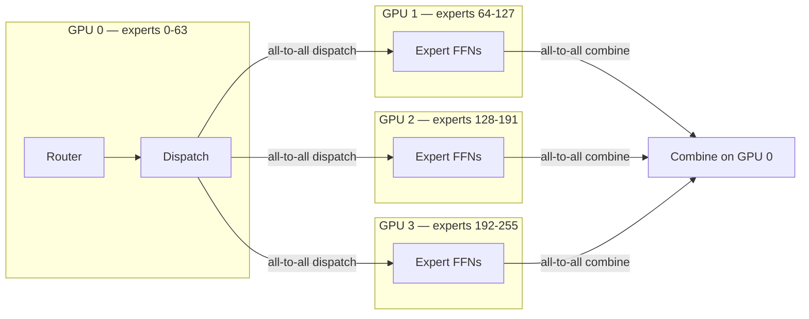

> **One-paragraph hook:** A [[Concept - Mixture of Experts Architecture|Mixture-of-Experts]] model like DeepSeek-V3 activates only 8 of its 256 experts per token, so the FLOPs per forward pass look like a much smaller dense model. But all 256 experts' weights must sit resident in GPU memory regardless of how many fire on any given step, and routing a token to "expert 173 on GPU 6" instead of computing it locally means a network hop. MoE inference inverts the usual serving bottleneck: it's cheap on compute and expensive on memory capacity and interconnect bandwidth — the opposite profile from a dense model of comparable quality, and it demands its own serving architecture, **expert parallelism**, to exploit that profile instead of fighting it.

## The mechanism

For a dense transformer, "shard the model across GPUs" means [[Concept - Tensor and Pipeline Parallelism|tensor or pipeline parallelism]] over layers or matrix dimensions, and every GPU does useful work on every token. Expert parallelism (EP) shards differently: each GPU holds a *disjoint subset of experts* for the MoE layers, and a token's assigned experts may live on any GPU in the group.

The per-layer sequence at inference becomes:

```
1. Router computes top-k expert indices for each token in the batch (local, cheap)
2. All-to-all DISPATCH: each token's hidden state is sent to the GPU(s)
   holding its selected expert(s)
3. Each GPU runs its resident experts on the tokens routed to it (local FFN compute)
4. All-to-all COMBINE: expert outputs are sent back to the token's origin GPU
   and weighted-summed per the router's gate weights
```

That's two collective communication operations — dispatch and combine — inserted into *every* MoE layer, on top of whatever [[Concept - All-Reduce and Collective Operations|all-reduce]] the attention blocks already need. This is the direct trade the architecture makes: sparse routing keeps active FLOPs low ($k/N$ of a dense layer's compute, where $k$ is experts-per-token and $N$ is total experts), but that saved compute is spent on network round-trips instead, so EP's viability depends entirely on interconnect quality.



## In practice

DeepSeek-V3 (top-8-of-256 routing, plus a shared expert) pairs its MoE layers with [[Concept - Multi-Head Attention Variants (MHA MQA GQA MLA)|MLA]] to shrink the KV cache side of memory, which pushes the memory bottleneck even more squarely onto expert weights — with a small [[Concept - KV Cache|KV cache]] footprint, VRAM is spent almost entirely fitting experts, and GPU count is frequently driven by "how many GPUs does it take to hold all the experts" rather than by KV capacity or raw compute at all.

Because dispatch and combine happen on every MoE layer of every forward pass, EP is extremely sensitive to interconnect: within a node, NVLink/NVSwitch bandwidth makes the all-to-all cheap relative to compute; across nodes, InfiniBand or RoCE adds latency that can dominate step time if EP degree is pushed too wide. Production MoE serving typically hybridizes EP with data parallelism (replicate the expert-parallel group and route different request batches to different replicas) rather than scaling EP degree indefinitely, because all-to-all cost grows with the number of participants while per-GPU compute savings don't. DeepSeek's open-sourced EPLB (Expert Parallelism Load Balancer, 2025) addresses the imbalance problem directly by dynamically replicating hot experts and rebalancing placement rather than assuming a static, uniform expert-to-GPU mapping is good enough.

## Failure modes

- **All-to-all as the bottleneck.** On slow or oversubscribed interconnect, dispatch/combine latency dominates step time and the "compute-cheap" MoE promise evaporates — profile network time separately from compute time before concluding a slowdown is a compute problem; it usually isn't.
- **Decode-time load imbalance.** At small decode batch sizes, only a handful of tokens are being routed per step (one per in-flight sequence), and top-k routing has no reason to spread them evenly across experts — most expert-holding GPUs sit idle while one or two "hot" experts bottleneck the step. This is far worse than the training-time average utilization would suggest, because training batches are enormous and average routing imbalance out; decode batches are small and don't.
- **Capacity-factor misconfiguration.** Systems that cap how many tokens an expert can accept per step (a capacity factor, to bound worst-case memory/compute) silently drop or reroute overflow tokens when the cap is set too tight, which shows up as degraded quality on inputs that happen to route unevenly — a correctness bug disguised as a quality regression.
- **Head-of-line stalls from imbalance.** A single overloaded expert on one GPU makes every other GPU in the EP group wait at the combine step, so p99 [[Concept - Latency, Throughput, and Cost in LLM Serving|inter-token latency]] becomes unpredictable even when average throughput looks fine — imbalance shows up in tail latency long before it shows up in the mean.

## The non-obvious

The training-time story about MoE — "you get a bigger, better model for the same active-parameter compute" — quietly stops being the whole story at serving time, because training batches are large enough that routing imbalance averages away, while decode batches (one token per in-flight sequence) are exactly the regime where imbalance is worst. A model that showed beautifully balanced expert utilization during training can still bottleneck badly at low-batch decode, because the statistical law-of-large-numbers effect that smoothed things out in training simply isn't operating at a decode batch of 8 or 16. Practitioners serving MoE at scale have to explicitly re-solve the load-balancing problem for the inference regime — [[Concept - MoE Training and Load Balancing|training-time load balancing]] and decode-time load balancing are related but not the same problem, and a model tuned only for the former can still surprise you in production.

## Connections
- [[Concept - Mixture of Experts Architecture]] — the routing math (top-k gate, expert FFNs) that expert parallelism is sharding and communicating around at serving time.
- [[Concept - MoE Training and Load Balancing]] — the training-time version of the load-balancing problem this note covers at inference; the two share a mechanism but diverge sharply at small batch.
- [[Concept - All-Reduce and Collective Operations]] — the collective-communication primitives (dispatch/combine are specialized all-to-alls) that make EP a networking problem as much as a compute one.
- [[Concept - Tensor and Pipeline Parallelism]] — the sharding strategies EP is typically hybridized with; MoE serving commonly runs EP for expert layers and TP for attention layers within the same deployment.
- [[Concept - KV Cache]] — the other major VRAM consumer that MoE architectures (especially MLA-based ones) deliberately shrink to leave more headroom for resident expert weights.
- [[Breakdown - SGLang and RadixAttention]] — a serving engine with strong DeepSeek MLA/MoE support, a reference implementation for this note's mechanism in production.
- [[Concept - GPU Memory Hierarchy]] — the HBM capacity constraint that expert weights, not KV or activations, typically dominate for large MoE models.
- [[Concept - Multi-Head Attention Variants (MHA MQA GQA MLA)]] — MLA specifically, which many large MoE models pair with EP to shift the memory bottleneck fully onto expert weights.
- [[Concept - Prefill-Decode Disaggregation]] — a complementary serving technique whose rationale (different phases want different resource shapes) mirrors why MoE decode and MoE prefill also want different batch and placement strategies.
- [[Concept - Latency, Throughput, and Cost in LLM Serving]] — the tail-latency-vs-throughput cost model that decode-time expert imbalance directly damages, since imbalance shows up in p99 before it shows up in the mean.

## Sources
- DeepSeek-AI (2024) — *DeepSeek-V3 Technical Report*. Describes the 256-expert, top-8-plus-shared-expert routing and MLA pairing that motivates this note's memory-vs-compute framing.
- Shazeer et al. (2017) — *Outrageously Large Neural Networks: The Sparsely-Gated Mixture-of-Experts Layer*. The foundational top-k sparse routing formulation that all later expert-parallel serving systems shard around.
