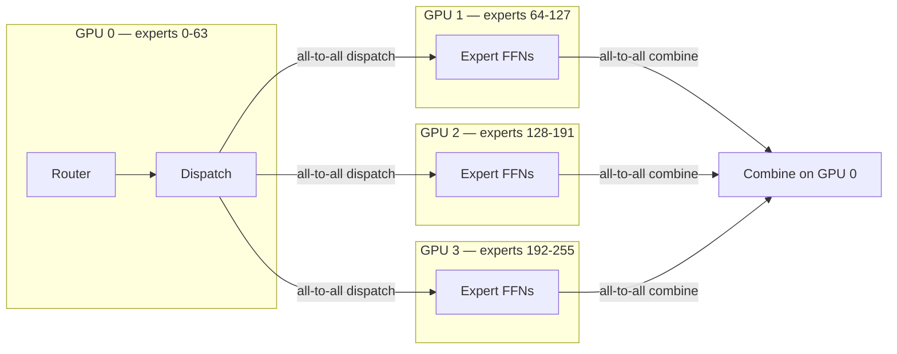

> **One-paragraph hook:** DeepSeek-V3, a [[Concept - Mixture of Experts Architecture|Mixture-of-Experts]] model, activates 8 of its 256 experts per token, so its FLOPs per forward pass look like a much smaller dense model's. All 256 experts' weights still have to sit in GPU memory however many fire on a given step, and sending a token to "expert 173 on GPU 6" instead of computing it locally costs a network hop. So MoE inference flips the usual serving bottleneck: cheap on compute, expensive on memory capacity and interconnect bandwidth. A dense model of comparable quality has the opposite profile. MoE needs its own serving architecture, **expert parallelism**, built around that profile instead of fighting it.

## The mechanism

For a dense transformer, sharding across GPUs means [[Concept - Tensor and Pipeline Parallelism|tensor or pipeline parallelism]] over layers or matrix dimensions, and every GPU does useful work on every token. Expert parallelism (EP) shards differently. Each GPU holds a *disjoint subset of experts* for the MoE layers, and a token's assigned experts may live on any GPU in the group.

Per layer at inference:

```
1. Router computes top-k expert indices for each token in the batch (local, cheap)
2. All-to-all DISPATCH: each token's hidden state is sent to the GPU(s)
   holding its selected expert(s)
3. Each GPU runs its resident experts on the tokens routed to it (local FFN compute)
4. All-to-all COMBINE: expert outputs are sent back to the token's origin GPU
   and weighted-summed per the router's gate weights
```

That puts two collective operations, dispatch and combine, into *every* MoE layer, on top of whatever [[Concept - All-Reduce and Collective Operations|all-reduce]] the attention blocks already need. Sparse routing keeps active FLOPs low ($k/N$ of a dense layer's compute, where $k$ is experts-per-token and $N$ is total experts), but the saved compute gets spent on network round-trips. Whether EP works depends entirely on interconnect quality.



## In practice

DeepSeek-V3 (top-8-of-256 routing, plus a shared expert) pairs its MoE layers with [[Concept - Multi-Head Attention Variants (MHA MQA GQA MLA)|MLA]] to shrink the KV cache side of memory. That pushes the memory bottleneck even further onto expert weights. With a small [[Concept - KV Cache|KV cache]] footprint, VRAM goes almost entirely to fitting experts, and GPU count is frequently set by how many GPUs it takes to hold all the experts, not by KV capacity or raw compute.

Dispatch and combine run on every MoE layer of every forward pass, so EP is extremely sensitive to interconnect. Inside a node, NVLink/NVSwitch bandwidth keeps the all-to-all cheap relative to compute. Across nodes, InfiniBand or RoCE adds latency that can dominate step time if EP degree is pushed too wide. Production MoE serving typically combines EP with data parallelism (replicate the expert-parallel group, send different request batches to different replicas) instead of scaling EP degree indefinitely, because all-to-all cost grows with the number of participants and per-GPU compute savings don't. DeepSeek's open-sourced EPLB (Expert Parallelism Load Balancer, 2025) goes after imbalance directly: it dynamically replicates hot experts and rebalances placement, instead of assuming a static, uniform expert-to-GPU mapping is good enough.

## Failure modes

- **All-to-all as the bottleneck.** On slow or oversubscribed interconnect, dispatch/combine latency dominates step time and the compute savings disappear. Profile network time separately from compute time before calling a slowdown a compute problem. It usually isn't.
- **Decode-time load imbalance.** At small decode batch sizes only a handful of tokens get routed per step (one per in-flight sequence), and nothing in top-k routing spreads them evenly across experts. Most expert-holding GPUs idle while one or two hot experts hold up the step. It's far worse than training-time average utilization suggests: training batches are enormous and average routing imbalance out, decode batches are small and don't.
- **Capacity-factor misconfiguration.** Some systems cap how many tokens an expert can accept per step (a capacity factor, to bound worst-case memory/compute). Set the cap too tight and they silently drop or reroute overflow tokens, which shows up as degraded quality on inputs that happen to route unevenly. It's a correctness bug that looks like a quality regression.
- **Head-of-line stalls from imbalance.** One overloaded expert on one GPU makes every other GPU in the EP group wait at the combine step. p99 [[Concept - Latency, Throughput, and Cost in LLM Serving|inter-token latency]] turns unpredictable even when average throughput looks fine; imbalance hits tail latency long before it hits the mean.

## The non-obvious

The training-time pitch for MoE is "a bigger, better model for the same active-parameter compute." At serving time that stops being the whole story. Training batches are big enough that routing imbalance averages away, and decode batches (one token per in-flight sequence) are the regime where imbalance is worst. Beautifully balanced expert utilization in training can still bottleneck badly at low-batch decode: the law-of-large-numbers smoothing isn't there at a decode batch of 8 or 16. Serving MoE at scale means re-solving load balancing for inference. [[Concept - MoE Training and Load Balancing|Training-time load balancing]] and decode-time load balancing are related but different problems, and a model tuned only for the first can still surprise you in production.

## Connections
- [[Concept - Mixture of Experts Architecture]] — the routing math (top-k gate, expert FFNs) that expert parallelism is sharding and communicating around at serving time.
- [[Concept - MoE Training and Load Balancing]] — the training-time version of the load-balancing problem this note covers at inference; the two share a mechanism but diverge sharply at small batch.
- [[Concept - All-Reduce and Collective Operations]] — the collective-communication primitives (dispatch/combine are specialized all-to-alls) that make EP a networking problem as much as a compute one.
- [[Concept - Tensor and Pipeline Parallelism]] — the sharding strategies EP is typically hybridized with; MoE serving commonly runs EP for expert layers and TP for attention layers within the same deployment.
- [[Concept - KV Cache]] — the other major VRAM consumer that MoE architectures (especially MLA-based ones) deliberately shrink to leave more headroom for resident expert weights.
- [[Breakdown - SGLang and RadixAttention]] — a serving engine with strong DeepSeek MLA/MoE support, a reference implementation for this note's mechanism in production.
- [[Concept - GPU Memory Hierarchy]] — the HBM capacity constraint that expert weights, not KV or activations, typically dominate for large MoE models.
- [[Concept - Multi-Head Attention Variants (MHA MQA GQA MLA)]] — MLA specifically, which many large MoE models pair with EP to shift the memory bottleneck fully onto expert weights.
- [[Concept - Prefill-Decode Disaggregation]] — a complementary serving technique whose rationale (different phases want different resource shapes) mirrors why MoE decode and MoE prefill also want different batch and placement strategies.
- [[Concept - Latency, Throughput, and Cost in LLM Serving]] — the tail-latency-vs-throughput cost model that decode-time expert imbalance directly damages, since imbalance shows up in p99 before it shows up in the mean.

## Sources
- DeepSeek-AI (2024) — *DeepSeek-V3 Technical Report*. Describes the 256-expert, top-8-plus-shared-expert routing and MLA pairing that motivates this note's memory-vs-compute framing.
- Shazeer et al. (2017) — *Outrageously Large Neural Networks: The Sparsely-Gated Mixture-of-Experts Layer*. The foundational top-k sparse routing formulation that all later expert-parallel serving systems shard around.
