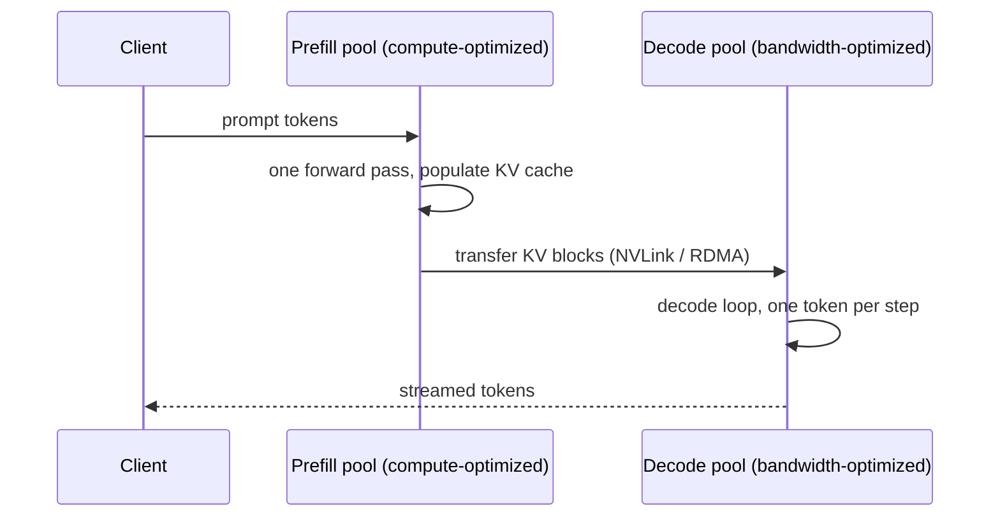

# Concept - Prefill-Decode Disaggregation
> **One-paragraph hook:** [[Concept - Chunked Prefill]] buys stall-free decode by time-slicing a single GPU between two workloads with opposite bottlenecks — but time-slicing still means both workloads share the same silicon, so raising one phase's token budget necessarily starves the other. Prefill-decode disaggregation removes the trade instead of managing it: run [[Concept - Prefill and Decode Phases|prefill]] on one pool of GPUs and decode on another, each sized and scheduled for its own bottleneck, and physically move the request's KV cache between them. The price is a new failure mode that didn't exist before: a network hop has to land before decode can start, so the technique trades a scheduling problem for a data-movement problem.

## The mechanism

Co-locating prefill and decode — even with chunked prefill's token-budget interleaving — forces a single hardware pool to serve two workloads that want opposite things: prefill wants a big *token* batch to keep tensor cores fed (compute-bound), decode wants a big *sequence* batch to amortize the HBM weight read (memory-bound). No token budget setting satisfies both simultaneously; you can only trade TTFT against TPOT along one shared curve. Disaggregation breaks the coupling by giving each phase its own hardware:

The prefill pool can run larger prompt batches, or even different (higher-FLOP) GPUs, without a single decoding request ever sharing an iteration with it. The decode pool runs its own continuous batch, unbothered by an incoming 8K-token prompt monopolizing a step. Each side is now a homogeneous workload that can be capacity-planned with the ordinary single-phase formulas in [[Reference - Inference Performance Math]].

The cost of this separation is the KV transfer itself. Using the memory formula from [[Concept - KV Cache]] (Llama-3-70B: ~0.31 MB/token), a 4,096-token prompt's KV cache is about 1.3 GB. Moved within an NVLink domain (~900 GB/s aggregate on an H100), that's roughly 1.5 ms — noise. Moved across racks over 400 Gb/s InfiniBand NDR (~50 GB/s effective per GPU), it's closer to 27 ms. Moved over a plain 100 Gb/s Ethernet fabric (~12.5 GB/s), it's over 100 ms — a meaningful fraction of, or larger than, the entire chat TTFT budget (300-500 ms, per [[Reference - Inference Performance Math]]). Treat these as order-of-magnitude illustrations, not benchmark numbers; re-measure against your actual fabric.

Named systems: **DistServe** (Zhong et al. 2024) frames placement as an optimization problem — given per-request TTFT and TPOT SLOs, decide how many GPUs go to each phase and how they're batched to maximize *goodput*. **Splitwise** (Patel et al. 2024, Microsoft) observed that prefill and decode have distinct utilization and power signatures and proposed mixed-hardware pools — cheaper, high-bandwidth GPUs for decode, fewer high-FLOP GPUs for prefill. **Mooncake** (Moonshot/Kimi 2024) goes a step further: it treats the KV cache as a first-class, globally addressable store rather than a per-request artifact tied to one node, so a cached prefix computed for one request can be reused by *any* request in the disaggregated fleet — coupling disaggregation with fleet-wide [[Concept - Automatic Prefix Caching|prefix caching]] instead of scoping caching to a single machine. NVIDIA Dynamo and vLLM now ship production prefill/decode disaggregation as a supported deployment mode (as of 2026).

## In practice

The wins are exactly the ones chunked prefill can't deliver simultaneously: a tight TTFT *and* a tight TPOT at the same time, higher goodput under a mixed short/long-prompt workload, and a cost lever — put prefill on GPUs with a good FLOPs-per-dollar ratio and decode on GPUs with a good bandwidth-per-dollar ratio, instead of paying for one GPU generation to be good at both. It composes with, rather than replaces, chunked prefill: a very long prompt still benefits from being chunked *within* the prefill pool to avoid one enormous prompt from starving other prefill requests in that pool — disaggregation solves cross-phase interference, chunking still helps with intra-phase interference. Teams typically adopt chunked prefill first, since it needs no new infrastructure, and disaggregate only once the TTFT/TPOT trade that a shared pool forces can no longer be tuned away — exactly the graduation path [[Concept - Chunked Prefill]] describes from its own side.

## Failure modes

- **KV transfer becomes the bottleneck.** On an oversubscribed or cross-datacenter link, transfer time can exceed the TTFT budget it was meant to protect, silently negating the entire point of disaggregating. Detection: instrument KV-transfer latency as its own metric, separate from queue time and prefill compute time — a TTFT regression that doesn't correlate with prefill queue depth or prompt length in the usual way is the tell.
- **Orchestration complexity.** A request now needs two-hop placement (which prefill node, then handed to which decode node), and the router must track both pools' utilization independently rather than balancing one fleet-wide number; a naive static prefill:decode GPU ratio is wrong the moment the mix of short vs. long prompts shifts.
- **Load imbalance between pools.** If traffic skews toward many short prompts, the prefill pool goes idle while decode queues; if it skews toward a few very long prompts, the reverse happens. Detection requires watching queue depth and utilization *per pool*, not a single aggregate — a healthy fleet-wide average can hide one starving pool.
- **KV blocks arriving from many prefill nodes fragment the decode pool's allocator.** Unlike single-pool serving, where blocks are freed and reused by one local scheduler, a decode pool ingesting transfers from multiple prefill nodes accumulates KV blocks of uneven size and arrival cadence — reproducing, on the receiving side of a network hop, the same paged-allocator fragmentation pathology documented in [[Lore - The KV Cache Fragmentation Crisis]].

## The non-obvious

TTFT in a disaggregated deployment gains a term that doesn't exist on shared hardware: transfer time proportional to KV size, which is proportional to prompt length — so at long context, "prefill is fast because it's parallel" can quietly stop being true again, for a completely different reason than the classic $O(P^2)$ attention cost. A team that validated disaggregation on short benchmark prompts and then serves a long-context workload in production can regress TTFT and not know why, because the regression lives in a network hop their prefill-only profiling never exercised.

The second, sharper lesson: disaggregation converts one hard problem (interference on shared hardware) into two easy ones (independent, homogeneous capacity planning per pool) plus one genuinely hard new one — jointly sizing two pools against a single shared, bursty arrival process. Teams that disaggregate without building a dynamic prefill:decode ratio controller often end up *worse off* than they were with chunked prefill on one pool, because a static split is wrong the instant the traffic mix moves, and a static split has nowhere to absorb that the shared-pool scheduler used to absorb for free.

## Connections
- [[Concept - Prefill and Decode Phases]] — the compute-bound/memory-bound asymmetry this technique exploits by finally giving each phase its own hardware.
- [[Concept - Chunked Prefill]] — the cheaper, single-pool alternative that time-slices instead of physically separating; most deployments try this first and graduate to disaggregation when it stops being enough.
- [[Concept - KV Cache Offloading and Compression]] — the sibling problem of a KV cache that doesn't fit at all, versus this note's problem of moving it once, intact, between two pools.
- [[Concept - All-Reduce and Collective Operations]] — cross-domain (08): KV transfer rides the same NVLink/RDMA fabric that collective communication uses, and the same interconnect-topology reasoning applies to sizing it.
- [[Reference - Inference Performance Math]] — supplies the KV-bytes-per-token formula and TTFT targets used in the worked transfer-time example above.
- [[Concept - Latency, Throughput, and Cost in LLM Serving]] — disaggregation is the lever that decouples TTFT and TPOT instead of trading one for the other on the shared-hardware Pareto frontier.
- [[Breakdown - TensorRT-LLM]] — a concrete serving engine shipping production prefill/decode disaggregation.
- [[Concept - GPU Memory Hierarchy]] — cross-domain (08): where the KV cache actually resides, in each pool's HBM, before and after the transfer.
- [[Concept - Autoscaling LLM Inference]] — cross-domain (16): disaggregation turns capacity planning into independently scaling two differently-shaped pools, which is exactly the problem autoscaling policy has to be built around.
- [[Lore - The KV Cache Fragmentation Crisis]] — the same allocator-fragmentation pathology this note's cross-pool KV transfer reproduces on the decode side, originally chronicled from single-node serving.

## Sources
- Zhong et al. (2024) — *DistServe: Disaggregating Prefill and Decoding for Goodput-Optimized Large Language Model Serving*. Formalizes per-phase placement and batching to hit independent TTFT/TPOT SLOs.
- Patel et al. (2024, Microsoft) — *Splitwise: Efficient Generative LLM Inference Using Phase Splitting*. Shows prefill and decode have distinct hardware utilization/power profiles and proposes mixed-hardware pools.
- Moonshot AI / Kimi (2024) — *Mooncake: A KVCache-centric Disaggregated Architecture for LLM Serving*. Treats the KV cache as a globally addressable store reused across the whole disaggregated fleet, not just one node.
