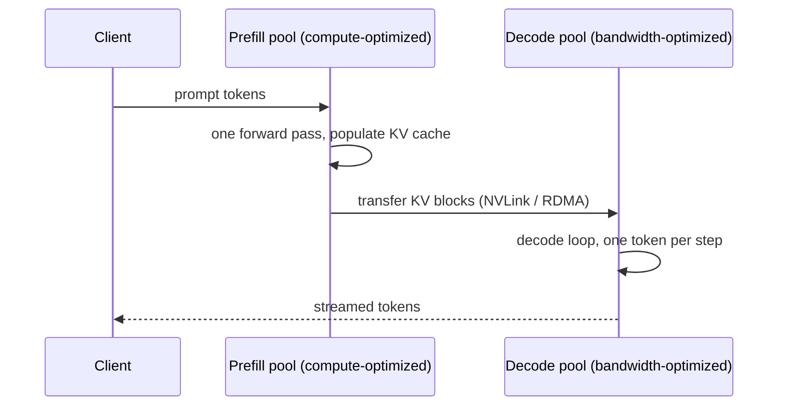

# Concept - Prefill-Decode Disaggregation
> **One-paragraph hook:** [[Concept - Chunked Prefill]] gets stall-free decode by time-slicing one GPU between two workloads with opposite bottlenecks. Both workloads still share the same silicon, so raising one phase's token budget starves the other. Prefill-decode disaggregation removes the trade instead of managing it: run [[Concept - Prefill and Decode Phases|prefill]] on one GPU pool and decode on another, each sized and scheduled for its own bottleneck, and physically move each request's KV cache between them. The price is a new failure mode. A network hop has to land before decode can start, so you've swapped a scheduling problem for a data-movement problem.

## The mechanism

Co-locating the two phases, even with chunked prefill's token-budget interleaving, makes one hardware pool serve two workloads that want opposite things. Prefill wants a big *token* batch to keep tensor cores fed (compute-bound). Decode wants a big *sequence* batch to amortize the HBM weight read (memory-bound). No token budget satisfies both; you can only slide TTFT against TPOT along one shared curve. Disaggregation breaks the coupling by giving each phase its own hardware:

The prefill pool can run larger prompt batches, or even different higher-FLOP GPUs, and no decoding request ever shares an iteration with it. The decode pool runs its own continuous batch and never loses a step to an incoming 8K-token prompt. Each side becomes a homogeneous workload you can capacity-plan with the ordinary single-phase formulas in [[Reference - Inference Performance Math]].

What you pay is the KV transfer. With the memory formula from [[Concept - KV Cache]] (Llama-3-70B: ~0.31 MB/token), a 4,096-token prompt carries about 1.3 GB of KV cache. Inside an NVLink domain (~900 GB/s aggregate on an H100) that moves in roughly 1.5 ms, which is noise. Across racks over 400 Gb/s InfiniBand NDR (~50 GB/s effective per GPU) it's closer to 27 ms. Over a plain 100 Gb/s Ethernet fabric (~12.5 GB/s) it's over 100 ms, a real fraction of the whole chat TTFT budget (300-500 ms, per [[Reference - Inference Performance Math]]) or more than all of it. These are order-of-magnitude illustrations, not benchmarks. Re-measure on your own fabric.

The named systems:

- **DistServe** (Zhong et al. 2024) treats placement as an optimization problem. Given per-request TTFT and TPOT SLOs, it picks how many GPUs each phase gets and how they batch, maximizing *goodput*.
- **Splitwise** (Patel et al. 2024, Microsoft) saw that prefill and decode have different utilization and power signatures and proposed mixed-hardware pools: cheaper high-bandwidth GPUs for decode, fewer high-FLOP GPUs for prefill.
- **Mooncake** (Moonshot/Kimi 2024) makes the KV cache a globally addressable store instead of a per-request artifact pinned to one node. A prefix computed for one request can be reused by *any* request in the fleet, so disaggregation comes paired with fleet-wide [[Concept - Automatic Prefix Caching|prefix caching]] instead of per-machine caching.

NVIDIA Dynamo and vLLM now ship prefill/decode disaggregation as a supported production deployment mode (as of 2026).

## In practice

You get what chunked prefill can't give you at once: tight TTFT *and* tight TPOT, higher goodput on a mixed short/long-prompt workload, and a cost lever. Put prefill on GPUs with good FLOPs per dollar and decode on GPUs with good bandwidth per dollar, instead of paying for one generation to be good at both.

It composes with chunked prefill. A very long prompt still gets chunked *inside* the prefill pool so it doesn't starve the other prefill requests there. Disaggregation fixes cross-phase interference; chunking still handles intra-phase interference. Teams typically adopt chunked prefill first, since it needs no new infrastructure, and disaggregate once the TTFT/TPOT trade on a shared pool can't be tuned away any more. [[Concept - Chunked Prefill]] describes the same graduation path from its side.

## Failure modes

- **KV transfer becomes the bottleneck.** On an oversubscribed or cross-datacenter link, transfer time can exceed the TTFT budget it was supposed to protect, silently cancelling the point of disaggregating. Instrument KV-transfer latency as its own metric, separate from queue time and prefill compute. The tell is a TTFT regression that doesn't track prefill queue depth or prompt length the usual way.
- **Orchestration gets harder.** Each request needs two-hop placement (which prefill node, then which decode node), and the router has to track both pools' utilization separately instead of balancing one fleet-wide number. A naive static prefill:decode GPU ratio is wrong as soon as the short/long prompt mix shifts.
- **The pools drift out of balance.** Lots of short prompts leave the prefill pool idle while decode queues; a few very long prompts do the reverse. You have to watch queue depth and utilization *per pool*. A healthy fleet-wide average can hide one starving pool.
- **KV blocks from many prefill nodes fragment the decode allocator.** In single-pool serving, one local scheduler frees and reuses blocks. A decode pool taking transfers from several prefill nodes collects blocks of uneven size and arrival cadence, which recreates on the far side of a network hop the paged-allocator fragmentation documented in [[Lore - The KV Cache Fragmentation Crisis]].

## The non-obvious

Disaggregated TTFT has a term shared hardware doesn't: transfer time, proportional to KV size, which is proportional to prompt length. At long context, "prefill is fast because it's parallel" can stop being true again, for a reason unrelated to the classic $O(P^2)$ attention cost. A team that validated disaggregation on short benchmark prompts and then serves long-context traffic can regress TTFT without knowing why. The regression sits in a network hop their prefill-only profiling never touched.

The sharper lesson: disaggregation turns one hard problem (interference on shared hardware) into two easy ones (independent, homogeneous capacity planning per pool) plus one hard new one, which is sizing two pools jointly against a single bursty arrival process. Teams that disaggregate without a dynamic prefill:decode ratio controller often end up *worse off* than with chunked prefill on one pool. A static split is wrong the moment the traffic mix moves, and it has nowhere to absorb the shift that the shared-pool scheduler used to absorb for free.

## Connections
- [[Concept - Prefill and Decode Phases]] — the compute-bound/memory-bound asymmetry this technique exploits by finally giving each phase its own hardware.
- [[Concept - Chunked Prefill]] — the cheaper, single-pool alternative that time-slices instead of physically separating; most deployments try this first and graduate to disaggregation when it stops being enough.
- [[Concept - KV Cache Offloading and Compression]] — the sibling problem of a KV cache that doesn't fit at all, versus this note's problem of moving it once, intact, between two pools.
- [[Concept - All-Reduce and Collective Operations]] — cross-domain (08): KV transfer rides the same NVLink/RDMA fabric that collective communication uses, and the same interconnect-topology reasoning applies to sizing it.
- [[Reference - Inference Performance Math]] — supplies the KV-bytes-per-token formula and TTFT targets used in the worked transfer-time example above.
- [[Concept - Latency, Throughput, and Cost in LLM Serving]] — disaggregation is the lever that decouples TTFT and TPOT instead of trading one for the other on the shared-hardware Pareto frontier.
- [[Breakdown - TensorRT-LLM]] — a concrete serving engine shipping production prefill/decode disaggregation.
- [[Concept - GPU Memory Hierarchy]] — cross-domain (08): where the KV cache actually resides, in each pool's HBM, before and after the transfer.
- [[Concept - Autoscaling LLM Inference]] — cross-domain (16): disaggregation turns capacity planning into independently scaling two differently-shaped pools, which is exactly the problem autoscaling policy has to be built around.
- [[Lore - The KV Cache Fragmentation Crisis]] — the same allocator-fragmentation pathology this note's cross-pool KV transfer reproduces on the decode side, originally chronicled from single-node serving.

## Sources
- Zhong et al. (2024) — *DistServe: Disaggregating Prefill and Decoding for Goodput-Optimized Large Language Model Serving*. Formalizes per-phase placement and batching to hit independent TTFT/TPOT SLOs.
- Patel et al. (2024, Microsoft) — *Splitwise: Efficient Generative LLM Inference Using Phase Splitting*. Shows prefill and decode have distinct hardware utilization/power profiles and proposes mixed-hardware pools.
- Moonshot AI / Kimi (2024) — *Mooncake: A KVCache-centric Disaggregated Architecture for LLM Serving*. Treats the KV cache as a globally addressable store reused across the whole disaggregated fleet, not just one node.
