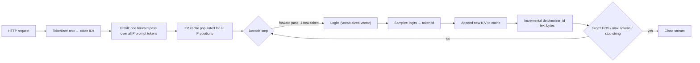

> **One-paragraph hook:** Every "the model is typing" experience you've ever watched is a specific, mechanical loop: one parallel forward pass over your prompt, then one sequential forward pass per output token, forever, until something tells it to stop. Understanding this loop is the prerequisite for understanding literally everything else in serving — batching, caching, quantization, and speculative decoding all exist to make one stage of this lifecycle cheaper.

## The mechanism

A request enters the serving stack as raw text and leaves as a stream of text chunks. The stages:

1. **Tokenize.** The prompt is encoded into integer token IDs by the model's tokenizer, almost always some flavor of [[Concept - Byte-Pair Encoding]]. This is CPU work and is normally negligible compared to everything downstream.
2. **Prefill.** The full prompt of `P` tokens is run through the model — the same forward pass structure as [[Deep Dive - The Transformer]] describes — in a single parallel pass. Every position's key and value projections get computed and written into the [[Concept - KV Cache]]; the only output that matters is the logits at the *last* position, which seed the first generated token.
3. **Decode loop.** Each iteration runs one forward pass for exactly one new token: a query is computed for the new position, it attends over every cached key/value from the prompt and every token generated so far, the model produces a logit vector over the vocabulary, and [[Concept - Sampling and Decoding Parameters]] turns that vector into a concrete token ID. The new token's own K,V are appended to the cache, and the loop repeats.
4. **Detokenize and stream.** Each new token ID is converted back to text incrementally — not trivial, because a single visible character can span multiple tokens ([[Concept - Streaming Detokenization]]) — and emitted as a server-sent-event chunk.
5. **Stop.** Every step checks three conditions: the sampled token equals the EOS ID, the generated length hit `max_tokens`, or the detokenized tail matches a configured stop string. Stop strings are the awkward one: because they're matched against decoded *text*, not token IDs, and a stop sequence can straddle a token boundary, the server must buffer trailing text and only commit output once it's sure no stop string is forming.

The structural fact that drives the entire field: **prefill is one pass over `P` tokens in parallel** — compute-bound, saturating tensor cores, described fully in [[Concept - Prefill and Decode Phases]] — while **decode is `N_gen` sequential single-token passes**, each one re-reading the entire weight matrix from HBM to produce a single token's worth of FLOPs. That asymmetry is why serving systems batch, cache, quantize, and speculate: almost every inference optimization is really an attack on the decode loop's cost structure.

## In practice

Two latency numbers matter operationally, and they come from different stages:

- **Time to first token (TTFT)** = queue wait + prefill compute. It scales roughly with prompt length `P` (with an `O(P^2)` attention term at long context, since [[Concept - Attention Mechanism]]'s score matrix grows quadratically), plus however long the request sat behind other work in the scheduler.
- **Inter-token latency (TPOT/ITL)** = time per decode step, which is dominated by re-reading the model's weights from HBM. For a 70B model in fp16 (~140 GB of weights) on an H100 (~3.35 TB/s HBM bandwidth), a single-stream decode step costs roughly `140e9 / 3.35e12 ≈ 42 ms`, i.e. under 25 tokens/sec, largely *independent* of how long the prompt was — the KV cache already exists, so decode only pays for reading weights plus a linear KV read, not for reprocessing the prompt.

Because every decode step re-reads the full weight matrix regardless of batch size, running many requests' decode steps together amortizes that read across all of them — this is the concrete mechanistic reason [[Concept - Continuous Batching]] exists: it isn't a scheduling nicety, it's the only way to get more useful FLOPs out of a decode step that is otherwise wasting almost all its memory bandwidth on one token.

The "typewriter" effect users see streaming from ChatGPT-style UIs is literally this loop ticking, one iteration = one visible token appended. A stream that visibly *pauses* — a burst of tokens, then a stall, then another burst — is diagnostic: it means the request is sitting in a queue, or the batch it's riding in just got interrupted by another request's prefill.

## Failure modes

- **"Hung" streams that are actually queued.** Clients report the API as frozen; the real cause is admission delay behind a full batch or a large competing prefill, not a dead connection. Detect by comparing observed TTFT against expected prefill time for the prompt length — a large gap is queue time, not compute time.
- **Doubled or missing BOS tokens.** A chat template that adds BOS *and* a tokenizer that also auto-prepends it silently corrupts every prefill; output degrades in quality without erroring, and it's invisible unless you diff the rendered prompt against the model card's reference template.
- **Stop strings leaking or truncating early.** Because stop matching happens on detokenized text and a stop sequence can span tokens, naive implementations either let part of the stop string leak into the output or cut off a legitimate character that merely looked like the start of one.
- **Runaway generation.** A missing or misconfigured EOS ID means the model never signals "done," and every request burns tokens up to `max_tokens` — a silent cost and latency disaster that only shows up in the token-spend dashboard, not in error logs.

## The non-obvious

The lifecycle is really a per-request state machine (`queued → prefilling → decoding → finished`), and that framing is exactly what iteration-level schedulers like Orca formalized: the scheduler doesn't think in terms of "requests running to completion," it thinks in terms of which state each sequence is in *this iteration*, admitting and evicting sequences every single decode step. Once you see the lifecycle this way, most "serving performance" work stops looking like model optimization and starts looking like operating-systems scheduling — which is why the vocabulary (paging, eviction, admission control) is borrowed directly from OS design.

## Connections
- [[Concept - KV Cache]] — the memory structure prefill populates and decode reads every step; its size is what caps how many requests can be in the "decoding" state at once.
- [[Concept - Prefill and Decode Phases]] — the deeper treatment of why these two stages have opposite hardware bottlenecks.
- [[Concept - Continuous Batching]] — the scheduler-level answer to decode's wasted memory bandwidth, re-forming the batch every iteration instead of running requests to completion.
- [[Concept - Sampling and Decoding Parameters]] — the transform applied to each step's logits to pick the next token ID.
- [[Concept - Streaming Detokenization]] — why turning token IDs back into correct, stop-aware text is its own nontrivial mechanism, not a free byproduct of the loop.
- [[Concept - Byte-Pair Encoding]] — the tokenizer that performs the very first step of the lifecycle.
- [[Deep Dive - The Transformer]] — the forward-pass architecture that prefill and each decode step actually execute.
- [[Concept - GPU Memory Hierarchy]] — the HBM-vs-SRAM distinction that explains why a decode step's cost is dominated by memory reads, not arithmetic.
- [[Concept - Attention Mechanism]] — the operation whose quadratic score matrix is why TTFT grows superlinearly with very long prompts.

## Sources
- Vaswani et al. (2017) — "Attention Is All You Need." Defines the forward-pass structure that both prefill and every decode step execute.
- Kwon et al. (2023, SOSP) — "Efficient Memory Management for Large Language Model Serving with PagedAttention" (the vLLM paper). Formalizes the iteration-level, per-request state machine this lifecycle is built around.
