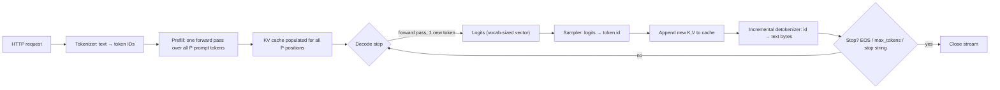

> **One-paragraph hook:** Every "the model is typing" experience is the same mechanical loop: one parallel forward pass over your prompt, then one sequential forward pass per output token until something says stop. You need this loop before anything else in serving makes sense. Batching, caching, quantization and speculative decoding each exist to make one stage of it cheaper.

## The mechanism

A request comes into the serving stack as raw text and leaves as a stream of text chunks:

1. **Tokenize.** The model's tokenizer, almost always some flavor of [[Concept - Byte-Pair Encoding]], turns the prompt into integer token IDs. It's CPU work and normally negligible next to everything after it.
2. **Prefill.** All `P` prompt tokens go through the model in one parallel pass, with the same forward-pass structure described in [[Deep Dive - The Transformer]]. Every position's key and value projections are computed and written into the [[Concept - KV Cache]]. The only output that matters is the logits at the *last* position, which seed the first generated token.
3. **Decode loop.** Each iteration is one forward pass for one new token. The model computes a query for the new position, attends over every cached key/value from the prompt and from the tokens generated so far, and produces a logit vector over the vocabulary. [[Concept - Sampling and Decoding Parameters]] turns that vector into a token ID. The new token's K,V go onto the cache and the loop repeats.
4. **Detokenize and stream.** Each new ID is turned back into text incrementally and sent as a server-sent-event chunk. This isn't trivial, since one visible character can span several tokens ([[Concept - Streaming Detokenization]]).
5. **Stop.** Every step checks three conditions: the sampled token is the EOS ID, the output length hit `max_tokens`, or the detokenized tail matches a configured stop string. Stop strings are the awkward one. They're matched against decoded *text*, and a stop sequence can straddle a token boundary, so the server has to buffer trailing text and only commit output once it knows no stop string is forming.

The fact everything else follows from: **prefill is one pass over `P` tokens in parallel**, compute-bound and saturating tensor cores (see [[Concept - Prefill and Decode Phases]]), while **decode is `N_gen` sequential single-token passes**, each re-reading the whole weight matrix from HBM to do one token's worth of FLOPs. Serving systems batch, cache, quantize and speculate because of that asymmetry. Almost every inference optimization is an attack on the decode loop's cost.

## In practice

Two latency numbers matter in operations, and they come from different stages:

- **Time to first token (TTFT)** = queue wait + prefill compute. It scales roughly with prompt length `P`, with an `O(P^2)` attention term at long context because the score matrix in [[Concept - Attention Mechanism]] grows quadratically, plus however long the request waited behind other work in the scheduler.
- **Inter-token latency (TPOT/ITL)** = time per decode step, dominated by re-reading the weights from HBM. A 70B model in fp16 (~140 GB of weights) on an H100 (~3.35 TB/s HBM bandwidth) costs roughly `140e9 / 3.35e12 ≈ 42 ms` per single-stream decode step, under 25 tokens/sec. That's largely *independent* of prompt length: the KV cache already exists, so decode pays for reading weights plus a linear KV read and never reprocesses the prompt.

Every decode step re-reads the full weight matrix whatever the batch size, so running many requests' decode steps together spreads that read across all of them. That's the mechanical reason [[Concept - Continuous Batching]] exists. It's the only way to get more useful FLOPs out of a decode step that otherwise spends nearly all its memory bandwidth on one token.

The "typewriter" effect in ChatGPT-style UIs is this loop ticking: one iteration, one visible token. A stream that visibly *pauses* (a burst of tokens, a stall, another burst) tells you something. The request is sitting in a queue, or its batch just got interrupted by another request's prefill.

## Failure modes

- **"Hung" streams that are really queued.** Clients report the API as frozen, but the cause is admission delay behind a full batch or a large competing prefill, and the connection is fine. Compare observed TTFT with the expected prefill time for that prompt length. A big gap is queue time.
- **Doubled or missing BOS tokens.** A chat template that adds BOS *and* a tokenizer that auto-prepends it corrupts every prefill. Quality drops with no error, and you won't see it unless you diff the rendered prompt against the model card's reference template.
- **Stop strings leaking or truncating early.** Matching happens on detokenized text and a stop sequence can span tokens, so naive implementations either leak part of the stop string into output or cut a legitimate character that only looked like the start of one.
- **Runaway generation.** With a missing or wrong EOS ID the model never signals "done," and every request burns tokens up to `max_tokens`. That's a silent cost and latency disaster that shows up in the token-spend dashboard and not in error logs.

## The non-obvious

The lifecycle is a per-request state machine (`queued → prefilling → decoding → finished`), and iteration-level schedulers like Orca formalized that. The scheduler doesn't reason about requests running to completion. It tracks which state each sequence is in *this iteration*, admitting and evicting sequences on every decode step. Seen this way, most serving performance work looks less like model optimization and more like operating-systems scheduling, and the vocabulary (paging, eviction, admission control) comes straight from OS design.

## Connections
- [[Concept - KV Cache]] — the memory structure prefill populates and decode reads every step; its size is what caps how many requests can be in the "decoding" state at once.
- [[Concept - Prefill and Decode Phases]] — the deeper treatment of why these two stages have opposite hardware bottlenecks.
- [[Concept - Continuous Batching]] — the scheduler-level answer to decode's wasted memory bandwidth, re-forming the batch every iteration instead of running requests to completion.
- [[Concept - Sampling and Decoding Parameters]] — the transform applied to each step's logits to pick the next token ID.
- [[Concept - Streaming Detokenization]] — why turning token IDs back into correct, stop-aware text is its own nontrivial mechanism, not a free byproduct of the loop.
- [[Concept - Byte-Pair Encoding]] — the tokenizer that performs the very first step of the lifecycle.
- [[Deep Dive - The Transformer]] — the forward-pass architecture that prefill and each decode step actually execute.
- [[Concept - GPU Memory Hierarchy]] — the HBM-vs-SRAM distinction that explains why a decode step's cost is dominated by memory reads, not arithmetic.
- [[Concept - Attention Mechanism]] — the operation whose quadratic score matrix is why TTFT grows superlinearly with very long prompts.

## Sources
- Vaswani et al. (2017) — "Attention Is All You Need." Defines the forward-pass structure that both prefill and every decode step execute.
- Kwon et al. (2023, SOSP) — "Efficient Memory Management for Large Language Model Serving with PagedAttention" (the vLLM paper). Formalizes the iteration-level, per-request state machine this lifecycle is built around.
