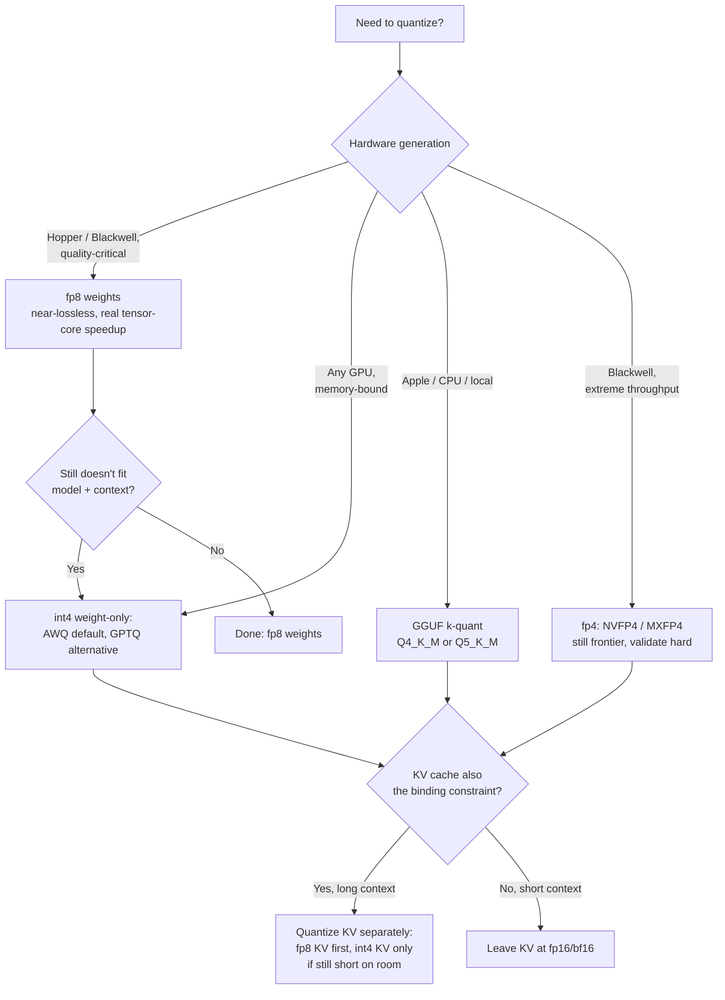

> **The decision, in one sentence:** how much precision to give up on weights, and separately on the KV cache, to fit your model and context on the GPUs you have without breaking the downstream task. **Default for a typical 2026 NVIDIA Hopper-or-newer deployment where quality matters:** fp8 weights + fp8 KV cache. Drop to AWQ int4 weight-only only once fp8 doesn't buy enough memory headroom to fit the model or context you need.

## Decision flow

Weight precision and KV precision are decided **independently** — pick a point on each axis, not one combined "quantization level." Long-context serving is frequently KV-bound even when weights comfortably fit at fp8 or bf16; short-context serving is frequently weight-bound even when the KV cache is trivially small. Conflating the two axes leads to over-quantizing whichever one wasn't actually the constraint.

## Tradeoff matrix

| Method | Bits | Memory vs bf16 | Throughput gain | Quality risk | Calibration needed | Engine support (2026) |
|---|---|---|---|---|---|---|
| bf16/fp16 (baseline) | 16 | 1x | — | none | no | universal |
| fp8 (weights) | 8 | ~2x | weight bandwidth + real tensor-core FLOPs speedup | low, often near-lossless | no (dynamic) | Hopper+, broad engine support |
| int4 AWQ (weight-only) | 4 | ~4x | bandwidth only (dequant to bf16 in the matmul) | low-moderate, best on instruct models | yes, small calibration set | broad — vLLM, TGI, TensorRT-LLM |
| int4 GPTQ (weight-only) | 4 | ~4x | bandwidth only | moderate, sensitive to `desc_act`/group-size mismatch | yes, larger calibration set, more sensitive | broad, older/more mature tooling |
| GGUF k-quant (Q4_K_M) | ~4-5 avg | ~4x | bandwidth only, CPU/Apple-optimized | moderate | optional (imatrix improves it) | llama.cpp / Ollama / LM Studio |
| fp4 (NVFP4 / MXFP4) | 4 | ~4x | bandwidth + FLOPs, best-case throughput | higher, frontier tooling | typically no (dynamic) | Blackwell only, immature |
| KV cache fp8 | 8 | ~2x KV capacity | more concurrent tokens/context | low | no | broad |
| KV cache int4 | 4 | ~4x KV capacity | more concurrent tokens/context | moderate-high, esp. long context | sometimes | narrower, check engine |

Weight-only formats (AWQ, GPTQ, GGUF k-quants) save memory and HBM bandwidth by dequantizing to bf16 inside the matmul — they cut the [[Concept - Latency, Throughput, and Cost in LLM Serving|decode-time bandwidth bottleneck]] but don't touch FLOPs. fp8 and fp4 additionally use faster tensor-core paths on supporting hardware, so they save both. See [[Concept - Post-Training Quantization Formats]] for the algorithms behind AWQ/GPTQ/GGUF and [[Concept - FP8 and Low-Precision Inference]] for the hardware-format side.

## The details that flip the decision

- **Activation outliers rule out naive int8 activation quantization.** A handful of large-magnitude activation channels (the Dettmers LLM.int8() finding) blow up naive int8 W8A8; you need SmoothQuant-style outlier migration or fp8's wider dynamic range instead. If someone proposes plain int8 activations without mentioning outlier handling, that's the flag to push back.
- **MoE experts, `lm_head`, and embeddings are precision-sensitive.** Uniformly quantizing every layer including these causes disproportionate damage relative to their size; production recipes commonly keep them at higher precision even while the bulk of transformer blocks go to 4-bit. See [[Concept - MoE Inference and Expert Parallelism]] for why expert weight *volume* already dominates memory in MoE models — that's exactly the layer type you don't also want degraded in quality.
- **Long-context quality is dominated by KV precision, not weight precision, especially for sink/early tokens.** A model with bf16 weights but aggressively quantized KV can lose long-context retrieval quality that a weight-quantized, KV-fp16 configuration wouldn't — check which axis is actually driving your failure before "fixing" the wrong one.
- **Reasoning, coding, and tool-calling degrade before perplexity does.** [[Gotchas - Quantization Quality Loss|WikiText perplexity delta is a weak proxy]] — a 4-bit model can look fine on perplexity and still fail structured tool calls or multi-step math. The accuracy budget has to be measured on the actual downstream task the model will run in production, not on a generic language-modeling benchmark.
- **Hardware gating silently defeats the point.** fp8 kernels need Hopper or newer, fp4 needs Blackwell; running either on Ampere/Ada either errors or falls back to slow emulation. Verify the tensor-core path is actually engaging (check achieved throughput against the roofline expectation, not just that the flag was set) — otherwise you pay the quality cost of quantization with none of the speed benefit.
- **Calibration data must be in-domain.** GPTQ/AWQ scales fit on a generic calibration corpus (e.g. WikiText) will skew toward general-text statistics; a model serving code or a narrow domain should be calibrated on representative in-domain data, or the quantization will degrade exactly the capability being served.

## Connections
- [[Breakdown - BitNet b1.58]] — the extreme end of the weight-precision axis this matrix stops short of: ternary weights trained QAT-from-scratch, removing the GEMM multiply entirely rather than just shrinking it.
- [[Concept - Post-Training Quantization Formats]] — the algorithms (GPTQ, AWQ, GGUF k-quants) behind the weight-quantization rows of the tradeoff matrix above.
- [[Concept - FP8 and Low-Precision Inference]] — the hardware-format side (fp8, fp4/NVFP4/MXFP4) and the Hopper/Blackwell gating that decides which rows are even available.
- [[Concept - KV Cache Quantization]] — the second, independent axis this decision explicitly separates from weight precision.
- [[Gotchas - Quantization Quality Loss]] — the concrete failure modes (perplexity blindness, calibration mismatch, format/runtime mismatch) behind "quality risk" in the matrix.
- [[Reference - Memory Math for Transformers]] — the formulas for how much memory each bit-width actually recovers, needed to turn "4x smaller" into a concrete GPU-fit calculation.
- [[Concept - Floating Point for Deep Learning]] — the number-format fundamentals (exponent/mantissa tradeoffs, dynamic range) that explain why fp8 tolerates quantization better than int8 at the same bit budget.
- [[Decision - Choosing an Inference Serving Framework]] — engine support is a hard constraint on this decision; a format with no kernel support in your chosen engine isn't a real option regardless of its quality profile.
- [[Concept - Latency, Throughput, and Cost in LLM Serving]] — the throughput/cost payoff this whole decision is ultimately in service of: more concurrent tokens or longer context per GPU dollar.
- [[Concept - MoE Inference and Expert Parallelism]] — why MoE expert weights are both the layer type most sensitive to over-quantization and the layer type consuming the most memory, sharpening this decision for MoE deployments specifically.

## Sources
- Frantar et al. (2022) — *GPTQ: Accurate Post-Training Quantization for Generative Pre-trained Transformers*. Layer-wise second-order error minimization for 3-4 bit weight quantization.
- Lin et al. (2023) — *AWQ: Activation-aware Weight Quantization for LLM Compression and Acceleration*. Protects salient weight channels via activation-magnitude-informed per-channel scaling.
- Dettmers et al. (2022) — *LLM.int8(): 8-bit Matrix Multiplication for Transformers at Scale*. Identifies the large-magnitude activation outlier features that naive int8 activation quantization must handle.
- Xiao et al. (2023) — *SmoothQuant: Accurate and Efficient Post-Training Quantization for Large Language Models*. Migrates activation outliers into weights to make int8 W8A8 quantization viable.
