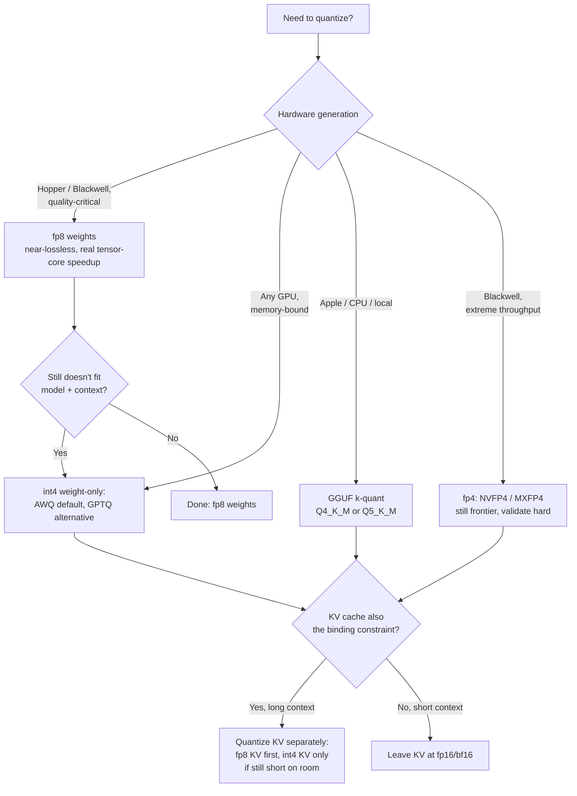

> **The decision, in one sentence:** how much precision to give up on weights, and separately on the KV cache, so your model and context fit on the GPUs you have without breaking the downstream task. **Default for a typical 2026 NVIDIA Hopper-or-newer deployment where quality matters:** fp8 weights + fp8 KV cache. Go down to AWQ int4 weight-only only when fp8 doesn't free enough memory for the model or context you need.

## Decision flow

Weight precision and KV precision are **separate decisions**. Pick a point on each axis instead of one combined "quantization level." Long-context serving is frequently KV-bound even when the weights fit comfortably at fp8 or bf16. Short-context serving is frequently weight-bound even with a tiny KV cache. Treat the two as one knob and you end up over-quantizing whichever axis wasn't the constraint.

## Tradeoff matrix

| Method | Bits | Memory vs bf16 | Throughput gain | Quality risk | Calibration needed | Engine support (2026) |
|---|---|---|---|---|---|---|
| bf16/fp16 (baseline) | 16 | 1x | — | none | no | universal |
| fp8 (weights) | 8 | ~2x | weight bandwidth + real tensor-core FLOPs speedup | low, often near-lossless | no (dynamic) | Hopper+, broad engine support |
| int4 AWQ (weight-only) | 4 | ~4x | bandwidth only (dequant to bf16 in the matmul) | low-moderate, best on instruct models | yes, small calibration set | broad — vLLM, TGI, TensorRT-LLM |
| int4 GPTQ (weight-only) | 4 | ~4x | bandwidth only | moderate, sensitive to `desc_act`/group-size mismatch | yes, larger calibration set, more sensitive | broad, older/more mature tooling |
| GGUF k-quant (Q4_K_M) | ~4-5 avg | ~4x | bandwidth only, CPU/Apple-optimized | moderate | optional (imatrix improves it) | llama.cpp / Ollama / LM Studio |
| fp4 (NVFP4 / MXFP4) | 4 | ~4x | bandwidth + FLOPs, best-case throughput | higher, frontier tooling | typically no (dynamic) | Blackwell only, immature |
| KV cache fp8 | 8 | ~2x KV capacity | more concurrent tokens/context | low | no | broad |
| KV cache int4 | 4 | ~4x KV capacity | more concurrent tokens/context | moderate-high, esp. long context | sometimes | narrower, check engine |

Weight-only formats (AWQ, GPTQ, GGUF k-quants) save memory and HBM bandwidth by dequantizing to bf16 inside the matmul. That cuts the [[Concept - Latency, Throughput, and Cost in LLM Serving|decode-time bandwidth bottleneck]] and leaves FLOPs alone. fp8 and fp4 also get faster tensor-core paths on hardware that supports them, so they save both. The algorithms behind AWQ/GPTQ/GGUF are in [[Concept - Post-Training Quantization Formats]]; the hardware-format side is in [[Concept - FP8 and Low-Precision Inference]].

## The details that flip the decision

- **Activation outliers rule out naive int8 activation quantization.** A handful of large-magnitude activation channels (the Dettmers LLM.int8() finding) blow up naive int8 W8A8. You need SmoothQuant-style outlier migration or fp8's wider dynamic range. If someone proposes plain int8 activations and says nothing about outliers, push back.
- **MoE experts, `lm_head`, and embeddings are precision-sensitive.** Quantizing every layer uniformly, these included, does damage out of proportion to their size. Production recipes commonly keep them at higher precision while most transformer blocks go to 4-bit. [[Concept - MoE Inference and Expert Parallelism]] covers why expert weight *volume* already dominates memory in MoE models, and that's the layer type you least want degraded.
- **Long-context quality is dominated by KV precision, especially for sink/early tokens.** A model with bf16 weights and aggressively quantized KV can lose long-context retrieval quality that a weight-quantized, KV-fp16 setup would keep. Find out which axis is causing the failure before you "fix" the wrong one.
- **Reasoning, coding, and tool-calling degrade before perplexity does.** [[Gotchas - Quantization Quality Loss|WikiText perplexity delta is a weak proxy]]. A 4-bit model can look fine on perplexity and still fail structured tool calls or multi-step math. Measure the accuracy budget on the downstream task the model will run in production, not a generic language-modeling benchmark.
- **Hardware gating silently defeats the point.** fp8 kernels need Hopper or newer and fp4 needs Blackwell. On Ampere/Ada either one errors or falls back to slow emulation. Confirm the tensor-core path is engaging by checking achieved throughput against the roofline expectation, not just that the flag is set. Otherwise you pay quantization's quality cost and get none of the speed.
- **Calibration data must be in-domain.** GPTQ/AWQ scales fit on a generic corpus (e.g. WikiText) skew toward general-text statistics. A model serving code or a narrow domain should be calibrated on representative in-domain data, or quantization degrades the very capability you're serving.

## Connections
- [[Breakdown - BitNet b1.58]] — the extreme end of the weight-precision axis this matrix stops short of: ternary weights trained QAT-from-scratch, removing the GEMM multiply entirely rather than just shrinking it.
- [[Concept - Post-Training Quantization Formats]] — the algorithms (GPTQ, AWQ, GGUF k-quants) behind the weight-quantization rows of the tradeoff matrix above.
- [[Concept - FP8 and Low-Precision Inference]] — the hardware-format side (fp8, fp4/NVFP4/MXFP4) and the Hopper/Blackwell gating that decides which rows are even available.
- [[Concept - KV Cache Quantization]] — the second, independent axis this decision explicitly separates from weight precision.
- [[Gotchas - Quantization Quality Loss]] — the concrete failure modes (perplexity blindness, calibration mismatch, format/runtime mismatch) behind "quality risk" in the matrix.
- [[Reference - Memory Math for Transformers]] — the formulas for how much memory each bit-width actually recovers, needed to turn "4x smaller" into a concrete GPU-fit calculation.
- [[Concept - Floating Point for Deep Learning]] — the number-format fundamentals (exponent/mantissa tradeoffs, dynamic range) that explain why fp8 tolerates quantization better than int8 at the same bit budget.
- [[Decision - Choosing an Inference Serving Framework]] — engine support is a hard constraint on this decision; a format with no kernel support in your chosen engine isn't a real option regardless of its quality profile.
- [[Concept - Latency, Throughput, and Cost in LLM Serving]] — the throughput/cost payoff this whole decision is ultimately in service of: more concurrent tokens or longer context per GPU dollar.
- [[Concept - MoE Inference and Expert Parallelism]] — why MoE expert weights are both the layer type most sensitive to over-quantization and the layer type consuming the most memory, sharpening this decision for MoE deployments specifically.

## Sources
- Frantar et al. (2022) — *GPTQ: Accurate Post-Training Quantization for Generative Pre-trained Transformers*. Layer-wise second-order error minimization for 3-4 bit weight quantization.
- Lin et al. (2023) — *AWQ: Activation-aware Weight Quantization for LLM Compression and Acceleration*. Protects salient weight channels via activation-magnitude-informed per-channel scaling.
- Dettmers et al. (2022) — *LLM.int8(): 8-bit Matrix Multiplication for Transformers at Scale*. Identifies the large-magnitude activation outlier features that naive int8 activation quantization must handle.
- Xiao et al. (2023) — *SmoothQuant: Accurate and Efficient Post-Training Quantization for Large Language Models*. Migrates activation outliers into weights to make int8 W8A8 quantization viable.
