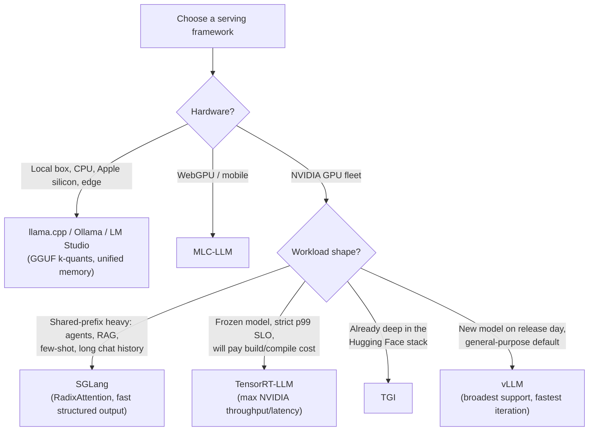

# Decision - Choosing an Inference Serving Framework

> **The decision:** which engine actually runs your model — vLLM, SGLang, TensorRT-LLM, llama.cpp/Ollama, TGI, or MLC-LLM — given your hardware, workload shape, and latency/throughput SLO. **Default for the 80% case:** vLLM on NVIDIA GPUs. It has the broadest model and hardware coverage, the fastest day-0 support for new open-weight releases, an OpenAI-compatible server, and a mature ecosystem ([[Concept - Continuous Batching]], quantization, LoRA, speculative decoding, P/D disaggregation) — it is the safe choice unless a specific workload trait pulls you elsewhere.

## Decision flow

## Tradeoff matrix

| Framework | Best hardware | Ideal workload | Quant formats | Multi-LoRA | Iteration speed | Notable weakness |
|---|---|---|---|---|---|---|
| **vLLM** | NVIDIA (also AMD ROCm, TPU) | General GPU serving, new-model day-0 | AWQ, GPTQ, fp8, GGUF (partial), bnb | Strong ([[Concept - Multi-LoRA Serving]] origin ecosystem) | Fastest — new models land in days | Not the raw-speed ceiling on a fixed, frozen model |
| **SGLang** | NVIDIA, AMD | Shared-prefix / agentic / RAG workloads, DeepSeek MLA+MoE | fp8, AWQ, GPTQ | Good | Fast | Smaller ecosystem than vLLM for less common models |
| **TensorRT-LLM** | NVIDIA only | Fixed model, max throughput/latency at fleet scale | fp8, fp4 (Blackwell), int4/int8, custom kernels | Weaker | Slowest — requires engine (re)compilation per model/shape change | Ergonomics cost; brittle to model/config changes |
| **llama.cpp / Ollama / LM Studio** | CPU, Apple silicon (unified memory), consumer GPU | Local, edge, single-user | GGUF k-quants and i-quants (widest quant zoo) | Limited | Fast for new GGUF conversions | Not built for high-concurrency fleet serving |
| **MLC-LLM** | WebGPU, mobile | Browser / on-device inference | Its own compiled quant formats | Limited | Moderate | Narrow deployment target |
| **TGI** | NVIDIA | Teams standardized on the Hugging Face stack | AWQ, GPTQ, bnb, fp8 | Moderate | Moderate | Feature lag vs vLLM/SGLang on the newest techniques |

## The details that flip the decision

- **Single-user local box** → llama.cpp, even if you'd otherwise default to vLLM; there's no batching benefit to amortize and vLLM's memory/ops overhead buys nothing on one machine.
- **Strict p99 latency SLO at fleet scale with a model that won't change for months** → TensorRT-LLM; the compile-time cost is a one-time tax against a long-lived payoff in tail latency and NVIDIA tensor-core utilization, especially for [[Concept - FP8 and Low-Precision Inference]] paths.
- **Brand-new open-weight model on release day** → vLLM or SGLang; TensorRT-LLM's engine-build step means it typically lags day-0 support by days to weeks.
- **Thousands of fine-tuned adapters over one base model** → weight the decision toward whichever engine has the strongest [[Concept - Multi-LoRA Serving]] path (batched heterogeneous-adapter kernels and adapter paging), since naive per-adapter serving is a different cost model entirely.
- **Heavy structured/JSON output or a fixed system-prompt-plus-tools scaffold repeated across every request** → SGLang's RadixAttention and compressed-FSM jump-forward decoding give it a real edge over generic [[Concept - Automatic Prefix Caching]] plus grammar masking.
- **DeepSeek-scale MoE with MLA** → SGLang has historically had the fastest, most complete support for that specific combination ([[Concept - MoE Inference and Expert Parallelism]]); verify current support before committing, since this landscape moves quickly (as of 2026).
- **AMD ROCm or TPU hardware** → narrows the field immediately; vLLM has the broadest non-NVIDIA support of the mainstream engines, TensorRT-LLM is NVIDIA-only by construction.

## Connections

- [[Breakdown - vLLM]] — the internals (PagedAttention, V1 scheduler) behind the default recommendation.
- [[Breakdown - SGLang and RadixAttention]] — the mechanism behind the shared-prefix-heavy recommendation.
- [[Breakdown - TensorRT-LLM]] — the compilation model and kernel strategy behind the max-throughput recommendation.
- [[Concept - Multi-LoRA Serving]] — the criterion that flips the decision when serving many adapters over one base.
- [[Concept - Continuous Batching]] — the scheduling capability every one of these engines implements differently; it's a large share of why they perform differently on the same hardware.
- [[Reference - Inference Performance Math]] — the formulas to actually benchmark candidates against before committing.
- [[Playbook - Tuning an LLM Serving Deployment]] — what happens after you've picked an engine: turning it into a tuned deployment.
- [[Concept - LLM Observability and Tracing]] — production operability (tracing, metrics) differs across these engines and should factor into the choice, not just raw throughput.
- [[Decision - Selecting GPUs for Training and Inference]] — the hardware decision this one is downstream of; framework choice narrows sharply once the GPU vendor is fixed.
- [[Concept - The Inference Request Lifecycle]] — the request path every one of these frameworks implements; understanding it is the prerequisite for evaluating any of them.
- [[Concept - FP8 and Low-Precision Inference]] — the precision path that makes TensorRT-LLM's max-throughput case strongest on Hopper/Blackwell.
- [[Concept - Automatic Prefix Caching]] — the generic version of the shared-prefix optimization that SGLang's RadixAttention specializes and outperforms on.
- [[Concept - MoE Inference and Expert Parallelism]] — why DeepSeek-scale MoE+MLA serving is called out as a separate criterion in this decision.

## Sources

- Kwon et al. (2023) — "Efficient Memory Management for Large Language Model Serving with PagedAttention" (SOSP). The vLLM paper; establishes the memory-management baseline every later engine is compared against.
- Zheng et al. (2024) — "SGLang: Efficient Execution of Structured Language Model Programs." Introduces RadixAttention, the mechanism behind SGLang's shared-prefix advantage.
- NVIDIA — TensorRT-LLM documentation and release notes (ongoing). The authoritative source for current NVIDIA-specific kernel and precision support; check dates, this is a fast-moving target (as of 2026).
