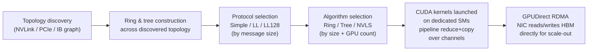

> NCCL (pronounced "nickel") is the library that turns "add up gradients across 512 GPUs" into a working sequence of CUDA kernels and network transfers. It is not a research artifact — it's the load-bearing infrastructure underneath PyTorch DDP/FSDP, Megatron-LM, and DeepSpeed, and when a distributed training job hangs or runs at half the expected bandwidth, NCCL's internals are almost always where the answer lives. Current as of 2026 (NCCL 2.2x line).

## The headline numbers

- Ring all-reduce bandwidth efficiency: transfers `2(N-1)/N × data_size` bytes per GPU regardless of `N` — asymptotically bandwidth-optimal, the number NCCL's ring algorithm is built to realize in practice.
- On an 8-GPU NVLink4 node, NCCL ring all-reduce routinely achieves 80-90%+ of the theoretical 900 GB/s per-GPU NVLink bandwidth for large messages.
- Across nodes over InfiniBand NDR (~400 Gb/s ≈ 50 GB/s per GPU), well-tuned NCCL gets within 80-90% of line rate with GPUDirect RDMA; misconfiguration (wrong HCA/GID selection) can silently halve that with no error.
- LL128 protocol overhead: ~1/8 of payload bandwidth spent on flags versus the pure bandwidth of the Simple protocol — the price of low latency on small messages.
- Default collective timeout in PyTorch's NCCL process group: ~30 minutes — the watchdog that fires on a true hang.

## How it actually works

**Topology discovery.** At initialization, NCCL probes the machine: which GPUs share NVLink, which sit behind which PCIe switch, which NICs are visible and which GPU each is closest to (PCIe topology-aware NIC affinity), and what fabric connects nodes (InfiniBand or RoCE). It builds an internal graph of this and uses it to construct communication patterns — this is the same physical hierarchy covered in [[Concept - Anatomy of an AI Training Cluster]], just discovered programmatically at runtime rather than known ahead of time.

**Ring and tree construction.** Given the topology graph, NCCL builds one or more rings (for bandwidth-optimal large-message collectives) and trees (for latency-optimal small-message or high-GPU-count collectives) that route through the discovered links — see [[Concept - All-Reduce and Collective Operations]] for the algorithmic cost model each is optimizing. A ring transfers `2(N-1)/N` of the data per GPU with `2(N-1)` sequential steps; a tree/recursive-doubling structure trades some bandwidth efficiency for `O(log N)` latency, which wins when messages are small or `N` is large.

**Protocol selection.** For a given ring/tree, NCCL picks a wire protocol based on message size: **Simple** maximizes bandwidth but has higher per-step latency (a full memory fence between steps); **LL** (low-latency) packs an 8-byte flag alongside each 8-byte data word to detect completion without a fence, at the cost of wasting half the wire bandwidth on flags; **LL128** is the NVLink-specific sweet spot, using 120 bytes of every 128-byte line for data and the rest for flags — good latency, most of the bandwidth. The size thresholds where NCCL crosses over between these are internal heuristics, tuned empirically across generations, and is exactly the kind of "folklore" number that shows up in NCCL source comments and mailing-list threads more than in any paper.

**Algorithm selection: Ring vs Tree vs NVLS.** NVLS (NVLink SHARP) is Hopper/Blackwell-era: the NVSwitch itself performs in-switch reduction, so partial sums are computed by the switch fabric as data flows through rather than purely by GPU ALUs — a genuine offload of the reduce step to network hardware, not just a faster wire.

**Channels and SM usage.** NCCL doesn't run for free on otherwise-idle hardware — it launches CUDA kernels that use GPU SMs to drive memory copies and reductions over multiple parallel "channels" (independent ring/tree instances multiplexed for bandwidth). `NCCL_MIN_NCHANNELS`/`NCCL_MAX_NCHANNELS` directly trades communication bandwidth (more channels, more parallelism) against SM occupancy available for actual model compute — a real resource-contention knob, not just a communication tuning parameter.

**SHARP for in-network reduction.** At the InfiniBand switch level (not just NVSwitch), SHARP (Scalable Hierarchical Aggregation and Reduction Protocol) offloads reduction operations into the IB fabric itself, cutting the number of times data crosses the wire for a large all-reduce — a large-cluster-scale win layered on top of NVLS's intra-node version.

## The clever parts

1. **Runtime topology discovery instead of static configuration.** NCCL doesn't require you to describe your cluster's wiring; it probes NVLink/PCIe/IB adjacency and NUMA affinity at startup and builds rings/trees automatically — this is what makes the same training code portable from an 8-GPU dev box to a 10,000-GPU cluster without a rewrite.
2. **Protocol switching by message size (Simple/LL/LL128).** Rather than one wire format, NCCL picks the latency/bandwidth tradeoff per-message, which is why small gradient buckets and large ones both perform reasonably without manual intervention — though gradient bucketing (fusing many small tensors into fewer larger messages) still matters because even LL128 pays a latency tax per message.
3. **NVLS: pushing the reduction into the switch.** Moving the addition itself into NVSwitch hardware (rather than having a GPU do it after receiving data) is a genuine architectural shift — it's the same "move compute to where the data already is" logic as the [[Concept - The Memory Wall]] motivates for on-chip memory hierarchies, applied at the network-switch level.
4. **Hierarchical collectives that exploit the two-tier bandwidth split.** NCCL composes intra-node NVLink reduction with inter-node IB/RoCE reduction rather than treating the cluster as flat — reduce within the node first (fast), then across nodes (slow), then broadcast back down — directly exploiting the bandwidth cliff described in [[Concept - GPU Interconnects (NVLink, InfiniBand, RoCE)]].

## What it got wrong / what's dated

NCCL's tuning surface is genuinely large and under-documented in places — the crossover thresholds between Ring/Tree and Simple/LL/LL128 are heuristics baked into the source, not published formulas, so practitioners rediscover them empirically per cluster generation, which is a real cost every time new hardware ships. RoCE support requires correct PFC/ECN configuration at the switch level that NCCL cannot verify or fix itself; a misconfigured fabric produces congestion collapse that looks like an NCCL bug but is a network problem NCCL merely exposes. And the classic "works on one node, hangs across two" failure — traced to wrong HCA/GID selection when a host has multiple NICs — remains a rite of passage for anyone standing up a new multi-node cluster, because the discovery heuristics occasionally guess wrong about which NIC is closest to which GPU.

## What to steal

The core lesson generalizes past NCCL: **discover topology at runtime and adapt your communication pattern to it, rather than hand-coding an assumed layout** — the same principle that makes cluster deployment portable is applicable to any distributed system that mixes heterogeneous link speeds. And **push reduction operations toward where bandwidth is scarcest** (in-switch for NVLS/SHARP, hierarchical intra-node-then-inter-node everywhere) rather than always centralizing compute — a pattern worth reusing any time you're designing your own aggregation pipeline over a non-uniform network.

## Connections
- [[Concept - All-Reduce and Collective Operations]] — the algorithmic layer (ring/tree cost models) NCCL is the concrete, production implementation of.
- [[Concept - The Memory Wall]] — the same "move compute to where data already is" logic that motivates NVLS in-switch reduction, applied here at the network-fabric level instead of the memory-hierarchy level.
- [[Concept - GPU Interconnects (NVLink, InfiniBand, RoCE)]] — the physical links (NVLink, IB, RoCE) NCCL discovers and routes collectives across.
- [[Concept - Network Topology for AI Clusters]] — the fat-tree/rail-optimized fabric design that determines what topology NCCL discovers at scale.
- [[Playbook - Debugging a Hung Distributed Training Job]] — the operational procedure that leans directly on `NCCL_DEBUG=INFO` output and NCCL's failure signatures.
- [[Concept - Data Parallelism and ZeRO]] — the training technique whose gradient/parameter all-reduce and all-gather/reduce-scatter calls NCCL executes underneath.
- [[Gotchas - Hardware Failures at Scale]] — hardware-level faults (bad NICs, ECC errors) that surface to the user as an NCCL hang or timeout.
- [[Concept - Fully Sharded Data Parallel (FSDP)]] — another PyTorch parallelism strategy whose all-gather/reduce-scatter traffic NCCL backs.
- [[Breakdown - Megatron-LM]] — a real large-scale training framework whose tensor/pipeline-parallel communication is implemented on top of NCCL.
- [[Concept - Anatomy of an AI Training Cluster]] — the physical GPU/node/rack hierarchy NCCL's topology discovery maps onto.
- [[Concept - The CUDA Moat]] — NCCL is part of what makes the CUDA ecosystem hard to replicate: it is deeply co-designed with NVIDIA's own interconnect hardware (NVLS, SHARP).

## Sources
- NVIDIA NCCL documentation and source (github.com/NVIDIA/nccl) — protocol (Simple/LL/LL128) and algorithm (Ring/Tree/NVLS) implementation details.
- Jeaugey, S. (NVIDIA, various GTC talks 2019-2023) — NCCL internals, ring/tree construction, and NVLS/SHARP design rationale.
