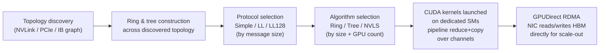

> NCCL (pronounced "nickel") turns "add up gradients across 512 GPUs" into a working sequence of CUDA kernels and network transfers. It's production infrastructure, sitting underneath PyTorch DDP/FSDP, Megatron-LM and DeepSpeed. When a distributed job hangs or runs at half the expected bandwidth, the answer is almost always somewhere in NCCL's internals. Current as of 2026 (NCCL 2.2x line).

## The headline numbers

- Ring all-reduce moves `2(N-1)/N × data_size` bytes per GPU whatever `N` is. That's asymptotically bandwidth-optimal, and NCCL's ring algorithm is built to hit it in practice.
- On an 8-GPU NVLink4 node, NCCL ring all-reduce routinely reaches 80-90%+ of the theoretical 900 GB/s per-GPU NVLink bandwidth for large messages.
- Across nodes over InfiniBand NDR (~400 Gb/s ≈ 50 GB/s per GPU), well-tuned NCCL with GPUDirect RDMA gets within 80-90% of line rate. Misconfiguration (wrong HCA/GID selection) can halve that with no error.
- LL128 protocol overhead: ~1/8 of payload bandwidth goes to flags, compared with the pure bandwidth of the Simple protocol. That's what low latency on small messages costs.
- Default collective timeout in PyTorch's NCCL process group: ~30 minutes. This is the watchdog that fires on a true hang.

## How it actually works

**Topology discovery.** At init, NCCL probes the machine. Which GPUs share NVLink, which sit behind which PCIe switch, which NICs are visible and which GPU each is closest to (PCIe topology-aware NIC affinity), and what fabric links the nodes (InfiniBand or RoCE). It builds an internal graph and constructs communication patterns from it. This is the physical hierarchy from [[Concept - Anatomy of an AI Training Cluster]], discovered by code at runtime instead of known in advance.

**Ring and tree construction.** From the topology graph, NCCL builds one or more rings (bandwidth-optimal for large-message collectives) and trees (latency-optimal for small messages or high GPU counts) routed over the discovered links. [[Concept - All-Reduce and Collective Operations]] has the cost model each one optimizes. A ring moves `2(N-1)/N` of the data per GPU in `2(N-1)` sequential steps. A tree or recursive-doubling structure gives up some bandwidth efficiency for `O(log N)` latency, which wins when messages are small or `N` is large.

**Protocol selection.** For a given ring or tree, NCCL picks a wire protocol by message size:
- **Simple** maximizes bandwidth but has higher per-step latency, because of a full memory fence between steps.
- **LL** (low-latency) packs an 8-byte flag next to each 8-byte data word so completion can be detected without a fence. Half the wire bandwidth goes to flags.
- **LL128** is the NVLink-specific sweet spot: 120 bytes of every 128-byte line carry data and the rest are flags. Good latency, most of the bandwidth.

The size thresholds where NCCL switches between them are internal heuristics tuned empirically per generation. They're the kind of folklore number you find in NCCL source comments and mailing-list threads, not in papers.

**Algorithm selection: Ring vs Tree vs NVLS.** NVLS (NVLink SHARP) arrived with Hopper/Blackwell. The NVSwitch performs the reduction itself, so partial sums are computed by the switch fabric as data passes through instead of only by GPU ALUs. The reduce step is offloaded to network hardware; the wire isn't merely faster.

**Channels and SM usage.** NCCL isn't free. It launches CUDA kernels that use GPU SMs to drive copies and reductions over several parallel "channels" (independent ring/tree instances multiplexed for bandwidth). `NCCL_MIN_NCHANNELS`/`NCCL_MAX_NCHANNELS` trade communication bandwidth (more channels, more parallelism) against SM occupancy left for model compute. It's a resource-contention knob as much as a communication setting.

**SHARP for in-network reduction.** One level up, at the InfiniBand switch, SHARP (Scalable Hierarchical Aggregation and Reduction Protocol) offloads reductions into the IB fabric, cutting how many times data crosses the wire in a large all-reduce. It's the large-cluster counterpart to NVLS's intra-node version.

## The clever parts

1. **Runtime topology discovery instead of static configuration.** You don't describe your cluster's wiring. NCCL probes NVLink/PCIe/IB adjacency and NUMA affinity at startup and builds rings and trees itself, so the same training code moves from an 8-GPU dev box to a 10,000-GPU cluster without a rewrite.
2. **Protocol switching by message size (Simple/LL/LL128).** NCCL picks the latency/bandwidth tradeoff per message, so small and large gradient buckets both perform reasonably with no manual tuning. Gradient bucketing (fusing many small tensors into fewer large messages) still matters, because even LL128 pays a latency tax per message.
3. **NVLS puts the reduction in the switch.** Doing the addition in NVSwitch hardware, instead of on a GPU after it receives the data, is an architectural shift. It's the same "move compute to where the data already is" logic that [[Concept - The Memory Wall]] motivates for on-chip memory hierarchies, applied at the network switch.
4. **Hierarchical collectives that use the two-tier bandwidth split.** NCCL doesn't treat the cluster as flat. It reduces inside the node over NVLink (fast), then across nodes over IB/RoCE (slow), then broadcasts back down, which exploits the bandwidth cliff described in [[Concept - GPU Interconnects (NVLink, InfiniBand, RoCE)]].

## What it got wrong / what's dated

The tuning surface is large and under-documented in places. The Ring/Tree and Simple/LL/LL128 crossover thresholds are heuristics in the source, not published formulas, so practitioners rediscover them empirically for each cluster generation, and that costs time every time new hardware ships. RoCE needs correct PFC/ECN configuration on the switches, which NCCL can't check or fix. A misconfigured fabric collapses under congestion in a way that looks like an NCCL bug but is a network problem NCCL merely exposes. And the classic "works on one node, hangs across two" failure, traced to wrong HCA/GID selection on hosts with several NICs, is still a rite of passage for anyone standing up a new multi-node cluster. The discovery heuristics occasionally guess wrong about which NIC is closest to which GPU.

## What to steal

The lesson travels beyond NCCL. **Discover topology at runtime and fit the communication pattern to it instead of hand-coding an assumed layout.** Any distributed system that mixes link speeds can use this, and it's what makes cluster deployment portable. Second, **push reductions toward where bandwidth is scarcest**: in-switch for NVLS/SHARP, intra-node-then-inter-node everywhere. Reuse that whenever you design your own aggregation pipeline over a non-uniform network, instead of always centralizing compute.

## Connections
- [[Concept - All-Reduce and Collective Operations]] — the algorithmic layer (ring/tree cost models) NCCL is the concrete, production implementation of.
- [[Concept - The Memory Wall]] — the same "move compute to where data already is" logic that motivates NVLS in-switch reduction, applied here at the network-fabric level instead of the memory-hierarchy level.
- [[Concept - GPU Interconnects (NVLink, InfiniBand, RoCE)]] — the physical links (NVLink, IB, RoCE) NCCL discovers and routes collectives across.
- [[Concept - Network Topology for AI Clusters]] — the fat-tree/rail-optimized fabric design that determines what topology NCCL discovers at scale.
- [[Playbook - Debugging a Hung Distributed Training Job]] — the operational procedure that leans directly on `NCCL_DEBUG=INFO` output and NCCL's failure signatures.
- [[Concept - Data Parallelism and ZeRO]] — the training technique whose gradient/parameter all-reduce and all-gather/reduce-scatter calls NCCL executes underneath.
- [[Gotchas - Hardware Failures at Scale]] — hardware-level faults (bad NICs, ECC errors) that surface to the user as an NCCL hang or timeout.
- [[Concept - Fully Sharded Data Parallel (FSDP)]] — another PyTorch parallelism strategy whose all-gather/reduce-scatter traffic NCCL backs.
- [[Breakdown - Megatron-LM]] — a real large-scale training framework whose tensor/pipeline-parallel communication is implemented on top of NCCL.
- [[Concept - Anatomy of an AI Training Cluster]] — the physical GPU/node/rack hierarchy NCCL's topology discovery maps onto.
- [[Concept - The CUDA Moat]] — NCCL is part of what makes the CUDA ecosystem hard to replicate: it is deeply co-designed with NVIDIA's own interconnect hardware (NVLS, SHARP).

## Sources
- NVIDIA NCCL documentation and source (github.com/NVIDIA/nccl) — protocol (Simple/LL/LL128) and algorithm (Ring/Tree/NVLS) implementation details.
- Jeaugey, S. (NVIDIA, various GTC talks 2019-2023) — NCCL internals, ring/tree construction, and NVLS/SHARP design rationale.
