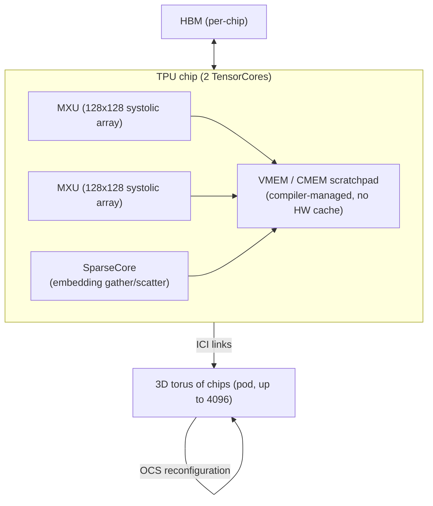

> The TPU is Google's in-house AI accelerator line, built since 2015 and now in its sixth-plus generation (Trillium/v6, with "Ironwood" v7 announced in 2025). It answers a question NVIDIA's GPUs answer differently: if you know your workload is overwhelmingly dense matmul, how much efficiency can you buy back by giving up generality? *(as of 2026)*

## The headline numbers

TPU v4 is the generation with the most public architectural detail (Jouppi et al. 2023, "TPU v4: An Optically Reconfigurable Supercomputer for Machine Learning with Hardware Support for Embeddings"), so it's the reference here:

| Metric | TPU v4 |
|---|---|
| Peak compute | ~275 BF16 TFLOP/s per chip (two TensorCores/chip, each with multiple MXUs) |
| MXU shape | 128x128 systolic array per unit |
| On-chip memory | Small VMEM/CMEM scratchpad, compiler-managed — no hardware cache |
| Pod size | Up to 4096 chips |
| Interconnect | ICI forms a 3D torus within the pod; optical circuit switches (OCS) reconfigure it |
| Programming model | XLA compile-first (JAX/TensorFlow), whole-program ahead-of-time compilation |
| Availability | Google Cloud only — no merchant silicon market |

Later generations (v5e, v5p, Trillium/v6, and Ironwood/v7 as of 2026) roughly follow the industry trend of doubling peak FLOPs and HBM bandwidth every one to two generations, and the line split into throughput-optimized (v5e-style) and peak-performance (v5p-style) SKUs. The comparative table is in [[Reference - AI Accelerator Landscape]]. Per-generation specs after v4 are mostly Google-disclosed marketing figures, not independently verified, so take them as directionally right and not exact.

## How it actually works

An NVIDIA GPU is a general-purpose SIMT processor with matmul accelerators bolted on. A TPU chip is built around the [[Concept - Systolic Arrays|systolic array]] as its *primary* compute primitive, and everything else on the chip exists to keep that array fed:

Operands stream in from the edges of the MXU and partial sums move through the grid, accumulating as they go. Each value loaded from SRAM is reused across a whole row or column of MAC units instead of being fetched again for every multiply, and that's where the systolic array's high FLOP/byte ratio comes from ([[Concept - Systolic Arrays]] has the general mechanism). Weights stay stationary in the array while activations stream through, a deliberate dataflow choice that gives up flexibility for reuse.

There's no hardware cache hierarchy like a GPU's L1/L2. XLA, the compiler, schedules every data movement between HBM and the VMEM scratchpad ahead of time, for the whole program graph. That's the biggest philosophical difference from CUDA. A GPU kernel makes decisions at runtime (branch, loop bound, dynamic shape). A TPU program is compiled once, in full, before it runs.

At pod level, chips connect over ICI (Inter-Chip Interconnect) in a 2D or 3D torus, up to 4096 chips in one TPU v4 pod. Optical circuit switches (OCS) sit at the torus boundary and can physically rewire which chips connect to which, both to route around failed chips and to reshape the torus for a job's communication pattern.

## The clever parts

- **Optical circuit switching for topology reconfiguration.** Most cluster interconnects (see [[Concept - Network Topology for AI Clusters]]) are fixed once cabled. Google's OCS lets software rewire the pod's torus: isolate a failed chip without recabling, or shape the torus for a particular collective pattern. It's a different architectural bet from the fixed fat-tree/Clos fabrics common in GPU clusters.
- **The SparseCore.** A dedicated unit for embedding-table gather/scatter. Dense systolic MXUs are terrible at that operation (irregular, memory-bound, not matmul-shaped), and recommendation-system and MoE-style workloads need it constantly. A merchant-silicon vendor serving many workloads is less likely to build a separate unit for it instead of pushing it through the MXU or a general core.
- **Whole-program static scheduling via XLA.** With no runtime scheduler making dynamic decisions, XLA can fuse the *entire* computation graph ahead of time and hand-place every buffer. That removes most of the launch-overhead and scheduling-overhead problems that plague dynamic-shape workloads on GPUs. [[Concept - Kernel Fusion]] covers the GPU-side version of the idea, done per kernel instead of per program.
- **bfloat16 as the native numeric format.** Google created [[Breakdown - bfloat16]] for TPU training: the same exponent range as FP32, so no loss scaling like FP16 needs, with a truncated mantissa. That hardware/numerics co-design later became an industry default well beyond Google's hardware (see [[Concept - Mixed Precision Training]]).
- **Weight-stationary dataflow at pod scale.** Holding weights fixed in the MXU while activations stream through, where some other accelerators use output-stationary or row-stationary dataflows, matches large dense transformer layers, which reuse the same weight matrix for every token in a batch.

## What it got wrong / what's dated

The static-scheduling bet that makes TPUs efficient on regular dense workloads makes them painful on irregular ones. Dynamic shapes, heavy data-dependent control flow, and anything that doesn't compile cleanly ahead of time fight the XLA model, and shape changes sometimes force recompilation with real wall-clock cost. Availability is GCP-only, so there's no merchant TPU market. You can't buy one, colocate it, or run it outside Google's cloud, which limits independent tooling and third-party optimization next to CUDA's much larger surface area ([[Concept - The CUDA Moat]] explains why that gap compounds over time). Long compile times also make the GPU researcher's debug loop (eager PyTorch, print a tensor mid-forward-pass) worse on TPU by default, though JAX has narrowed the gap with `jax.debug`-style tooling.

## What to steal

Static scheduling plus whole-program fusion is worth copying even if you never touch a TPU. `torch.compile`'s graph capture and CUDA graphs are both GPU-side attempts to claw back the launch-overhead and scheduling-overhead savings XLA gets by construction. Topology-aware collective design (know your interconnect's physical shape and route collectives to match) carries straight over to [[Concept - Network Topology for AI Clusters]] for GPU clusters, OCS or not. And the perf/watt case for specialization, where a systolic array beats a general SIMT core at its sweet spot and loses flexibility, is the same argument now playing out across the inference ASICs in [[Reference - AI Accelerator Landscape]].

## Connections
- [[Concept - Systolic Arrays]] — the compute primitive this entire breakdown is built around; read that note first for the general mechanism before this note's TPU-specific application.
- [[Concept - Kernel Fusion]] — XLA's whole-program static fusion is the same idea GPU-world fusion chases per-kernel; useful to see both sides of the tradeoff.
- [[Concept - The CUDA Moat]] — the ecosystem gap that keeps TPU a GCP-only niche despite competitive raw hardware, explained at the industry level.
- [[Reference - AI Accelerator Landscape]] — where the TPU sits in the broader comparison against GPUs, MI300X, and inference specialists.
- [[Concept - Tensor Cores]] — the GPU-world analog and direct point of contrast: many small flexible MMA units plus SIMT versus one large rigid systolic fabric.
- [[Concept - All-Reduce and Collective Operations]] — the collective algorithms that run over ICI, shaped by the torus topology rather than a fat-tree.
- [[Concept - Network Topology for AI Clusters]] — contrast the TPU pod's reconfigurable torus+OCS against the fixed Clos fabrics typical of GPU clusters.
- [[Reference - Model Genealogy]] — TPUs trained many of Google's own model lineages (PaLM, Gemini); useful for tracing which models were built on which hardware generation.
- [[Concept - Mixed Precision Training]] — the training-numerics discipline that bfloat16, invented for TPU, now underpins industry-wide.
- [[Breakdown - The NVIDIA Datacenter GPU (Hopper and Blackwell)]] — the direct rival architecture; read both breakdowns back to back to see where systolic-rigid and SIMT-flexible philosophies diverge.
- [[Decision - Selecting GPUs for Training and Inference]] — the practical decision this breakdown feeds: TPU is usually excluded from that decision's scope by the GCP-only constraint, but it's the reason "excluded" needs justifying.
- [[Breakdown - bfloat16]] — the numeric format TPU hardware was co-designed around, now a default far beyond Google's own chips.

## Sources
- Jouppi, N. et al. (2023) — "TPU v4: An Optically Reconfigurable Supercomputer for Machine Learning with Hardware Support for Embeddings" (ISCA 2023) — the primary source for the v4 architecture, OCS mechanism, and SparseCore.
- Jouppi, N. et al. (2017) — "In-Datacenter Performance Analysis of a Tensor Processing Unit" (ISCA 2017) — the original TPU v1 paper establishing the systolic MXU design and the weight-stationary dataflow choice.
