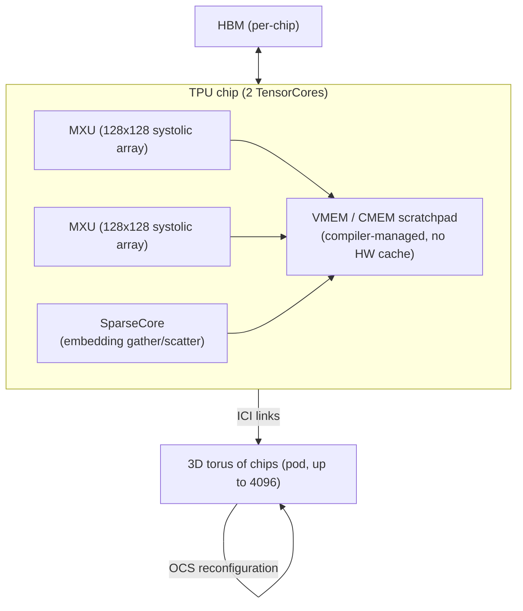

> The TPU is Google's in-house AI accelerator line, built since 2015 and now in its sixth-plus generation (Trillium/v6, with "Ironwood" v7 announced in 2025). It exists to answer a question NVIDIA's GPUs answer differently: if you know your workload is overwhelmingly dense matmul, how much efficiency can you buy back by giving up generality? *(as of 2026)*

## The headline numbers

TPU v4, the generation with the most public architectural detail (Jouppi et al. 2023, "TPU v4: An Optically Reconfigurable Supercomputer for Machine Learning with Hardware Support for Embeddings"), is the reference identity card:

| Metric | TPU v4 |
|---|---|
| Peak compute | ~275 BF16 TFLOP/s per chip (two TensorCores/chip, each with multiple MXUs) |
| MXU shape | 128x128 systolic array per unit |
| On-chip memory | Small VMEM/CMEM scratchpad, compiler-managed — no hardware cache |
| Pod size | Up to 4096 chips |
| Interconnect | ICI forms a 3D torus within the pod; optical circuit switches (OCS) reconfigure it |
| Programming model | XLA compile-first (JAX/TensorFlow), whole-program ahead-of-time compilation |
| Availability | Google Cloud only — no merchant silicon market |

Later generations (v5e, v5p, Trillium/v6, and Ironwood/v7 as of 2026) roughly track the industry-wide trend of doubling peak FLOPs and HBM bandwidth every one to two generations, alongside a split into throughput-optimized (v5e-style) and peak-performance (v5p-style) SKUs — see [[Reference - AI Accelerator Landscape]] for the comparative table. Exact per-generation specs beyond v4 are largely Google-disclosed marketing figures rather than independently-verified numbers, so treat them as directionally correct rather than exact.

## How it actually works

A TPU chip is not a general-purpose SIMT processor wearing a matmul accelerator, the way an NVIDIA GPU is. It is built around the [[Concept - Systolic Arrays|systolic array]] as the *primary* compute primitive, with everything else built to keep it fed:

Operands stream in from the edges of the MXU and partial sums march through the grid, accumulating as they go — each value loaded from SRAM is reused across an entire row or column of MAC units instead of being re-fetched per multiply, which is the source of the systolic array's high FLOP/byte ratio (see [[Concept - Systolic Arrays]] for the general mechanism). Weights are held stationary in the array while activations stream through — a deliberate dataflow choice that trades flexibility for reuse.

Above the chip, there is no hardware cache hierarchy comparable to a GPU's L1/L2 — instead, XLA (the compiler) statically schedules every data movement between HBM and the VMEM scratchpad ahead of time, for the entire program graph. This is the single biggest philosophical difference from CUDA: a GPU kernel makes dynamic decisions at runtime (branch, loop bound, dynamic shape); a TPU program is compiled once, in full, before it runs.

At the pod level, chips connect via ICI (Inter-Chip Interconnect) in a 2D or 3D torus topology — up to 4096 chips in one TPU v4 pod. Optical circuit switches (OCS) sit at the boundary of this torus and can physically reconfigure which chips are wired to which, both to route around failed chips and to reshape the torus for a given job's communication pattern.

## The clever parts

- **Optical circuit switching for topology reconfiguration.** Most cluster interconnects (see [[Concept - Network Topology for AI Clusters]]) are fixed once cabled. Google's OCS lets the pod's torus topology be rewired in software — isolating a failed chip without a physical recable, or shaping the torus for a specific collective pattern. This is a genuinely distinct architectural bet from the fixed fat-tree/Clos fabrics common in GPU clusters.
- **The SparseCore.** A dedicated unit for embedding-table gather/scatter — the operation dense systolic MXUs are terrible at (irregular, memory-bound, not matmul-shaped) but that recommendation-system and MoE-style workloads need constantly. Building a separate specialized unit for it, instead of forcing it through the MXU or falling back to a general core, is the kind of workload-specific hardware bet a merchant-silicon vendor targeting many workloads is less likely to make.
- **Whole-program static scheduling via XLA.** Because there's no runtime scheduler making dynamic decisions, XLA can fuse the *entire* computation graph ahead of time and hand-place every buffer, eliminating most of the launch-overhead and scheduling-overhead problems that plague dynamic-shape workloads on GPUs (see [[Concept - Kernel Fusion]] for the GPU-side version of the same idea, done per-kernel rather than per-program).
- **bfloat16 as the native numeric format.** Google originated the [[Breakdown - bfloat16]] format specifically for TPU training — same exponent range as FP32 (so it doesn't need loss scaling the way FP16 does) with a truncated mantissa. This is a hardware/numerics co-design decision that later became an industry-wide default, adopted well beyond Google's own hardware — see [[Concept - Mixed Precision Training]].
- **Weight-stationary dataflow at pod scale.** The choice to hold weights fixed in the MXU while activations stream through (rather than the output-stationary or row-stationary alternatives used by some other accelerators) matches the access pattern of large dense transformer layers, where the same weight matrix is reused across every token in a batch.

## What it got wrong / what's dated

The static-scheduling bet that makes TPUs efficient on regular dense workloads is the same bet that makes them painful on irregular ones: dynamic shapes, heavy data-dependent control flow, and anything that doesn't compile cleanly ahead of time fights the XLA model, sometimes forcing recompilation (with real wall-clock compile-time cost) on shape changes. The GCP-only availability means there is no merchant TPU market — you cannot buy one, colocate it, or run it outside Google's cloud, which caps the ecosystem's independent tooling and third-party optimization compared to CUDA's much larger surface area (see [[Concept - The CUDA Moat]] for why that ecosystem gap compounds over time, not just at a point in time). Long compile times also mean the debug/iterate loop researchers are used to on GPUs (eager PyTorch, print-debug a tensor mid-forward-pass) is a worse experience on TPU by default, even though JAX has narrowed this gap with `jax.debug`-style tooling.

## What to steal

The static-scheduling-plus-whole-program-fusion mindset transfers even if you never touch a TPU: `torch.compile`'s graph capture and CUDA graphs are both GPU-world attempts to claw back the same launch-overhead and scheduling-overhead savings that XLA gets by construction. Topology-aware collective design — knowing your interconnect's physical shape and routing collectives to match it — is directly transferable to designing [[Concept - Network Topology for AI Clusters]] for GPU clusters, even without an OCS. And the perf/watt argument for specialization (a systolic array beats a general SIMT core at its sweet spot, at the cost of flexibility) is the same argument now playing out across the whole [[Reference - AI Accelerator Landscape]] of inference ASICs.

## Connections
- [[Concept - Systolic Arrays]] — the compute primitive this entire breakdown is built around; read that note first for the general mechanism before this note's TPU-specific application.
- [[Concept - Kernel Fusion]] — XLA's whole-program static fusion is the same idea GPU-world fusion chases per-kernel; useful to see both sides of the tradeoff.
- [[Concept - The CUDA Moat]] — the ecosystem gap that keeps TPU a GCP-only niche despite competitive raw hardware, explained at the industry level.
- [[Reference - AI Accelerator Landscape]] — where the TPU sits in the broader comparison against GPUs, MI300X, and inference specialists.
- [[Concept - Tensor Cores]] — the GPU-world analog and direct point of contrast: many small flexible MMA units plus SIMT versus one large rigid systolic fabric.
- [[Concept - All-Reduce and Collective Operations]] — the collective algorithms that run over ICI, shaped by the torus topology rather than a fat-tree.
- [[Concept - Network Topology for AI Clusters]] — contrast the TPU pod's reconfigurable torus+OCS against the fixed Clos fabrics typical of GPU clusters.
- [[Reference - Model Genealogy]] — TPUs trained many of Google's own model lineages (PaLM, Gemini); useful for tracing which models were built on which hardware generation.
- [[Concept - Mixed Precision Training]] — the training-numerics discipline that bfloat16, invented for TPU, now underpins industry-wide.
- [[Breakdown - The NVIDIA Datacenter GPU (Hopper and Blackwell)]] — the direct rival architecture; read both breakdowns back to back to see where systolic-rigid and SIMT-flexible philosophies diverge.
- [[Decision - Selecting GPUs for Training and Inference]] — the practical decision this breakdown feeds: TPU is usually excluded from that decision's scope by the GCP-only constraint, but it's the reason "excluded" needs justifying.
- [[Breakdown - bfloat16]] — the numeric format TPU hardware was co-designed around, now a default far beyond Google's own chips.

## Sources
- Jouppi, N. et al. (2023) — "TPU v4: An Optically Reconfigurable Supercomputer for Machine Learning with Hardware Support for Embeddings" (ISCA 2023) — the primary source for the v4 architecture, OCS mechanism, and SparseCore.
- Jouppi, N. et al. (2017) — "In-Datacenter Performance Analysis of a Tensor Processing Unit" (ISCA 2017) — the original TPU v1 paper establishing the systolic MXU design and the weight-stationary dataflow choice.
