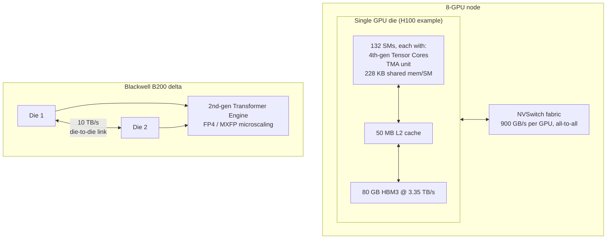

> Almost every frontier lab trains and serves on NVIDIA's datacenter GPU line. Hopper (H100, 2022; H200, 2023) and Blackwell (B200/GB200, 2024, shipping at volume through 2025-2026) each change how data moves between HBM and the compute units, which is the real bottleneck per [[Concept - The Memory Wall]]. They aren't clock-speed bumps on Ampere. This note covers what sits under the spec-sheet numbers, current as of 2026.

## The headline numbers

| | H100 SXM5 | H200 | B200 | GB200 (per B200) |
|---|---|---|---|---|
| SMs | 132 | 132 | ~2x H100 (dual-die) | same as B200 |
| Dense BF16 TFLOP/s | ~989 | ~989 | ~2.2x H100 training throughput | same |
| Dense FP8 TFLOP/s | ~1979 | ~1979 | ~2x B200 BF16 | same |
| FP4 (new) | — | — | yes, ~2x FP8 | yes |
| HBM capacity | 80 GB HBM3 | 141 GB HBM3e | 192 GB HBM3e | 192 GB + Grace CPU LPDDR |
| HBM bandwidth | ~3.35 TB/s | ~4.8 TB/s | ~8 TB/s | ~8 TB/s |
| L2 cache | 50 MB | 50 MB | larger (dual-die) | — |
| NVLink | NVLink4, 900 GB/s/GPU | 900 GB/s/GPU | NVLink5, 1.8 TB/s/GPU | 1.8 TB/s/GPU |
| TDP | 700 W | 700 W | ~1000 W+ | higher (paired w/ Grace) |

For [[Concept - The Roofline Model|roofline]] reasoning the number that matters most is the ridge point. H100's ~989 TFLOP/s over ~3.35 TB/s gives ~295 FLOP/byte: each loaded byte has to be reused roughly 300 times before a kernel is compute-bound. Blackwell's HBM bandwidth grows (~8 TB/s), but with FP4 its FLOPs grow faster, so the ridge point keeps climbing. A growing share of real transformer kernels (norms, softmax, small attention heads) lands on the memory-bound side even as peak FLOPs balloon.

## How it actually works

**SM and tensor-core structure.** An H100 has 132 streaming multiprocessors, each with 4th-generation [[Concept - Tensor Cores]] that execute warpgroup-async `wgmma` instructions, a step up from Ampere's per-warp `mma.sync`. In the [[Concept - GPU Memory Hierarchy]], each SM tops out at ~228 KB of shared memory (Hopper's high end), and that caps the tile sizes you can feed the tensor cores.

**TMA, the async data-movement unit.** For kernel writers, the most consequential thing Hopper added is the Tensor Memory Accelerator. One instruction issues a bulk, multidimensional, strided copy between global and shared memory asynchronously and signals completion through an `mbarrier`, so the issuing thread doesn't block. Before TMA, getting a tile into shared memory meant every thread cooperatively issuing loads. TMA hands that to dedicated hardware and frees compute threads to keep the tensor cores fed. It's the hardware half of [[Concept - Warp Specialization and Async Pipelines on Hopper]]: producer warpgroups issue TMA loads, consumer warpgroups run `wgmma`, and the two overlap in a software pipeline.

**Thread-block clusters and distributed shared memory.** Hopper adds a scheduling tier above the thread block. A cluster of blocks (typically up to 16) is scheduled together across SMs and can read each other's shared memory directly (distributed shared memory), so a kernel's working set can span several SMs' fast memory without a trip through L2 or HBM.

**The Transformer Engine.** Hopper's FP8 tensor cores (E4M3/E5M2) come with software, the Transformer Engine, that tracks per-tensor amax history and picks scale factors automatically each step ("delayed scaling"). Raw FP8 has too little dynamic range to hold activations without it (see [[Concept - FP8 and Low-Precision Hardware Formats]]). Blackwell's 2nd-generation Transformer Engine goes further with **microscaling (MX)** formats, which share one exponent per block of ~32 elements instead of per tensor. That's what makes FP4 usable at all; one scale factor for a whole tensor at 4 bits of mantissa would be far too coarse.

**Blackwell's dual-die packaging.** B200 is two reticle-limited dies joined by a 10 TB/s die-to-die interconnect and presented to software as one GPU. It follows from the [[Concept - The Memory Wall|memory wall]]/capacity wall: one die can't host enough SMs and HBM controllers to keep scaling, so NVIDIA scaled sideways.

**GB200 and the rack turn.** A GB200 pairs a Grace ARM CPU with two B200 GPUs over a coherent NVLink-C2C link. GB200 NVL72 puts 72 B200s in one NVLink5 domain (~130 TB/s bisection) that software sees as something close to one giant GPU. [[Concept - Rack-Scale Systems and NVLink Domains]] covers what that changes about parallelism placement.

## The clever parts

1. **TMA + `wgmma` async pipelining.** Decoupling data movement from compute at the instruction level, instead of only adding shared memory or cache, let FlashAttention-3 (Shah et al., 2024) reach ~75% of H100 peak against FlashAttention-2's ~50-70% on the same hardware. That gain is all overlap. The algorithm stayed the same; what changed was the ability to hide TMA latency behind `wgmma`.
2. **Microscaling over per-tensor scaling.** Per-block exponent sharing is the idea that makes FP4 viable for real workloads and not just a spec-sheet number. A little extra metadata buys enough dynamic range to keep outlier activations representable within a block, the same outlier problem [[Concept - Post-Training Quantization Formats|LLM.int8]] solved for int8.
3. **Dual-die scaling instead of a bigger single die.** NVIDIA took on a 10 TB/s inter-die link and the NUMA-like effects across it instead of chasing reticle limits, and kept the FLOPs/HBM growth curve going. The same "scale sideways" logic drives NVLink domains at the rack level.
4. **DPX instructions.** Hopper added instructions for dynamic-programming inner loops (max-plus, min-plus recurrences). It's a narrow but real bet that some non-GEMM workloads (genomics, routing) deserve silicon too, apart from the transformer-centric rest of the chip.
5. **Delayed scaling in the Transformer Engine.** Scale factors come from a rolling history of recent amax values instead of being computed fresh each step, which would cost an extra full pass over the tensor. It's a pragmatic latency/accuracy trade that makes FP8 training tractable without a separate calibration pass.

## What it got wrong / what's dated

**The 2:4 structured sparsity "2x"** carried over from Ampere is still mostly a marketing asterisk in production. It needs a specific pruning pattern and a recovery fine-tune that most teams skip, so realized throughput rarely gets near the advertised doubling.

**FP4 accuracy is on the edge.** Microscaling narrows the outlier problem without eliminating it, and calibration failures show up as silent accuracy loss instead of a crash. That makes FP4 riskier to adopt blind than FP8 was.

**Liquid cooling is what actually blocks Blackwell deployment at rack scale.** GB200 NVL72 racks run at roughly 120 kW, well past what air cooling can remove. Retrofitting datacenters for liquid cooling, or building new ones, is a slower and more capital-intensive bottleneck than silicon supply.

**Allocation politics** (who gets H100/B200 supply, at what price, on what timeline) has decided who trains frontier models as much as the chip's raw specs. The hardware story and the market story ([[Reference - The AI Hardware Market]]) can't be separated as of 2026.

## What to steal

Two ideas carry over to your own kernel and systems work, NVIDIA or not. First, **overlapping async memory movement with compute is now table stakes for peak performance**, and it isn't a Hopper-specific trick. Any kernel-optimization effort (Triton, CUTLASS, or a custom accelerator) should start by asking whether data movement overlaps the math or is serialized with it. Second, **co-designing numeric formats with hardware (block scaling, mixed precision, Transformer Engine-style automatic scale tracking) is now a throughput lever as big as algorithmic changes.** [[Concept - Mixed Precision Training]] and [[Concept - FP8 and Low-Precision Hardware Formats]] show how to apply it in your own training and serving stacks; [[Concept - Post-Training Quantization Formats]] is the inference-side analog.

## Connections
- [[Concept - Tensor Cores]] — the general tensor-core mechanism this note traces across four hardware generations.
- [[Concept - GPU Memory Hierarchy]] — the registers/shared-memory/L2/HBM pyramid whose exact capacities and bandwidths this note supplies per-chip.
- [[Concept - The Memory Wall]] — the underlying FLOP:bandwidth gap this note's ridge-point numbers quantify per generation, and the reason dual-die packaging and rack-scale NVLink exist.
- [[Concept - The Roofline Model]] — the framework for reading the ridge-point number (~295 FLOP/byte on H100) computed from this chip's own FLOPs and bandwidth.
- [[Concept - GPU Interconnects (NVLink, InfiniBand, RoCE)]] — NVLink4 vs NVLink5's aggregate bandwidth per GPU, the scale-up half of the interconnect story.
- [[Concept - Rack-Scale Systems and NVLink Domains]] — what happens when you extend Blackwell's NVLink5 fabric to 72 GPUs as one coherent domain.
- [[Concept - FP8 and Low-Precision Hardware Formats]] — the numeric formats the Transformer Engine implements in hardware.
- [[Concept - Warp Specialization and Async Pipelines on Hopper]] — the kernel-design pattern (producer/consumer warpgroups) that TMA and `wgmma` exist to enable.
- [[Reference - AI Accelerator Landscape]] — how these chips compare to TPUs, MI300X, and inference specialists on the same axes.
- [[Deep Dive - FlashAttention]] — the algorithm whose v3 revision is the clearest public proof that Hopper's async pipeline hardware translates into real speedup.
- [[Concept - Mixed Precision Training]] — the training technique the Transformer Engine's automatic scaling exists to support.
- [[Reference - The AI Hardware Market]] — the supply, pricing, and allocation dynamics around this hardware that are inseparable from its technical story.
- [[Concept - Post-Training Quantization Formats]] — the inference-side quantization formats that consume FP4/FP8 hardware support at serving time.

## Sources
- NVIDIA Hopper Architecture Whitepaper (2022) — H100 SM structure, TMA, thread-block clusters, Transformer Engine.
- NVIDIA Blackwell Architecture Whitepaper (2024) — B200 dual-die design, 2nd-gen Transformer Engine, MX formats, NVLink5.
- Shah, J. et al. (2024) — "FlashAttention-3: Fast and Accurate Attention with Asynchrony and Low-precision" — the public proof point for TMA/wgmma overlap reaching ~75% of H100 peak.
