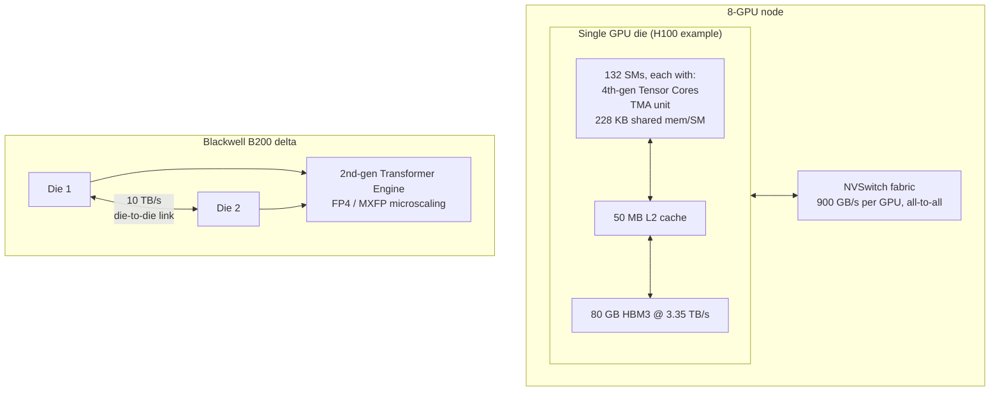

> NVIDIA's datacenter GPU line is the substrate almost every frontier lab trains and serves on. Hopper (H100, 2022; H200, 2023) and Blackwell (B200/GB200, 2024, shipping at volume through 2025-2026) are not just clock-speed bumps on Ampere — each generation changes how data moves between HBM and the compute units, which is the actual bottleneck per the [[Concept - The Memory Wall]]. This note is what's under the spec-sheet numbers, current as of 2026.

## The headline numbers

| | H100 SXM5 | H200 | B200 | GB200 (per B200) |
|---|---|---|---|---|
| SMs | 132 | 132 | ~2x H100 (dual-die) | same as B200 |
| Dense BF16 TFLOP/s | ~989 | ~989 | ~2.2x H100 training throughput | same |
| Dense FP8 TFLOP/s | ~1979 | ~1979 | ~2x B200 BF16 | same |
| FP4 (new) | — | — | yes, ~2x FP8 | yes |
| HBM capacity | 80 GB HBM3 | 141 GB HBM3e | 192 GB HBM3e | 192 GB + Grace CPU LPDDR |
| HBM bandwidth | ~3.35 TB/s | ~4.8 TB/s | ~8 TB/s | ~8 TB/s |
| L2 cache | 50 MB | 50 MB | larger (dual-die) | — |
| NVLink | NVLink4, 900 GB/s/GPU | 900 GB/s/GPU | NVLink5, 1.8 TB/s/GPU | 1.8 TB/s/GPU |
| TDP | 700 W | 700 W | ~1000 W+ | higher (paired w/ Grace) |

The number that matters most for [[Concept - The Roofline Model|roofline]] reasoning is the ridge point: H100's ~989 TFLOP/s over ~3.35 TB/s gives ~295 FLOP/byte — you must reuse each loaded byte roughly 300 times to be compute-bound. Blackwell's HBM bandwidth grows (~8 TB/s) but FLOPs grow faster with FP4, so the ridge point keeps climbing, meaning an ever-larger share of real transformer kernels (norms, softmax, small attention heads) fall on the memory-bound side of the roofline even as peak FLOPs balloon.

## How it actually works

**SM and tensor-core structure.** An H100 has 132 streaming multiprocessors, each carrying 4th-generation [[Concept - Tensor Cores]] that execute warpgroup-async `wgmma` instructions — a step up from Ampere's per-warp `mma.sync`. The [[Concept - GPU Memory Hierarchy]] per SM tops out at ~228 KB of shared memory (Hopper's high end), which directly caps the tile sizes fed to those tensor cores.

**TMA — the async data-movement unit.** Hopper's single most consequential addition for kernel writers is the Tensor Memory Accelerator: one instruction issues a bulk, multidimensional, strided copy between global memory and shared memory asynchronously, signaling completion via an `mbarrier` instead of blocking the issuing thread. Before TMA, moving a tile into shared memory meant every thread cooperatively issuing loads; TMA offloads that entirely to dedicated hardware, freeing compute threads to keep tensor cores fed. This is the hardware half of [[Concept - Warp Specialization and Async Pipelines on Hopper]] — producer warpgroups issue TMA loads, consumer warpgroups run `wgmma`, and the two overlap in a software pipeline.

**Thread-block clusters and distributed shared memory.** Hopper introduces a scheduling tier above the thread block: a cluster of blocks (typically up to 16) can be scheduled together across SMs and access each other's shared memory directly (distributed shared memory), letting a kernel's working set span multiple SMs' worth of fast memory without going through L2 or HBM.

**The Transformer Engine.** Hopper's FP8 tensor cores (E4M3/E5M2) are paired with software — the Transformer Engine — that tracks per-tensor amax history and picks scale factors automatically each step ("delayed scaling"), because raw FP8 has too little dynamic range to hold activations without it (see [[Concept - FP8 and Low-Precision Hardware Formats]]). Blackwell's 2nd-generation Transformer Engine moves this further: **microscaling (MX)** formats share one exponent per block of ~32 elements instead of per tensor, which is what lets FP4 be usable at all — a single scale factor for an entire tensor at 4 bits of mantissa would be far too coarse.

**Blackwell's dual-die packaging.** B200 is not one monolithic die — it's two reticle-limited dies connected by a 10 TB/s die-to-die interconnect, presented to software as a single GPU. This is a direct consequence of the [[Concept - The Memory Wall|memory wall]]/capacity wall: a single die can no longer host enough SMs and HBM controllers to keep scaling, so NVIDIA scaled sideways instead.

**GB200 and the rack turn.** A GB200 pairs a Grace ARM CPU with two B200 GPUs over a coherent NVLink-C2C link, and GB200 NVL72 racks 72 B200s together inside one NVLink5 domain (~130 TB/s bisection), presented to software as close to one giant GPU — see [[Concept - Rack-Scale Systems and NVLink Domains]] for what that changes about parallelism placement.

## The clever parts

1. **TMA + `wgmma` async pipelining.** Decoupling data movement from compute at the instruction level (not just via more shared memory or bigger caches) is what let FlashAttention-3 (Shah et al., 2024) reach ~75% of H100 peak versus FlashAttention-2's ~50-70% on the same hardware, purely from better overlap — the algorithm didn't change, the ability to hide TMA latency behind `wgmma` did.
2. **Microscaling over per-tensor scaling.** Per-block (rather than per-tensor) exponent sharing is the specific idea that makes FP4 viable for real workloads instead of a marketing number — it trades a small amount of extra metadata for enough dynamic range to keep outlier activations representable within a block, echoing the same outlier problem [[Concept - Post-Training Quantization Formats|LLM.int8]] solved for int8.
3. **Dual-die scaling instead of a bigger single die.** Rather than chase reticle limits, NVIDIA accepted the complexity of a 10 TB/s inter-die link and NUMA-like effects across it, in exchange for continuing the FLOPs/HBM growth curve — the same "scale sideways" logic that motivates NVLink domains at the rack level.
4. **DPX instructions.** Hopper added dedicated instructions for dynamic-programming inner loops (max-plus, min-plus recurrences) — a narrow but real bet that some non-GEMM workloads (genomics, routing) deserve silicon too, distinct from the transformer-centric rest of the chip.
5. **Delayed scaling in the Transformer Engine.** Choosing scale factors from a rolling history of recent amax values, rather than computing them fresh each step (which would require an extra full pass over the tensor), is a pragmatic latency/accuracy tradeoff that makes FP8 training tractable without a separate calibration pass.

## What it got wrong / what's dated

The **2:4 structured sparsity "2x"** carried over from Ampere is still mostly a marketing asterisk in production — it requires a specific pruning pattern and a recovery fine-tune that most teams skip, so realized throughput rarely approaches the advertised doubling. **FP4 accuracy is genuinely on the edge**: microscaling narrows but doesn't eliminate the outlier problem, and calibration failures show up as silent accuracy degradation rather than a crash, making FP4 riskier to adopt blind than FP8 was. **Liquid cooling is the real deployment blocker for Blackwell at rack scale** — GB200 NVL72 racks run at roughly 120 kW, well past what air cooling can dissipate, and retrofitting datacenters for liquid cooling (or building new ones) is a slower, more capital-intensive bottleneck than silicon supply. Finally, **allocation politics** — who gets H100/B200 supply, at what price, on what timeline — has been as decisive for who trains frontier models as the chip's raw specs; the hardware story and the market story (see [[Reference - The AI Hardware Market]]) are inseparable as of 2026.

## What to steal

Even outside NVIDIA silicon, two ideas transfer directly to your own kernel and systems work: **async memory movement overlapped with compute is now table stakes for peak performance**, not a Hopper-specific trick — any kernel-optimization effort (Triton, CUTLASS, or a custom accelerator) should ask "is data movement overlapped with math, or serialized with it?" before anything else. And **numeric-format co-design with hardware (block scaling, mixed precision, Transformer Engine-style automatic scale tracking) is now a first-class throughput lever on par with algorithmic changes** — see [[Concept - Mixed Precision Training]] and [[Concept - FP8 and Low-Precision Hardware Formats]] for how to apply the same logic in your own training and serving stacks, and [[Concept - Post-Training Quantization Formats]] for the inference-side analog.

## Connections
- [[Concept - Tensor Cores]] — the general tensor-core mechanism this note traces across four hardware generations.
- [[Concept - GPU Memory Hierarchy]] — the registers/shared-memory/L2/HBM pyramid whose exact capacities and bandwidths this note supplies per-chip.
- [[Concept - The Memory Wall]] — the underlying FLOP:bandwidth gap this note's ridge-point numbers quantify per generation, and the reason dual-die packaging and rack-scale NVLink exist.
- [[Concept - The Roofline Model]] — the framework for reading the ridge-point number (~295 FLOP/byte on H100) computed from this chip's own FLOPs and bandwidth.
- [[Concept - GPU Interconnects (NVLink, InfiniBand, RoCE)]] — NVLink4 vs NVLink5's aggregate bandwidth per GPU, the scale-up half of the interconnect story.
- [[Concept - Rack-Scale Systems and NVLink Domains]] — what happens when you extend Blackwell's NVLink5 fabric to 72 GPUs as one coherent domain.
- [[Concept - FP8 and Low-Precision Hardware Formats]] — the numeric formats the Transformer Engine implements in hardware.
- [[Concept - Warp Specialization and Async Pipelines on Hopper]] — the kernel-design pattern (producer/consumer warpgroups) that TMA and `wgmma` exist to enable.
- [[Reference - AI Accelerator Landscape]] — how these chips compare to TPUs, MI300X, and inference specialists on the same axes.
- [[Deep Dive - FlashAttention]] — the algorithm whose v3 revision is the clearest public proof that Hopper's async pipeline hardware translates into real speedup.
- [[Concept - Mixed Precision Training]] — the training technique the Transformer Engine's automatic scaling exists to support.
- [[Reference - The AI Hardware Market]] — the supply, pricing, and allocation dynamics around this hardware that are inseparable from its technical story.
- [[Concept - Post-Training Quantization Formats]] — the inference-side quantization formats that consume FP4/FP8 hardware support at serving time.

## Sources
- NVIDIA Hopper Architecture Whitepaper (2022) — H100 SM structure, TMA, thread-block clusters, Transformer Engine.
- NVIDIA Blackwell Architecture Whitepaper (2024) — B200 dual-die design, 2nd-gen Transformer Engine, MX formats, NVLink5.
- Shah, J. et al. (2024) — "FlashAttention-3: Fast and Accurate Attention with Asynchrony and Low-precision" — the public proof point for TMA/wgmma overlap reaching ~75% of H100 peak.
