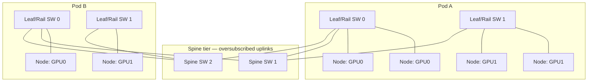

# Concept - Network Topology for AI Clusters

> **One-paragraph hook:** An InfiniBand NIC's line rate is a fixed, advertised number. The bandwidth a training job gets out of the scale-out fabric during an all-reduce depends on how thousands of those NICs are wired together, and two clusters with identical per-link bandwidth can differ 2-4x in achieved collective throughput from topology and job placement alone. Past a few hundred GPUs, [[Concept - Anatomy of an AI Training Cluster|the cluster's]] scale-out network stops being "a switch" and becomes its own engineering discipline, built on the non-blocking-fabric theory telephone networks worked out decades ago.

## The mechanism

The standard scale-out fabric for 10k-100k GPU clusters is a **fat-tree / Clos** topology: a multi-tier switch hierarchy (typically leaf → spine → core, 2-3 tiers) built on the non-blocking multistage switching theory Charles Clos formalized for telephone exchanges in 1953. "Fat" refers to *effective* bandwidth toward the root, which comes from adding more parallel equal-bandwidth paths at each higher tier, not physically fatter links. A fully **non-blocking** (1:1 subscription) Clos fabric guarantees any permutation of endpoints can talk at full line rate at once. That's the theoretical ideal and the expensive one.

**Rail-optimized wiring** uses the fact that each [[Concept - Anatomy of an AI Training Cluster|training node]] has several GPUs, each with its own NIC. Instead of wiring every NIC into a shared pool of leaf switches, the design dedicates switch fabric per GPU index: GPU 0 on every node goes into "rail 0," GPU 1 into "rail 1," and so on. In [[Concept - All-Reduce and Collective Operations|ring all-reduce]], same-rank GPUs across nodes talk to each other (rank $i$ owns chunk $i$ of the reduction), so with rail alignment that traffic stays on one dedicated rail and never hops across shared switches. Fewer hops, less contention, and bandwidth that gets close to the ring's theoretical $2(N-1)/N$ bytes-per-GPU bound instead of sagging under cross-rail congestion.

**Oversubscription** is the main cost lever. A fully non-blocking fabric at every tier is expensive, so the upper tiers (spine, core) are commonly built with fewer uplinks than 1:1 would need; 2:1 or 4:1 oversubscription is typical. That's fine while most traffic stays inside a well-connected leaf group (a "pod"). Once a job's collective spans several pods, the oversubscribed uplinks between them can't carry full line rate from every leaf at once, and they become the limit.

Other designs push further. **Dragonfly** topologies (Kim, Dally, Scott, Abts, 2008) cut network diameter by grouping routers so any two groups are one hop apart, giving up path diversity for fewer switch traversals; it's a classic HPC interconnect choice. Google's TPU pods use an **optical circuit switch (OCS)**. Instead of a fixed electrical topology, the OCS physically re-patches optical links to reconfigure the pod's ICI torus, so the fabric can route around a failed chip or link with no static rewiring (Jouppi et al., 2023, on TPU v4's optically reconfigurable interconnect). See [[Breakdown - The Google TPU]].

**Congestion control** matters because RoCEv2 (RDMA over Converged Ethernet) needs a lossless transport. Priority Flow Control (PFC) pauses upstream senders before a switch buffer overflows, and Explicit Congestion Notification (ECN) tells senders to back off early. Misconfigured PFC thresholds cause pause-frame storms that cascade back through the fabric, with head-of-line blocking spreading to unrelated flows. [[Concept - Mixture of Experts Architecture|MoE all-to-all]] traffic is the worst case: every GPU sends to every expert at once, and the many-to-many incast burst can overwhelm switch buffers even on a well-provisioned, non-oversubscribed fabric.

## In practice

Production clusters at 10k-100k+ GPUs (see [[Concept - Anatomy of an AI Training Cluster]]) standardize on 2-3 tier Clos fabrics. Switch radix (ports per switch) and total cable count both scale roughly with GPU count times tier depth. Copper reaches a few meters over direct-attach cable, so the spine/core tiers switch to active optical cables and transceivers, and that's where the cost piles up. Rail-optimized wiring per the NVIDIA DGX SuperPOD/BasePOD reference designs is now standard because it makes ring-based [[Concept - All-Reduce and Collective Operations|all-reduce]] performance predictable instead of dependent on which switches happen to be free. Topology-aware schedulers (Slurm's topology plugin, Kubernetes network-aware scheduling extensions) try to pack a job's ranks into one pod or leaf group so they don't cross oversubscribed uplinks. [[Concept - GPU Orchestration on Kubernetes|GPU-aware Kubernetes scheduling]] follows the same principle more broadly.

## Failure modes

**Oversubscription throttling cross-pod collectives.** Symptom: achieved all-reduce bandwidth falls off a cliff once a job's ranks span more than one leaf group/pod. Cause: the shared uplinks between pods can't sustain full line-rate traffic from every leaf simultaneously. Detection: per-rank bandwidth telemetry showing a step-function drop correlated with job placement, not with any single broken link.

**Incast/PFC storm from MoE all-to-all traffic.** Symptom: intermittent stalls or throughput collapse specifically during expert-dispatch phases. Cause: simultaneous many-to-many bursts overwhelm switch buffers, triggering cascading PFC pause frames. Detection: switch-side PFC pause-frame counters and buffer-drop statistics spiking in correlation with MoE layers.

**Topology-unaware job placement.** Symptom: a job runs correctly but with elevated, high-variance step time and no single identifiable broken component. Cause: the scheduler placed ranks across distant failure domains/pods, adding hops and cross-pod contention to every collective. Detection: compare achieved collective bandwidth against the topology's known non-blocking bandwidth for the actual rank placement, not the fabric's advertised peak.

**Blast radius from a spine failure.** Losing a spine switch removes redundant paths and degrades throughput cluster-wide without crashing anything. That's more dangerous than an outright failure, because the job silently runs slower instead of erroring. When step time degrades with no obvious cause, cross-check [[Gotchas - Hardware Failures at Scale]] and the topology-aware diagnosis steps in [[Playbook - Debugging a Hung Distributed Training Job]].

## The non-obvious

Folklore, well-corroborated: the per-link bandwidth on a switch's spec sheet matters far less than whether the fabric is rail-aligned and non-oversubscribed *for the job placement actually in use*. Two clusters built from identical switches and NICs can differ 2-4x in achieved all-reduce bandwidth because one uses rail-optimized wiring with topology-aware scheduling and the other doesn't. "GPU-hours" or "peak cluster FLOPs" are unreliable proxies for training throughput unless you know the fabric and how jobs land on it. Cloud providers and labs treat their exact topology and rail mapping as a competitive detail for the same reason, and keep it off the marketing spec.

## Connections
- [[Concept - Anatomy of an AI Training Cluster]] — the physical hierarchy (node → rack → pod → datacenter) that this topology connects at the pod-and-above scale.
- [[Concept - GPU Interconnects (NVLink, InfiniBand, RoCE)]] — the individual link technologies (InfiniBand NDR, RoCEv2) that this topology wires together into a fabric.
- [[Concept - All-Reduce and Collective Operations]] — the workload this topology exists to serve efficiently; rail alignment directly determines achievable ring all-reduce bandwidth.
- [[Breakdown - NCCL]] — the library whose topology-detection and ring/tree algorithm selection has to match the physical fabric described here to perform well.
- [[Gotchas - Hardware Failures at Scale]] — the failure taxonomy this topology's blast-radius design is meant to contain.
- [[Concept - Tensor and Pipeline Parallelism]] — the parallelism strategy decisions (what crosses the network vs. stays on NVLink) that determine how sensitive a job is to this topology's oversubscription.
- [[Concept - GPU Orchestration on Kubernetes]] — where topology-aware scheduling is implemented in practice to keep a job's ranks within one well-connected failure domain.
- [[Deep Dive - The AI Compute Buildout]] — the industry-scale buildout narrative in which this exact fat-tree/rail-optimized/OCS engineering is what's physically being constructed.

## Sources
- Clos, C. (1953) — "A Study of Non-Blocking Switching Networks" — the original non-blocking multistage switching theory underlying fat-tree/Clos fabrics.
- Kim, J., Dally, W.J., Scott, S., Abts, D. (2008) — "Technology-Driven, Highly-Scalable Dragonfly Topology" — the low-diameter dragonfly interconnect design.
- Jouppi, N. et al. (2023) — "TPU v4: An Optically Reconfigurable Supercomputer for Machine Learning with Hardware Support for Embeddings" (ISCA) — the optical circuit switch reconfigurable-topology design.
