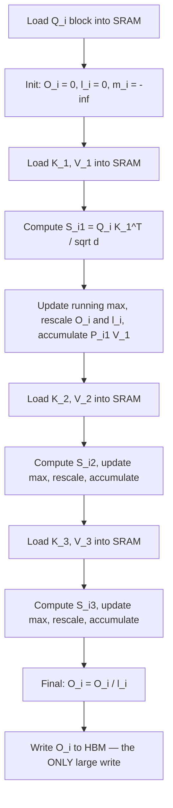

# Deep Dive - FlashAttention

> Naive [[Concept - Attention Mechanism|attention]] computes $S = QK^T$, writes the full $N \times N$ score matrix to HBM, reads it back for softmax, writes the $N \times N$ probability matrix back, and reads that again for the output matmul. For an 8k-token sequence that's tens of millions of entries per head, round-tripped through HBM several times, and each one lives only long enough to be exponentiated and thrown away. FlashAttention (Dao et al. 2022) restructures the computation so that matrix never exists in HBM. It streams $Q$, $K$, $V$ through SRAM in tiles, computes softmax incrementally with a running max and sum, and writes only the final $O(N)$ output to global memory. The FLOP count barely changes, and the backward pass does *more* FLOPs than the naive version, yet wall-clock time drops 2-4x. Attention is bound by [[Concept - The Memory Wall|memory bandwidth]], not arithmetic, and FlashAttention is an IO-minimization algorithm in an attention-shaped costume.

## The mechanism

Standard attention for one head computes:

$$S = \frac{QK^T}{\sqrt{d}} \in \mathbb{R}^{N \times N}, \quad P = \text{softmax}(S), \quad O = PV$$

where [[Concept - Softmax]] is the usual row-normalized exponential. The naive implementation materializes $S$ and $P$ in full in HBM; FlashAttention never does. It tiles $Q$ into row-blocks of size $B_r$ and $K, V$ into column-blocks of size $B_c$, sized so a $Q$-block plus one $K/V$-block fit in [[Concept - GPU Memory Hierarchy|shared memory]] next to the running accumulators. For each $Q$-block it loops over every $K/V$-block and applies the **online softmax** update, which is the core of the technique. The streaming softmax recurrence goes back to Milakov & Gimelshein 2018. Rabe & Staats 2021 first used it to make attention $O(N)$-memory, and Dao et al. 2022 fused it into a single IO-aware kernel that was fast as well as memory-efficient.

For each new block $j$, given the running max $m_i$, running sum $\ell_i$, and running (unnormalized) output accumulator $O_i$ from blocks $1..j-1$:

$$S_{ij} = \frac{Q_i K_j^T}{\sqrt{d}}, \qquad \tilde m_{ij} = \text{rowmax}(S_{ij}), \qquad m_i^{\text{new}} = \max(m_i, \tilde m_{ij})$$
$$P_{ij} = \exp(S_{ij} - m_i^{\text{new}}), \qquad \ell_i^{\text{new}} = e^{m_i - m_i^{\text{new}}} \ell_i + \text{rowsum}(P_{ij})$$
$$O_i^{\text{new}} = e^{m_i - m_i^{\text{new}}} O_i + P_{ij} V_j$$

The $e^{m_i - m_i^{\text{new}}}$ term is a **rescale**. Whenever a new block reveals a larger max, the output and sum accumulated so far (now wrongly normalized) get corrected by that one scalar before the new block's contribution is added. After the last $K/V$-block, $O_i \leftarrow O_i / \ell_i$ gives the exact softmax output, not an approximation. The *math* is identical to naive attention. What changes is that $S$ and $P$ exist only as $B_r \times B_c$ tiles in SRAM, one block at a time, and never get written to HBM.

The **IO complexity** result (Dao et al. 2022) is why it matters. Naive attention needs $\Theta(Nd + N^2)$ HBM accesses, dominated by the $N^2$ term from reading and writing $S$ and $P$. FlashAttention needs $\Theta(N^2 d^2 M^{-1})$, where $M$ is the SRAM size. As long as $d \le M$, that's asymptotically fewer HBM accesses by roughly a factor of $M/d$. It's the [[Concept - The Roofline Model|roofline]] argument pushed all the way: FLOPs are cheap and plentiful, HBM bandwidth is scarce, so an algorithm that trades nearly free recomputed FLOPs for expensive HBM traffic wins even while doing more total arithmetic.

The backward pass makes the same trade explicitly. Storing $S$ and $P$ from the forward pass would cost $O(N^2)$ memory and defeat the point, so FlashAttention **recomputes** them in SRAM during the backward sweep from $Q$, $K$, $V$ and the saved output statistics ($m_i$, $\ell_i$). That's strictly more FLOPs than caching $S$/$P$, and still faster in wall-clock time, because attention's backward pass is even more memory-bound than its forward.

## Architecture / walkthrough

The forward pass for one $Q$-block against a sequence split into three $K/V$-blocks:

What matters in this loop is that **$S$ and $P$ never leave boxes E, G, I**. They're created, used and discarded in SRAM within one block iteration. Only $Q$, $K$, $V$ (each read once, in blocks) and the final $O$ (written once) touch HBM at their full $O(N)$ size. The whole loop is one CUDA/Triton kernel: [[Concept - Kernel Fusion|kernel fusion]] applied to the entire attention operator instead of a pointwise chain.

## In practice

Three shipped versions, each going after the next bottleneck once the previous one was gone:

- **FlashAttention v1 (Dao et al. 2022)** established the algorithm above and validated it on A100. No accuracy loss, since it computes exact softmax (unlike sparse or linear attention approximations), and materially faster end-to-end training than the standard PyTorch attention of the time.
- **FlashAttention-2 (Dao 2023)** kept the algorithm and fixed work partitioning. v1 split work across warps in a way that needed extra synchronization and non-matmul FLOPs (rescaling, reduction) that don't run on tensor cores. v2 also parallelizes over the sequence dimension, not only batch/heads, which cuts non-matmul overhead and improves [[Concept - Occupancy and Latency Hiding|SM occupancy]]. The result is roughly 2x v1's throughput, an estimated 50-70% of a GPU's theoretical peak FLOP/s, very high for a kernel that started out memory-bound.
- **FlashAttention-3 (Shah et al. 2024)** is Hopper-specific and uses hardware that v1/v2 predate: asynchronous **TMA** (Tensor Memory Accelerator) copies that move tiles HBM↔SRAM without tying up a thread, **wgmma** warpgroup-level asynchronous matrix multiply, and **warp specialization**, where some warps only produce (load/copy) data and others only consume it (run MMAs), so the two roles overlap instead of alternating. [[Concept - Warp Specialization and Async Pipelines on Hopper]] covers the general pattern. FA3 also adds FP8 support with careful per-block scaling. It reaches roughly 75% of H100's tensor-core peak, which earlier versions never approached because their pipelines couldn't fully overlap memory movement and compute.

Every major inference and training stack ships FlashAttention or a derivative as the default attention kernel. It's the floor now, not an optional optimization. [[Concept - Matmul Tiling on GPUs]] covers the same shared-memory tiling discipline for plain GEMM; FlashAttention specializes it to an operator with a nonlinearity (softmax) between two matmuls.

## Failure modes

- **Numerical drift from the rescale step.** Computing $e^{m_i - m_i^{\text{new}}}$ carelessly (e.g., fp16 instead of fp32 accumulation) can pile up rounding error over many blocks on very long sequences. Detection: output diverges from a naive, unfused reference only at long context, never at short context. That's accumulated rescale error, not a logic bug.
- **`head_dim` ceiling.** Early FlashAttention kernels hard-capped head dimension (commonly at 128, later 256), because larger head dims don't fit the fixed tile shapes the kernel was compiled for. You get a "head_dim not supported" error or a silent fallback to a slow reference path. Check the installed kernel's supported head-dim range against the model's actual head_dim before assuming FlashAttention is active.
- **Masking, ALiBi, and variable-length (varlen) variants.** Causal masking, ALiBi biases and packed variable-length sequences each need their own handling inside the tiled loop: skipping fully masked blocks for speed, applying the bias before the running-max update, respecting per-sequence boundaries in a packed batch. A kernel that supports vanilla causal masking can silently produce wrong numbers, with no error, on ALiBi or ragged-batch inputs it wasn't built for.
- **Dropout RNG state.** Attention dropout in a fused FlashAttention kernel needs its own on-the-fly RNG, since there's no materialized $P$ matrix to mask afterward. The RNG must be seeded and advanced identically in the forward pass and the recomputed backward pass, or gradients silently correspond to a different dropout mask than the forward used.
- **Attention sinks.** Streaming and long-context setups that rely on [[Concept - Attention Sinks]] (keeping the first few tokens' KV in the window permanently) need the tiling loop to guarantee those blocks are never evicted. A windowed FlashAttention variant that treats all blocks the same can silently drop the sink tokens and degrade generation quality on long streams without any error.

## The non-obvious

FlashAttention usually gets described as "attention that uses less memory." True, but it misses the bigger claim: **it's exact, not approximate, and faster, not only leaner.** Most memory-saving attention tricks before it (sparse attention, low-rank or linear approximations) gave up accuracy for a smaller footprint. Getting the *exact* softmax output while touching HBM $O(N)$ times instead of $O(N^2)$ meant practitioners no longer had to choose between fast-and-approximate and exact-and-slow.

The deeper lesson is the IO-complexity argument. Once you accept that recomputation is cheap and HBM bandwidth is scarce (the [[Concept - The Roofline Model|roofline]] framing), throwing away and recomputing $S$/$P$ in the backward pass stops looking wasteful. It's the right trade whenever the alternative is more HBM traffic, and that pattern reaches well beyond attention (activation recomputation in training, for one).

## Evolution

- **2018-2021: the memory problem gets named.** Standard attention's $O(N^2)$ memory is recognized as the practical ceiling on sequence length well before anyone fixes its speed. Rabe & Staats (2021), "Self-attention Does Not Need $O(n^2)$ Memory," gets memory to $O(N)$ with the online-softmax idea but doesn't fuse it into a single fast kernel. Memory-efficient, not fast.
- **2022: FlashAttention makes it fast.** Dao et al. fuse tiling and the online-softmax recurrence into one IO-aware CUDA kernel, with recomputation for the backward pass. A memory trick becomes a real end-to-end speedup and the default in most training stacks within a year.
- **2023: FlashAttention-2 fixes the parallelization.** Better work partitioning across warps and over the sequence dimension roughly doubles v1's throughput by cutting non-matmul overhead and raising occupancy. An optimization pass, not a new algorithm.
- **2024: FlashAttention-3 co-designs with Hopper.** Shah et al. rebuild the kernel around Hopper's async TMA copies and warp specialization and reach ~75% of peak. At this level of optimization the algorithm and its target hardware generation can't be separated.
- **Next:** kernels are converging on [[Concept - Triton]]-based implementations (see [[Snippet - A Minimal FlashAttention Kernel in Triton]]) that give up a little hand-tuned peak for portability and much faster iteration. Inference serving has carried the same IO-aware thinking into the [[Concept - KV Cache]] itself through [[Concept - PagedAttention]]-style paging (out of scope here; see domain 07).

## Connections
- [[Concept - Attention Mechanism]] — the operation FlashAttention computes exactly; read this first for the math FlashAttention re-derives IO-efficiently.
- [[Concept - Multi-Head Attention Variants (MHA MQA GQA MLA)]] — FlashAttention kernels are typically written per-variant (MHA/GQA/MQA change the K/V tile shapes and reuse pattern).
- [[Concept - GPU Memory Hierarchy]] — the SRAM/HBM split whose capacity directly sets the achievable tile size $B_r \times B_c$.
- [[Concept - The Roofline Model]] — the formal justification for why trading FLOPs for HBM traffic is a win; FlashAttention is this model's canonical worked example.
- [[Concept - The Memory Wall]] — the broader phenomenon (compute outpacing bandwidth) that makes an IO-minimizing algorithm like this one necessary at all.
- [[Concept - Kernel Fusion]] — FlashAttention is kernel fusion applied to an entire multi-stage operator, not just a pointwise chain.
- [[Concept - Warp Specialization and Async Pipelines on Hopper]] — the producer/consumer warp split and TMA async copies that make FlashAttention-3 reach ~75% of peak.
- [[Snippet - A Minimal FlashAttention Kernel in Triton]] — a runnable, block-level implementation of the online-softmax loop described above.
- [[Concept - Softmax]] — the numerically-stable max-subtraction trick that the online-softmax recurrence generalizes to a streaming setting (cross-domain: neural networks).
- [[Concept - Attention Sinks]] — a long-context technique whose interaction with windowed FlashAttention variants is a real failure mode, not just a footnote (cross-domain: frontier & esoterica).
- [[Concept - KV Cache]] — the inference-time structure FlashAttention's IO-aware philosophy extends into via paged/chunked attention kernels (cross-domain: inference & serving).
- [[Concept - PagedAttention]] — takes FlashAttention's IO-aware mindset and applies it to KV-cache memory management instead of the attention compute itself (cross-domain: inference & serving).
- [[Concept - Matmul Tiling on GPUs]] — the general GEMM-tiling discipline FlashAttention specializes to an operator with a softmax in the middle.
- [[Concept - Ring Attention and Extreme Context]] — extends FlashAttention's tiling idea across GPUs (not just across HBM/SRAM) to support sequences too long for one device (cross-domain: frontier & esoterica).
- [[Concept - Occupancy and Latency Hiding]] — the SM-occupancy mechanics that FlashAttention-2's sequence-dimension parallelization improves to roughly double v1's throughput.
- [[Concept - Triton]] — the kernel language most current FlashAttention-derived implementations (including the linked minimal one) are written in.

## Sources
- Dao, Fu, Ermon, Rudra, Ré (2022) — "FlashAttention: Fast and Memory-Efficient Exact Attention with IO-Awareness" — the core algorithm, the IO-complexity theorem, and the recomputation-based backward pass.
- Dao (2023) — "FlashAttention-2: Faster Attention with Better Parallelism and Work Partitioning" — the warp-partitioning and sequence-parallel fixes that roughly double v1's throughput.
- Shah, Bikshandi, Zhang, Thakkar, Ramani, Dao (2024) — "FlashAttention-3: Fast and Accurate Attention with Asynchrony and Low-precision" — Hopper-specific warp specialization, TMA async pipelines, and FP8 support.
- Rabe, Staats (2021) — "Self-attention Does Not Need $O(n^2)$ Memory" — the earlier online-softmax memory-reduction result that FlashAttention builds on and makes fast.
- Milakov, Gimelshein (2018) — "Online normalizer calculation for softmax" — the original streaming/online softmax recurrence underlying the running max-and-sum update.
