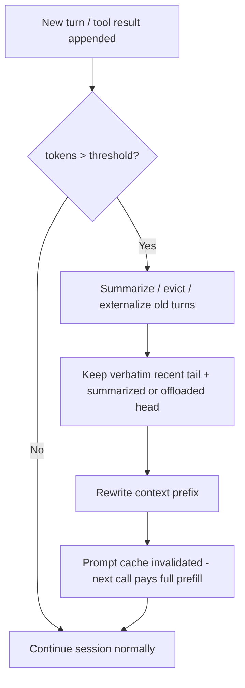

> **One-paragraph hook:** An agent running tool calls for an hour has no context problem at turn one. By turn fifty, tool outputs, retries and dead ends have eaten the whole window. Context compaction keeps a session alive past the point where naive accumulation would overflow the window or trigger [[Concept - Context Rot]]. Get it wrong and you either crash mid-task or silently throw away the one fact the next fifty turns depend on.

## The mechanism

Multi-turn and agentic sessions only grow. Every tool call, retrieved document and retry appends tokens, and in agentic workloads most of the growth is tool output, not conversation text. Past a threshold (commonly 70-80% of the effective window, leaving headroom below the true limit) you have three options: compress, evict or overflow. Overflow means truncation or a hard error. Length and truncation-induced information loss each trigger [[Concept - Context Rot]] on their own, so letting it grow is a silent quality cliff, not a neutral default.

Four techniques cover most of the options:

1. **Summarization / rollup.** An LLM call replaces a block of old turns with a generated summary. Claude Code's auto-compaction and ChatGPT's long-conversation summarization both work this way. The big decision is *what to keep verbatim*. Summarize the head of the conversation and keep a verbatim recent tail, so near-term context, which is disproportionately likely to matter right away, never goes through lossy compression.
2. **Externalization.** Write state to files, scratchpads or structured notes and re-read it when needed. This "context offloading" uses the file system as effectively unbounded memory, accessed through [[Concept - Tool Use and Function Calling]]. It's also how [[Concept - Agent Memory Systems]] persist across sessions as well as within one.
3. **Sub-agent isolation.** Spawn a fresh, bounded context for a subtask and return only the distilled result to the parent (see [[Concept - Multi-Agent Orchestration]]). The parent's context stays clean however much the child explores. The child's mess gets thrown away, not compacted.
4. **Eviction policies.** Drop least-recently-used tool outputs, deduplicate repeated observations (a file read three times only needs to appear once) and trim verbose logs. Pin the system prompt and task spec; those never get evicted.

Compaction is dynamic, per-session [[Concept - Context Engineering]]: the same curation calls a human prompt engineer makes offline, made at runtime under a token budget.

## In practice

MemGPT (Packer et al. 2023, *"MemGPT: Towards LLMs as Operating Systems"*) formalized this as OS-style virtual memory. A bounded "main context" plays the role of RAM, an unbounded "external context" plays disk, and the model itself issues function calls to page data in and out. So compaction becomes something the model can manage, and not only a rule the harness imposes from outside. In production, Claude Code's auto-compaction fires as the window fills. It summarizes the conversation while keeping key decisions and file state, the summary becomes the new head of context, and later turns append as usual. Both designs face the same question: how far to trust the model's own summary, and what to force through unconditionally (task specs, open TODOs, unresolved errors).

## Failure modes

- **Summarizing away the detail that mattered.** A constraint mentioned once, forty turns ago ("never modify the prod config"), drops out of the summary and gets violated fifty turns later. Nothing errors at compaction time; you just get a wrong action downstream. Mitigation: pin task-critical constraints outside the summarizable region.
- **Compaction loops (summary-of-summary drift).** Each compaction cycle summarizes a head that was already summarized and loses a bit more fidelity, like re-encoding a JPEG over and over. Mitigation: cap the number of compaction generations, or periodically rebuild the summary from a retained verbatim log instead of the previous summary.
- **Losing in-flight tool-call IDs.** Compacting mid-task can break the pairing between a tool call and its pending result. Most provider APIs treat that as a hard error, not a soft quality issue. Mitigation: never compact across an open tool-call/tool-result boundary.
- **Cache invalidation cost.** Compaction rewrites the context prefix, which invalidates [[Concept - Prompt Caching]]. The next request pays a full uncached prefill however many tokens you saved. Compact too eagerly and re-prefill can cost more than the smaller context saves. Batch compaction events instead of firing on every turn near the threshold.

## The non-obvious

Most teams don't budget for the cache cost until the bill arrives. To the cache, a compaction event looks the same as editing your system prompt: the shared prefix is invalidated and the next call pays a full-price prefill. A harness with a tight, twitchy threshold (say, compacting every time context crosses 75%) can pay more in repeated full prefills than a looser one that compacts less often and carries a slightly bigger context in between.

The crudest ancestor of compaction already shipped. Microsoft's fix for [[Lore - The Sydney Incident]] was to cap conversation turns outright, bounding context by fiat. Modern compaction is the more surgical version of the same idea: long, unmanaged context is a stability liability as well as a cost.

## Connections
- [[Concept - Context Rot]] — the quality-decay failure that compaction exists to prevent by keeping effective context small and high-signal.
- [[Concept - Context Engineering]] — the umbrella discipline; compaction is context engineering performed dynamically, at runtime, under a token budget.
- [[Concept - Agent Memory Systems]] — externalization-based compaction is the mechanism that lets agent memory persist beyond a single session's context window.
- [[Concept - Multi-Agent Orchestration]] — sub-agent isolation is a compaction strategy implemented as an architectural pattern rather than a compression algorithm.
- [[Concept - Tool Use and Function Calling]] — tool outputs are the dominant source of context growth in agentic sessions, and the read/write interface externalization relies on.
- [[Concept - Prompt Caching]] — compaction's hidden cost: rewriting the prefix invalidates the cache and forces a full re-prefill on the next call.
- [[Deep Dive - RAG Architectures]] — retrieval and compaction solve the same underlying budget problem from opposite ends: fetch less vs. keep less.
- [[Concept - LLM Observability and Tracing]] — you cannot tune a compaction threshold or catch summary drift without tracing what actually got dropped at each compaction event.
- [[Lore - The Sydney Incident]] — the historical precedent for bounding context to preserve stability, of which modern compaction is the more precise descendant.

## Sources
- Packer et al. (2023) — "MemGPT: Towards LLMs as Operating Systems." The OS-paging framing (main context vs. external context, model-issued paging calls) that underlies most modern externalization-based compaction.
- Anthropic — Claude Code auto-compaction (real deployed system, as of 2026). A production example of threshold-triggered summarization with a verbatim recent tail.
