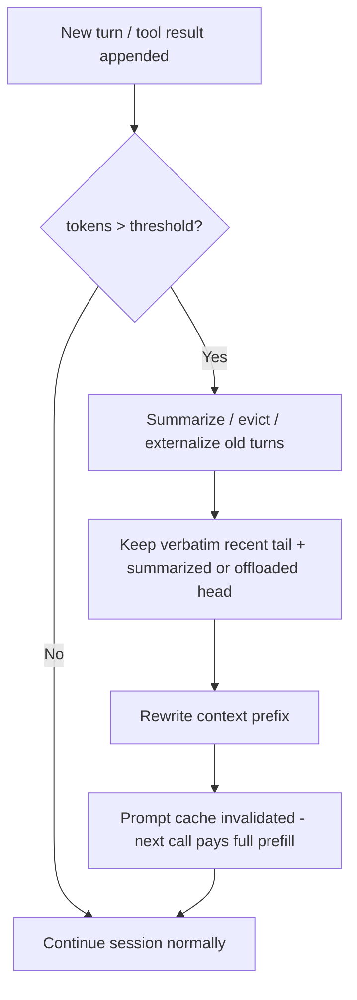

> **One-paragraph hook:** An agent that runs tool calls for an hour doesn't have a context problem at turn one — it has one by turn fifty, when tool outputs, retries, and dead ends have quietly eaten the entire window. Context compaction is the discipline of keeping a session alive past the point where naive accumulation would either overflow the window or trigger [[Concept - Context Rot]]. Get it wrong and you either crash mid-task or silently discard the one fact the next fifty turns depend on.

## The mechanism

Multi-turn and agentic sessions grow monotonically: every tool call, every retrieved document, every retry appends tokens, and tool outputs — not conversation text — dominate the growth in agentic workloads. Past a threshold (commonly 70-80% of the effective window, kept below the true limit as headroom), you have exactly three options: compress, evict, or overflow. Overflow means truncation or a hard error; both length and truncation-induced information loss independently trigger [[Concept - Context Rot]], so "just let it grow" is not a neutral default — it's a silent quality cliff.

Four compaction techniques cover most of the design space:

1. **Summarization / rollup.** An LLM call replaces a block of old turns with a generated summary. Claude Code's auto-compaction and ChatGPT's long-conversation summarization both work this way. The critical design choice is *what to keep verbatim*: summarize the head of the conversation while keeping a verbatim recent tail, so near-term context (which is disproportionately likely to be immediately relevant) never passes through a lossy compression step.
2. **Externalization.** Write state to files, scratchpads, or structured notes and re-read on demand — "context offloading," using the file system as effectively unbounded memory paired with [[Concept - Tool Use and Function Calling]]. This is the mechanism behind [[Concept - Agent Memory Systems]] that persist across sessions, not just within one.
3. **Sub-agent isolation.** Spawn a fresh, bounded context for a subtask and return only the distilled result to the parent (see [[Concept - Multi-Agent Orchestration]]). The parent's context stays clean regardless of how much exploration the child does — the child's mess is thrown away, not compacted.
4. **Eviction policies.** Drop least-recently-used tool outputs, deduplicate repeated observations (the same file read three times only needs to appear once), and trim verbose logs — while pinning the system prompt and task spec, which should never be evicted.

Compaction is a form of dynamic, per-session [[Concept - Context Engineering]] — it makes the same curation decisions a human prompt engineer would make offline, but at runtime and under a token budget.

## In practice

MemGPT (Packer et al. 2023, *"MemGPT: Towards LLMs as Operating Systems"*) formalized this as OS-style virtual memory: a bounded "main context" analogous to RAM, an unbounded "external context" analogous to disk, and explicit function calls the model itself issues to page data in and out — reframing compaction as something the model can manage, not just something the harness imposes from outside. In deployed systems, Claude Code's auto-compaction triggers as the window fills, summarizing the conversation while preserving key decisions and file state; the resulting summary becomes the new head of context, with subsequent turns appended normally. The design tension in both cases is the same: how much to trust the model's own summary versus how much to force through unconditionally (task specs, open TODOs, unresolved errors).

## Failure modes

- **Summarizing away the load-bearing detail.** A constraint mentioned once, forty turns ago ("never modify the prod config"), gets compressed out of the summary and violated fifty turns later. There's no error at compaction time — only a wrong action downstream. Mitigation: pin task-critical constraints outside the summarizable region entirely.
- **Compaction loops (summary-of-summary drift).** Repeated compaction cycles summarize an already-summarized head, and each pass loses a little more fidelity — the conversational equivalent of repeated JPEG re-encoding. Mitigation: cap the number of compaction generations, or periodically re-derive the summary from a retained verbatim log rather than from the prior summary.
- **Losing in-flight tool-call IDs.** Compacting mid-task can drop the pairing between a tool call and its pending result, which most provider APIs treat as a hard structural error, not a soft quality issue. Mitigation: never compact across an open tool-call/tool-result boundary.
- **Cache invalidation cost.** Compaction rewrites the context prefix, which invalidates [[Concept - Prompt Caching]] — the next request pays a full, uncached prefill regardless of how much you saved on token count. Compact too eagerly and you can spend more on re-prefill than the compaction saved in context size; batch compaction events rather than triggering on every turn near the threshold.

## The non-obvious

The cache-cost tradeoff is the thing most teams don't budget for until the bill arrives: every compaction event is, from the cache's perspective, indistinguishable from editing your system prompt — it invalidates the shared prefix and forces a full-price prefill on the very next call. A harness that compacts on a tight, twitchy threshold (say, every time context crosses 75%) can end up paying more in repeated full prefills than a looser threshold that compacts less often but eats a slightly larger context in the meantime. It's also worth noting that compaction's crudest possible ancestor already shipped in production: Microsoft's fix for [[Lore - The Sydney Incident]] was simply capping conversation turns outright, bounding context by fiat rather than managing it. Modern compaction is the more surgical version of the same insight — long, unmanaged context is a stability liability, not just a cost one.

## Connections
- [[Concept - Context Rot]] — the quality-decay failure that compaction exists to prevent by keeping effective context small and high-signal.
- [[Concept - Context Engineering]] — the umbrella discipline; compaction is context engineering performed dynamically, at runtime, under a token budget.
- [[Concept - Agent Memory Systems]] — externalization-based compaction is the mechanism that lets agent memory persist beyond a single session's context window.
- [[Concept - Multi-Agent Orchestration]] — sub-agent isolation is a compaction strategy implemented as an architectural pattern rather than a compression algorithm.
- [[Concept - Tool Use and Function Calling]] — tool outputs are the dominant source of context growth in agentic sessions, and the read/write interface externalization relies on.
- [[Concept - Prompt Caching]] — compaction's hidden cost: rewriting the prefix invalidates the cache and forces a full re-prefill on the next call.
- [[Deep Dive - RAG Architectures]] — retrieval and compaction solve the same underlying budget problem from opposite ends: fetch less vs. keep less.
- [[Concept - LLM Observability and Tracing]] — you cannot tune a compaction threshold or catch summary drift without tracing what actually got dropped at each compaction event.
- [[Lore - The Sydney Incident]] — the historical precedent for bounding context to preserve stability, of which modern compaction is the more precise descendant.

## Sources
- Packer et al. (2023) — "MemGPT: Towards LLMs as Operating Systems." The OS-paging framing (main context vs. external context, model-issued paging calls) that underlies most modern externalization-based compaction.
- Anthropic — Claude Code auto-compaction (real deployed system, as of 2026). A production example of threshold-triggered summarization with a verbatim recent tail.
