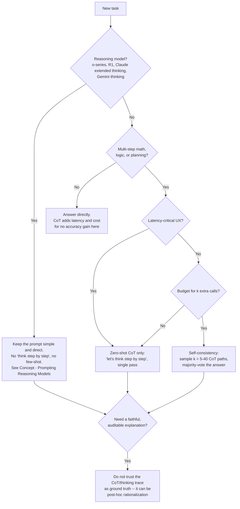

# Decision - When to Use Chain-of-Thought

> The decision is whether to spend extra output tokens and latency generating explicit reasoning before an answer. Default (as of 2026): on a non-reasoning instruction-tuned model doing multi-step math, logic, or planning, use [[Concept - Chain-of-Thought and Why It Works|chain-of-thought]]; on a reasoning model (o-series, DeepSeek-R1, Claude extended thinking, Gemini thinking), do **not** add "think step by step" — it is redundant at best and degrades output at worst, because the reasoning is already trained into the policy (see [[Concept - Prompting Reasoning Models]]).

## Decision flow

## Tradeoff matrix

| Approach | Extra cost | Accuracy effect | Latency | Best fit | Faithfulness |
|---|---|---|---|---|---|
| Direct answer, no CoT | 1× calls, no extra output tokens | Baseline | Lowest | Lookup/simple classification, or already a reasoning model | N/A |
| Zero-shot CoT ("let's think step by step") | 1× calls, + output tokens for the reasoning trace | GSM8K ~18%→~41% on GPT-3 (Kojima et al. 2022) | + generation time for the trace | Multi-step math/logic on a non-reasoning instruct model | Weak — can be post-hoc rationalization (Turpin et al. 2023) |
| Few-shot CoT | 1× calls, + exemplar tokens + output tokens | Large gains above ~60-100B params (Wei et al. 2022); can hurt below that | Similar to zero-shot CoT plus exemplar prefill | Same as above, when good worked examples exist | Same faithfulness caveat |
| Self-consistency | k× calls (k = 5-40 typical) | +10-18 points on GSM8K-class benchmarks over single-path CoT (Wang et al. 2022) | k× the single-call latency, or parallelized | Maximum accuracy, non-reasoning model, budget available | Marginally better (majority *answer*, not majority reasoning) |
| Reasoning model, no added CoT | 1× call, but hidden "thinking" tokens are billed regardless | SOTA on math/code/logic-heavy benchmarks | Latency step-change from hidden reasoning, largely independent of your prompt | Hard reasoning tasks where the reasoning-token bill is acceptable | Explicit CoT is redundant here; the emitted trace still isn't guaranteed faithful |

Self-consistency's row has a sharp practitioner trap: it only produces diverse paths worth voting over at nonzero [[Concept - Sampling and Decoding Parameters|temperature]] — running k samples at temperature 0 just repeats the identical greedy path k times and wastes the entire budget for zero benefit. Set temperature explicitly when implementing this row.

## The details that flip the decision

**Small models can go the wrong way with CoT.** Below roughly 10B parameters (task-dependent), models often do *worse* with CoT than answering directly, because their generated reasoning is noisy and the model then anchors on its own wrong intermediate step. Test CoT against a direct-answer baseline on your actual model size rather than assuming it always helps — the emergence threshold from Wei et al. (2022) cuts both ways.

**Verbalization can actively distort some tasks.** Liu et al. (2024) document perception- and pattern-matching-style tasks where forcing the model to narrate its process degrades accuracy relative to answering directly — not every skill benefits from being put into words, and CoT is not a universal accuracy dial.

**Faithfulness needs kill CoT-as-explanation, not CoT-as-technique.** Turpin et al. (2023) show a model's written chain-of-thought can be a post-hoc rationalization: under a biasing cue, the model flips its final answer while the *written* reasoning stays clean and never mentions the bias. CoT can still be worth using for the accuracy lift it provides — just never treat the trace itself as a trustworthy audit log or a faithful account of why the model answered as it did, especially for high-stakes or compliance-relevant decisions.

**Cost math is not symmetric across the table.** CoT spends output tokens, which are priced higher than input tokens on most providers — the expensive side of the ledger gets the multiplier. Self-consistency multiplies the *entire call* by k, not just the output. Reasoning models bill hidden thinking tokens regardless of what you asked for, which is a step change in cost independent of prompt length — budget for all three differently (see [[Concept - Cost Engineering for LLM Applications]]).

**Structured downstream consumption changes the prompt shape, not the CoT decision.** If CoT output has to be machine-parsed, the reasoning and the final answer must live in visibly separate regions — a delimiter or a dedicated JSON field — so a parser never has to sift free-form prose for the answer (see [[Playbook - Reliable Structured Output]]). This is an implementation detail layered on top of the decision above, not a reason to skip CoT.

**Verbose reasoning traces leak into production surfaces if you let them.** Whether from an explicit CoT prompt or a reasoning model's hidden trace, strip or collapse the reasoning before it reaches an end user, and watch for token-budget blowups on tasks where the model "overthinks" a problem that didn't need it.

## Connections
- [[Concept - Chain-of-Thought and Why It Works]] — the mechanism (serial forward passes as test-time compute) this decision is built on top of.
- [[Concept - Prompting Reasoning Models]] — the full guidance for the "yes, reasoning model" branch of the flowchart, including why few-shot exemplars can hurt there too.
- [[Concept - GRPO and RL with Verifiable Rewards]] — the RL training method that moved long CoT from a prompting technique into the trained policy for reasoning models.
- [[Concept - Cost Engineering for LLM Applications]] — the cost model behind the "cost math is not symmetric" detail above.
- [[Playbook - Reliable Structured Output]] — how to structure CoT output so a downstream parser can separate reasoning from the final answer.
- [[Concept - Sampling and Decoding Parameters]] — the temperature setting self-consistency depends on to generate genuinely diverse paths to vote over.

## Sources
- Kojima et al. (2022) — "Large Language Models are Zero-Shot Reasoners." The zero-shot CoT result (GSM8K ~18%→~41%).
- Wei et al. (2022) — "Chain-of-Thought Prompting Elicits Reasoning in Large Language Models." The few-shot CoT emergence threshold.
- Wang et al. (2022) — "Self-Consistency Improves Chain of Thought Reasoning in Language Models." The k-sample majority-vote technique and its accuracy gain.
- Turpin et al. (2023) — "Language Models Don't Always Say What They Think." The CoT faithfulness problem behind the auditability caveat.
- Liu et al. (2024) — findings on tasks where verbalized reasoning degrades performance relative to direct answering.
