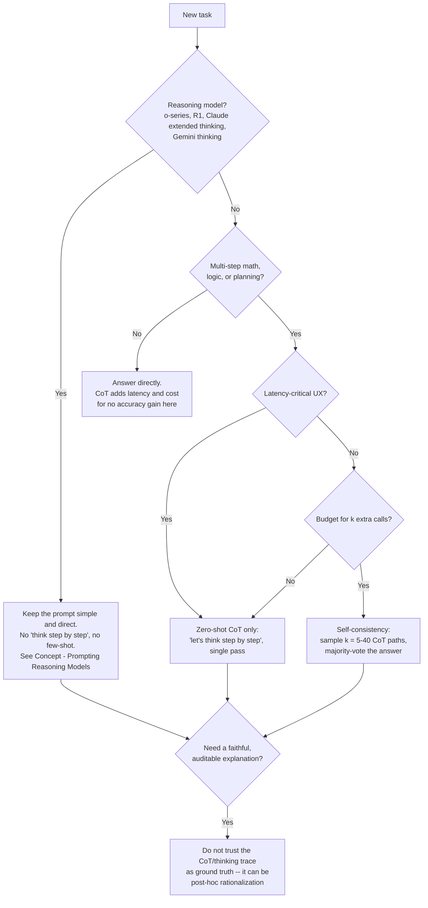

# Decision - When to Use Chain-of-Thought

> The decision: do you spend extra output tokens and latency on explicit reasoning before the answer? Default (as of 2026): on a non-reasoning instruction-tuned model doing multi-step math, logic or planning, use [[Concept - Chain-of-Thought and Why It Works|chain-of-thought]]. On a reasoning model (o-series, DeepSeek-R1, Claude extended thinking, Gemini thinking), do **not** add "think step by step". The reasoning is already trained into the policy, so the instruction is redundant at best and degrades output at worst (see [[Concept - Prompting Reasoning Models]]).

## Decision flow

## Tradeoff matrix

| Approach | Extra cost | Accuracy effect | Latency | Best fit | Faithfulness |
|---|---|---|---|---|---|
| Direct answer, no CoT | 1× calls, no extra output tokens | Baseline | Lowest | Lookup/simple classification, or already a reasoning model | N/A |
| Zero-shot CoT ("let's think step by step") | 1× calls, + output tokens for the reasoning trace | GSM8K ~18%→~41% on GPT-3 (Kojima et al. 2022) | + generation time for the trace | Multi-step math/logic on a non-reasoning instruct model | Weak — can be post-hoc rationalization (Turpin et al. 2023) |
| Few-shot CoT | 1× calls, + exemplar tokens + output tokens | Large gains above ~60-100B params (Wei et al. 2022); can hurt below that | Similar to zero-shot CoT plus exemplar prefill | Same as above, when good worked examples exist | Same faithfulness caveat |
| Self-consistency | k× calls (k = 5-40 typical) | +10-18 points on GSM8K-class benchmarks over single-path CoT (Wang et al. 2022) | k× the single-call latency, or parallelized | Maximum accuracy, non-reasoning model, budget available | Marginally better (majority *answer*, not majority reasoning) |
| Reasoning model, no added CoT | 1× call, but hidden "thinking" tokens are billed regardless | SOTA on math/code/logic-heavy benchmarks | Latency step-change from hidden reasoning, largely independent of your prompt | Hard reasoning tasks where the reasoning-token bill is acceptable | Explicit CoT is redundant here; the emitted trace still isn't guaranteed faithful |

One trap in the self-consistency row: you only get diverse paths worth voting over at nonzero [[Concept - Sampling and Decoding Parameters|temperature]]. Run k samples at temperature 0 and you get the same greedy path k times, wasting the whole budget. Set temperature explicitly.

## The details that flip the decision

**Small models can get worse with CoT.** Below roughly 10B parameters (task-dependent), models often do *worse* with CoT than answering directly. Their reasoning is noisy, and they anchor on their own wrong intermediate step. Test CoT against a direct-answer baseline at your actual model size; the emergence threshold from Wei et al. (2022) cuts both ways.

**Verbalizing can distort some tasks.** Liu et al. (2024) document perception and pattern-matching tasks where making the model narrate its process lowers accuracy compared with answering directly. Not every skill benefits from being put into words, and CoT isn't a universal accuracy dial.

**Needing faithfulness rules out CoT as an explanation, not as a technique.** Turpin et al. (2023) show a model's written chain-of-thought can be post-hoc rationalization. Under a biasing cue the model flips its final answer while the *written* reasoning stays clean and never mentions the bias. CoT can still be worth it for the accuracy gain. Just never treat the trace as a trustworthy audit log or a faithful account of why the model answered as it did, especially for high-stakes or compliance-relevant decisions.

**The cost math differs row by row.** CoT spends output tokens, which most providers price above input tokens, so the multiplier lands on the expensive side. Self-consistency multiplies the *entire call* by k. Reasoning models bill hidden thinking tokens whatever you asked for, a step change in cost that doesn't depend on prompt length. Budget for each differently (see [[Concept - Cost Engineering for LLM Applications]]).

**Parsing downstream changes the prompt shape, not the CoT decision.** If CoT output gets machine-parsed, put the reasoning and the final answer in visibly separate regions (a delimiter or a dedicated JSON field) so the parser never digs through free-form prose for the answer (see [[Playbook - Reliable Structured Output]]). It's an implementation detail on top of the decision, and no reason to skip CoT.

**Verbose reasoning leaks into production surfaces if you let it.** Whether it comes from a CoT prompt or a reasoning model's hidden trace, strip or collapse the reasoning before it reaches an end user. Watch for token-budget blowups where the model "overthinks" a problem that didn't need it.

## Connections
- [[Concept - Chain-of-Thought and Why It Works]] — the mechanism (serial forward passes as test-time compute) this decision is built on top of.
- [[Concept - Prompting Reasoning Models]] — the full guidance for the "yes, reasoning model" branch of the flowchart, including why few-shot exemplars can hurt there too.
- [[Concept - GRPO and RL with Verifiable Rewards]] — the RL training method that moved long CoT from a prompting technique into the trained policy for reasoning models.
- [[Concept - Cost Engineering for LLM Applications]] — the cost model behind the "cost math is not symmetric" detail above.
- [[Playbook - Reliable Structured Output]] — how to structure CoT output so a downstream parser can separate reasoning from the final answer.
- [[Concept - Sampling and Decoding Parameters]] — the temperature setting self-consistency depends on to generate genuinely diverse paths to vote over.

## Sources
- Kojima et al. (2022) — "Large Language Models are Zero-Shot Reasoners." The zero-shot CoT result (GSM8K ~18%→~41%).
- Wei et al. (2022) — "Chain-of-Thought Prompting Elicits Reasoning in Large Language Models." The few-shot CoT emergence threshold.
- Wang et al. (2022) — "Self-Consistency Improves Chain of Thought Reasoning in Language Models." The k-sample majority-vote technique and its accuracy gain.
- Turpin et al. (2023) — "Language Models Don't Always Say What They Think." The CoT faithfulness problem behind the auditability caveat.
- Liu et al. (2024) — findings on tasks where verbalized reasoning degrades performance relative to direct answering.
