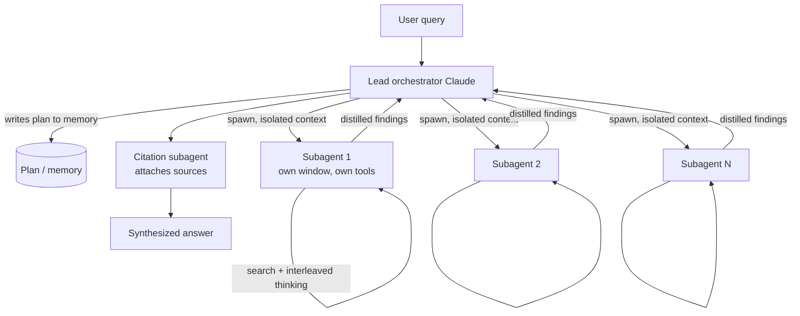

# Breakdown - Anthropic's Multi-Agent Research System

> **What it is:** the production multi-agent system behind Anthropic's Research feature, described in the June 2025 engineering post "How we built our multi-agent research system." A lead Claude *orchestrator* breaks down a research query, spawns several Claude *subagents* that search in parallel with isolated context windows, and synthesizes their findings into one answer. It's the clearest public engineering account, with real numbers, of when [[Pattern - Orchestrator-Worker Agents|orchestrator-worker]] multi-agent architecture pays off. It also reaches the opposite conclusion from Cognition's "Don't Build Multi-Agents", published around the same time, which is why the two are worth reading together *(as of 2026)*.

## The headline numbers

- **~90% improvement.** On Anthropic's internal research eval, the multi-agent system (Claude Opus 4 lead + Claude Sonnet 4 subagents, per the write-up) beat a single-agent Claude Opus 4 by roughly 90%.
- **~15x tokens.** The system uses about 15x the tokens of an ordinary chat interaction. Multi-agent research *buys* capability with token spend; the architecture itself isn't a free win.
- **~80% of variance.** Across configurations, token usage alone explained about 80% of the performance variance on the eval. The number of subagents, the tool calls and the model choice are, mechanically, ways of spending more tokens.
- **The economic gate:** with a token multiplier that large, the architecture only makes sense for high-value tasks where breadth and parallel search really help. Deep research, yes. A support chatbot, no.

## How it works

The lead agent takes the query, works out an approach, and **writes its plan to memory**, so a context-window truncation on a long run doesn't wipe out the strategy. Then it spawns subagents, each with a clean context window, its own tools and a specific objective. Each subagent runs its own [[Deep Dive - The Agent Loop|agent loop]] (search, read, interleaved extended thinking as a scratchpad) and sends *distilled findings* back to the lead, not its full trace. The lead synthesizes, and a separate citation subagent goes through the final text attaching sources to claims. It's map-reduce over LLM calls: fan out to parallel workers, reduce to one answer.

It beats a single agent on research because of [[Concept - Context Engineering for Agents|context isolation]]. One agent chasing ten sub-questions piles all ten threads into one window and degrades from context rot. Ten subagents each get a fresh window for one thread. Research suits this well: it's read-heavy and separable, and the sub-questions rarely need each other's in-progress state. That's also where it departs from a [[Deep Dive - RAG Architectures|single-shot RAG]] pipeline. The agents decide *what* to retrieve next based on what they just found, over and over, instead of retrieving once against the original query.

## The clever parts

1. **Effort scaling in the orchestrator prompt.** The lead is told to match the number of subagents to query complexity: about one for a simple fact-find, several for a broad comparison. Without that, Claude over-spawns, and since [[Concept - Cost Engineering for LLM Applications|token spend]] is 80% of variance, over-spawning is the default way to waste money. Treating spawn count as a *capability dial* is the central design decision.
2. **Context isolation is the mechanism.** Each subagent's clean window is why the architecture works at all. The whole system is built to keep the lead's context clean by having workers return summaries instead of raw transcripts, which is the concrete version of what [[Concept - Multi-Agent Orchestration|multi-agent orchestration]] promises in the abstract.
3. **"Think like your agents."** The team's most repeated prompting lesson: watch real trajectories, notice where a subagent misreads its objective, and fix the *orchestrator's delegation instructions* instead of patching symptoms. Small wording changes in how the lead frames a subtask visibly change delegation behavior.
4. **Start wide, then narrow.** Orchestrator instructions push subagents to start with broad queries and focus progressively, the way a human researcher scans before drilling in, which avoids locking onto one framing too early.
5. **Plan to memory, for durability.** Keeping the lead's plan outside the context window is what lets a long, many-step run survive compaction. It's a small bit of state management, and it's what separates a demo from a production system.
6. **LLM-judge evals, early and often.** Trajectories are long and non-deterministic, so the team used LLM-graded rubrics on a small number of examples to iterate fast, accepting the known judge biases in exchange for speed.

## What it got wrong / what's dated

The post lists its own failures. **Subagents duplicate work** when the orchestrator's decomposition overlaps: two workers research the same sub-question and you pay twice. **Coordination overhead** is real, since every synthesis and every spawn is a full model call, and the lead can under- or over-delegate. **Evaluation is hard.** Non-determinism and long trajectories make [[Concept - Agent Evaluation Challenges|reproducible scoring]] a research problem of its own, which is why they fell back on LLM-judge rubrics. And the ~15x token bill is a permanent tax, not a passing inefficiency.

The bigger caveat is that the conclusion depends on the task. Cognition's "Don't Build Multi-Agents" (2025) argues the opposite: shared context and fragile coordination make multi-agent systems *worse* for write-heavy, coherent-artifact work like building one codebase. Each is right in its own domain, and that's what the [[Decision - Single-Agent vs Multi-Agent|single-vs-multi decision]] is about. Multi wins on read-heavy parallel breadth; single wins on write-heavy coherence. As models absorb more agentic skill, the [[Concept - Trained vs Prompted Agents|thin-scaffold thesis]] predicts even this orchestration should get lighter.

## What to steal

Use orchestrator-worker for read-heavy, separable, breadth-limited tasks like research and large-scale document analysis, and *not* for coherent build tasks. Give every worker a clean, isolated context and make it return distilled findings, never its full trace. Put the effort dial in the orchestrator prompt and scale spawn count to complexity, because your token bill *is* your performance curve. Keep the plan outside the window so long runs survive compaction. When you tune, iterate on the *delegation* prompt against a small LLM-judged eval instead of guessing. Most of these tricks are collected in [[Lore - Agent Prompt-Engineering Folklore]].

## Connections
- [[Pattern - Orchestrator-Worker Agents]] — the reusable design this system is the flagship instance of; read that for the pattern in the abstract.
- [[Decision - Single-Agent vs Multi-Agent]] — the go/no-go framework; this system is the "multi wins" data point, Cognition is the "single wins" counterweight.
- [[Concept - Multi-Agent Orchestration]] — the topology/communication survey this system exemplifies with the orchestrator + isolated-worker + synthesis pattern.
- [[Concept - Context Engineering for Agents]] — per-subagent context isolation is the single mechanical reason multi beats single here.
- [[Concept - Cost Engineering for LLM Applications]] — the ~15x multiplier and 80%-of-variance finding make this a budget decision as much as an architecture one.
- [[Concept - Agent Evaluation Challenges]] — non-determinism and long trajectories forced the team onto LLM-judge rubrics; this system is a case study in why agent eval is hard.
- [[Deep Dive - RAG Architectures]] — contrast: agentic iterative retrieval by parallel subagents vs a single-shot retrieve-then-generate pipeline.
- [[Deep Dive - The Agent Loop]] — each subagent runs the standard observe-think-act loop inside its isolated window.
- [[Concept - Trained vs Prompted Agents]] — the thin-scaffold thesis predicts this orchestration should shrink as models get better at agency natively.
- [[Lore - Agent Prompt-Engineering Folklore]] — "think like your agents," start-wide-then-narrow, and plan-to-memory are the folklore tricks this system productized.

## Sources
- Anthropic (2025) — "How we built our multi-agent research system." The primary source: architecture, the ~90% / ~15x / ~80%-variance numbers, and the prompt-engineering lessons.
- Cognition (2025) — "Don't Build Multi-Agents." The contrasting position for write-heavy coherent tasks; the other half of the single-vs-multi debate.
