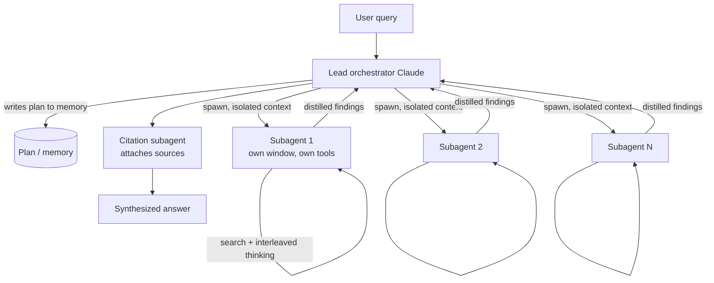

# Breakdown - Anthropic's Multi-Agent Research System

> **What it is:** the production multi-agent system behind Anthropic's Research feature, documented in the June 2025 engineering post "How we built our multi-agent research system." A lead Claude *orchestrator* decomposes a research query, spawns several Claude *subagents* that search in parallel with isolated context windows, and then synthesizes their findings into one answer. Why it matters: it is the clearest public engineering account of when [[Pattern - Orchestrator-Worker Agents|orchestrator-worker]] multi-agent architecture actually pays off, backed by real numbers — and it lands on the opposite conclusion from Cognition's contemporaneous "Don't Build Multi-Agents," which is what makes the pair worth studying together *(as of 2026)*.

## The headline numbers

- **~90% improvement.** On Anthropic's internal research eval, the multi-agent system (Claude Opus 4 lead + Claude Sonnet 4 subagents, per the write-up) outperformed a single-agent Claude Opus 4 by roughly 90%.
- **~15x tokens.** The system burns about 15x the tokens of an ordinary chat interaction. Multi-agent research is a way of *buying* capability with token spend, not a free architectural win.
- **~80% of variance.** Across configurations, token usage alone explained about 80% of the performance variance on the eval — the number of subagents and tool calls and the models chosen are, mechanically, ways of spending more tokens.
- **The economic gate that follows:** because the token multiplier is so large, the architecture only makes sense for high-value tasks where breadth and parallel search genuinely help — deep research, not a support chatbot.

## How it actually works

The lead agent receives the query, thinks through an approach, and — critically — **writes its plan to memory** so a context-window truncation on a long run doesn't wipe the strategy. It then spawns subagents, each with its own clean context window, its own tools, and a specific objective. The subagents run their own [[Deep Dive - The Agent Loop|agent loop]] (search, read, interleaved extended-thinking as a scratchpad), and each returns *distilled findings* — not its full trace — back to the lead. The lead synthesizes, and a separate citation subagent walks the final text to attach sources to claims. This is map-reduce over LLM calls: fan out to parallel workers, reduce to one answer.

The reason this beats a single agent on research is [[Concept - Context Engineering for Agents|context isolation]]. A single agent chasing ten sub-questions accumulates all ten threads in one window and degrades from context rot; ten subagents each get a fresh window on one thread. Research is the ideal shape for this because it is read-heavy and separable — the sub-questions rarely need to see each other's in-progress state — which is exactly the regime where it diverges from a [[Deep Dive - RAG Architectures|single-shot RAG]] pipeline: the agents decide *what* to retrieve next based on what they just found, iteratively, instead of retrieving once against the original query.

## The clever parts

1. **Effort scaling baked into the orchestrator prompt.** The lead is told to scale the number of subagents to query complexity — roughly one subagent for a simple fact-find, several for a broad comparison. Without this, Claude would over-spawn, and since [[Concept - Cost Engineering for LLM Applications|token spend]] is 80% of variance, over-spawning is the default way to waste money. Treating the spawn count as a *capability dial* is the core design move.
2. **Context isolation as the mechanism, not a side effect.** Each subagent's clean window is why the architecture works at all; the whole system is built around keeping the lead's context clean by having workers return summaries rather than raw transcripts — the concrete win that [[Concept - Multi-Agent Orchestration|multi-agent orchestration]] promises in the abstract.
3. **"Think like your agents."** The team's most-repeated prompt-engineering lesson: watch real trajectories, notice where a subagent misreads its objective, and fix the *orchestrator's delegation instructions* rather than patching symptoms. Small wording changes in how the lead frames a subtask visibly shift delegation behavior.
4. **Start wide, then narrow.** Orchestrator instructions push subagents to begin with broad queries and progressively focus — mirroring how a human researcher scans before drilling, and avoiding premature commitment to one framing.
5. **Plan-to-memory for durability.** Persisting the lead's plan outside the context window is what lets a long, many-step run survive compaction — a small piece of state management that separates a demo from a production system.
6. **Evaluate with an LLM judge early and often.** Because trajectories are long and non-deterministic, the team leaned on LLM-graded rubrics from a small number of examples to iterate quickly, accepting the known judge biases as a tradeoff for velocity.

## What it got wrong / what's dated

The honest failure list is in the post. **Subagents duplicate work** when the orchestrator's decomposition overlaps — two workers researching the same sub-question, paying twice. **Coordination overhead** is real: every synthesis and every spawn is a full model call, and the lead can under- or over-delegate. **Evaluation is genuinely hard** — non-determinism and long trajectories make [[Concept - Agent Evaluation Challenges|scoring reproducibly]] a research problem in itself, which is why they fell back on LLM-judge rubrics. And the ~15x token bill is a permanent tax, not a transient inefficiency.

The larger caveat is that the conclusion is *task-shaped*. Cognition's "Don't Build Multi-Agents" (2025) argues the exact opposite — that shared context and fragile coordination make multi-agent systems *worse* for write-heavy, coherent-artifact work like building one codebase. Both are right within their domain, which is the whole point of the [[Decision - Single-Agent vs Multi-Agent|single-vs-multi decision]]: multi wins on read-heavy parallel breadth, single wins on write-heavy coherence. And as models absorb more agentic skill, the [[Concept - Trained vs Prompted Agents|thin-scaffold thesis]] predicts even this orchestration should get lighter over time.

## What to steal

Use orchestrator-worker for tasks that are read-heavy, separable, and breadth-limited — research, large-scale document analysis — and *not* for coherent build tasks. Give every worker a clean, isolated context and require it to return distilled findings, never its full trace. Put the effort dial in the orchestrator prompt and scale spawn count to complexity, because your token bill *is* your performance curve. Persist the plan outside the window so long runs survive compaction. And when you tune, iterate the *delegation* prompt against a small LLM-judged eval rather than guessing — most of the practitioner tricks here are catalogued in [[Lore - Agent Prompt-Engineering Folklore]].

## Connections
- [[Pattern - Orchestrator-Worker Agents]] — the reusable design this system is the flagship instance of; read that for the pattern in the abstract.
- [[Decision - Single-Agent vs Multi-Agent]] — the go/no-go framework; this system is the "multi wins" data point, Cognition is the "single wins" counterweight.
- [[Concept - Multi-Agent Orchestration]] — the topology/communication survey this system exemplifies with the orchestrator + isolated-worker + synthesis pattern.
- [[Concept - Context Engineering for Agents]] — per-subagent context isolation is the single mechanical reason multi beats single here.
- [[Concept - Cost Engineering for LLM Applications]] — the ~15x multiplier and 80%-of-variance finding make this a budget decision as much as an architecture one.
- [[Concept - Agent Evaluation Challenges]] — non-determinism and long trajectories forced the team onto LLM-judge rubrics; this system is a case study in why agent eval is hard.
- [[Deep Dive - RAG Architectures]] — contrast: agentic iterative retrieval by parallel subagents vs a single-shot retrieve-then-generate pipeline.
- [[Deep Dive - The Agent Loop]] — each subagent runs the standard observe-think-act loop inside its isolated window.
- [[Concept - Trained vs Prompted Agents]] — the thin-scaffold thesis predicts this orchestration should shrink as models get better at agency natively.
- [[Lore - Agent Prompt-Engineering Folklore]] — "think like your agents," start-wide-then-narrow, and plan-to-memory are the folklore tricks this system productized.

## Sources
- Anthropic (2025) — "How we built our multi-agent research system." The primary source: architecture, the ~90% / ~15x / ~80%-variance numbers, and the prompt-engineering lessons.
- Cognition (2025) — "Don't Build Multi-Agents." The contrasting position for write-heavy coherent tasks; the other half of the single-vs-multi debate.
