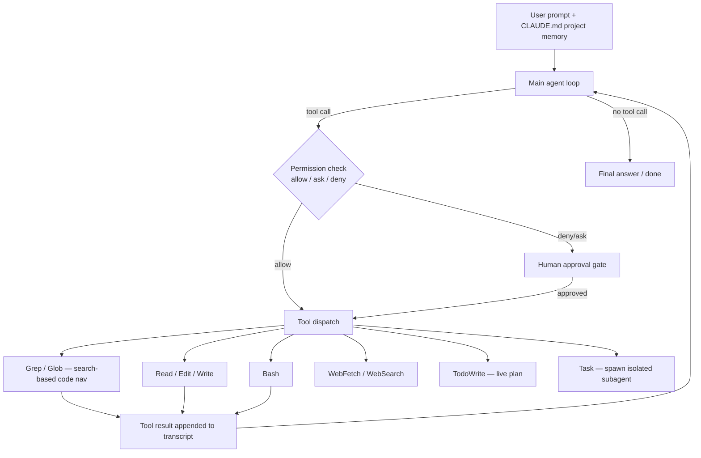

# Breakdown - Claude Code

> **What it is:** Claude Code is Anthropic's command-line coding agent (2025). One main agent loop wraps a strong Claude model in a curated tool set and runs in the user's terminal, against their real repository. It's the clearest shipped example of the thin-scaffold, model-first approach: no elaborate hardcoded orchestration graph, just very good tools, a permission system, and the model in charge. Below: the architecture, and the decisions worth stealing. **Evidence status:** based on Anthropic's public materials, the documented tool and settings surface, and the product's observable behavior. Not on internal source.

## The headline numbers

- **One main loop, ~10 core tools.** No multi-agent framework by default. One agent with a small, sharp tool set.
- **Underlying model score:** the Claude models it runs on report in the ~70% range on [[Breakdown - SWE-bench and SWE-agent|SWE-bench Verified]] (Anthropic-reported, *as of 2026*). That capability is what lets the scaffold stay thin.
- **Context budget:** one long-context window (hundreds of thousands of tokens), plus on-demand [[Concept - Context Engineering for Agents|compaction]] and subagents. The practical working limit is far below the nominal window, because tool output and file reads fill it fast.
- **Permission granularity:** three modes (allow / ask / deny), set per tool and per argument pattern in `settings.json`.

## How it works

The loop is the ordinary observe–think–act cycle of [[Deep Dive - The Agent Loop|the agent loop]]. Three design choices define the product.

**Code navigation by search, not embeddings.** Code is found with `Grep` (ripgrep) and `Glob` (path patterns). There's no embedded repo and no [[Concept - Semantic Search|semantic vector search]]. Grep is exact, has no index to build or invalidate, can't go stale when code changes mid-session, and matches how the model already thinks about code (symbol names, string literals, regexes). Embedding-RAG over a codebase has to be rebuilt as files change, returns fuzzy neighbors when the model wanted an exact call site, and adds an index to keep coherent. That buys little when the model can just write a good regex. Grep can't find *conceptually* related code with no shared tokens; in practice the model compensates by searching iteratively.

**Permission gating as UX as well as a sandbox.** Every tool call goes through an allow/ask/deny check keyed on the tool and the specific pattern (e.g., allow `Bash(git status)`, ask on `Bash(rm *)`). Destructive or out-of-scope actions hit a human approval gate. It's the interactive complement to [[Checklist - Sandboxing an Agent|hard sandboxing]]: a human sits in the loop at the points where actions become irreversible, which is where [[Gotchas - Agents in Production|over-eager destructive actions]] otherwise do damage.

**Context kept clean by construction.** `CLAUDE.md` files hold durable project memory (conventions, commands, architecture) that loads every session, so the model doesn't rediscover it. Long sessions compact older turns to free up the window. The `Task` tool spawns a subagent with its own isolated context that returns a distilled result. That's the same context-isolation move as [[Breakdown - Anthropic's Multi-Agent Research System|the multi-agent research system]], used here surgically (search a large area, run a self-contained subtask) instead of as the default topology.

Also: `TodoWrite` keeps a **live todo list** that brings the goal and remaining steps back up every turn. And Claude Code is a [[Concept - Model Context Protocol (MCP)|Model Context Protocol]] client. External tools plug in as MCP servers, so the tool set grows without changing the agent, and every added tool comes through the same [[Concept - Tool Use and Function Calling|function-calling interface]] and permission machinery.

## The clever parts

1. **Recitation as a product feature.** The todo list is the [[Lore - Agent Prompt-Engineering Folklore|recitation trick]] shipped as a feature. Restating the goal and open items every turn counters goal drift and lost-in-the-middle on long tasks, where a static system prompt scrolls out of attention range. It's the product's most visible piece of long-horizon engineering.
2. **A thin scaffold on purpose.** No fixed plan-then-execute graph, no forced reflection loop. The bet is that a capable enough model with great tools beats hand-built orchestration, which is the applied side of the [[Concept - Trained vs Prompted Agents|trained-agent thesis]] and of [[Deep Dive - Agentic Coding in Production|agentic coding in production]]. Less scaffold means fewer places where the harness fights the model's prior.
3. **The tool set is the product.** Following SWE-agent's Agent-Computer-Interface insight, the gains come from tools designed for a model instead of a human. `Edit` takes an exact old-string/new-string pair, which forces the model to show it read the code before changing it. Errors come back as readable text the model can act on. `Bash` opens the whole Unix toolbox, so nobody has to enumerate a hundred bespoke tools.
4. **Permissions designed in from the start.** Treating allow/ask/deny as a core surface, and not something bolted on later for safety, is what makes an autonomous agent tolerable to run against a real repo with real credentials.

## What it got wrong / what's dated

Large repos still exceed the practical context budget. The model can't keep a million-line codebase in view, so it leans hard on search and navigation, and occasionally misses the right file. **Over-eager edits** happen: the model changes more than it was asked to, or "fixes" something that wasn't broken. That's why the [[Checklist - Agent Tool Definition Review|tool contract]] and permission gates matter. The token bill is real too. A long agentic coding session isn't cheap, so [[Concept - Cost Engineering for LLM Applications|cost]] is a live constraint. As the underlying models improve, expect the compaction and subagent scaffolding here to thin out further.

## What to steal

For code, prefer exact search over embedding-RAG; an index you never build can't go stale. Give any long-horizon agent a live todo/recitation surface. Design permissions as a real surface, gated per pattern, with human approval at the points of irreversibility. Build tools for the model (exact-match edits, readable errors, one Bash escape hatch) instead of porting a human UI. And keep the scaffold thin, since a stronger model may make any orchestration flourish you add redundant.

## Connections
- [[Breakdown - SWE-bench and SWE-agent]] — the benchmark and the Agent-Computer-Interface insight Claude Code's tool design descends from.
- [[Concept - Context Engineering for Agents]] — CLAUDE.md memory, compaction, and subagent isolation are this note's concrete instances of context engineering.
- [[Concept - Trained vs Prompted Agents]] — Claude Code is the flagship product bet that a trained model + thin scaffold beats heavy orchestration.
- [[Lore - Agent Prompt-Engineering Folklore]] — the todo list is the recitation folklore trick made a shipped feature.
- [[Checklist - Sandboxing an Agent]] — permission gating is the interactive complement to the hard-isolation controls in that checklist.
- [[Concept - Model Context Protocol (MCP)]] — Claude Code is an MCP client; MCP is how its tool set extends without changing the agent.
- [[Concept - Tool Use and Function Calling]] — every tool, native or MCP, arrives through the standard function-calling interface.
- [[Checklist - Agent Tool Definition Review]] — the exact-match Edit and readable-error design are that checklist's principles applied.
- [[Deep Dive - The Agent Loop]] — the underlying observe-think-act cycle the whole product is a loop over.
- [[Deep Dive - Agentic Coding in Production]] — the software-engineering domain's treatment of shipping agents like this one.
- [[Concept - Semantic Search]] — the embedding-retrieval approach Claude Code deliberately declines in favor of grep/glob for code.
- [[Concept - Cost Engineering for LLM Applications]] — long agentic sessions have a real token bill; the main ongoing operational constraint.
- [[Gotchas - Agents in Production]] — over-eager edits and destructive actions are exactly the production failure modes the permission gates exist to catch.
- [[Breakdown - Anthropic's Multi-Agent Research System]] — the same context-isolation subagent move, used surgically here via the Task tool rather than as the default topology.
