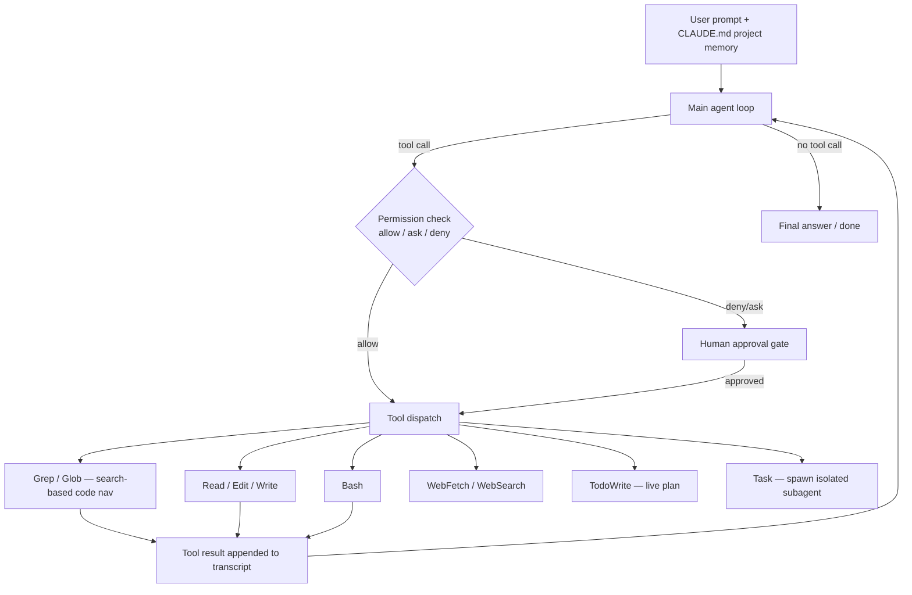

# Breakdown - Claude Code

> **What it is:** Claude Code is Anthropic's command-line coding agent (2025) — a single main agent loop that wraps a strong Claude model in a curated tool set and runs directly in the user's terminal, against their real repository. It is the clearest shipped instance of the thin-scaffold / model-first philosophy: rather than hardcode an elaborate orchestration graph, it gives the model excellent tools and a permission system, and lets the model drive. This breakdown reads it as an architecture, and pulls out the design decisions worth stealing. **Evidence status:** based on Anthropic's public materials, the documented tool and settings surface, and the observable behavior of the product — not on internal source.

## The headline numbers

- **One main loop, ~10 core tools.** No multi-agent framework by default; a single agent with a small, sharp tool set.
- **Underlying model score:** the Claude models it runs on report in the ~70% range on [[Breakdown - SWE-bench and SWE-agent|SWE-bench Verified]] (Anthropic-reported, *as of 2026*) — the capability that lets the scaffold stay thin.
- **Context budget:** a single long-context window (hundreds of thousands of tokens) plus on-demand [[Concept - Context Engineering for Agents|compaction]] and subagents; the practical working limit is far below the nominal window because tool output and file reads fill it fast.
- **Permission granularity:** three modes — allow / ask / deny — settable per tool and per argument pattern in `settings.json`.

## How it actually works

The loop is the ordinary observe–think–act cycle of [[Deep Dive - The Agent Loop|the agent loop]], but three design choices define the product:

**Search-based code navigation, deliberately not embeddings.** Code is found with `Grep` (ripgrep) and `Glob` (path patterns), not by embedding the repo and doing [[Concept - Semantic Search|semantic vector search]]. This is a considered bet: grep is exact, needs no index to build or invalidate, never goes stale as the code changes mid-session, and matches how the model already reasons about code (symbol names, string literals, regexes). Embedding-RAG over a codebase has to be rebuilt as files change, returns fuzzy neighbors where the model wanted an exact call-site, and adds an index to keep coherent — costs that buy little when the model can just write a good regex. The tradeoff: grep can't find *conceptually* related code that shares no lexical tokens, but in practice the model compensates by searching iteratively.

**Permission gating as UX, not just a sandbox.** Every tool call passes an allow/ask/deny check keyed on the tool and the specific pattern (e.g., allow `Bash(git status)` but ask on `Bash(rm *)`). Destructive or out-of-scope actions hit a human approval gate. This is the interactive complement to [[Checklist - Sandboxing an Agent|hard sandboxing]] — it puts a human in the loop precisely where irreversibility lives, which is where [[Gotchas - Agents in Production|over-eager destructive actions]] otherwise bite.

**Context kept clean by construction.** `CLAUDE.md` files carry durable project memory (conventions, commands, architecture) that loads every session so the model doesn't rediscover it. Long sessions compact older turns to reclaim the window. And the `Task` tool spawns a subagent with its own isolated context that returns a distilled result — the same context-isolation move as [[Breakdown - Anthropic's Multi-Agent Research System|the multi-agent research system]], used here surgically (search a large area, run a self-contained subtask) rather than as the default topology.

Two more surfaces matter. `TodoWrite` maintains a **live todo list** that re-surfaces the goal and remaining steps each turn. And Claude Code is a [[Concept - Model Context Protocol (MCP)|Model Context Protocol]] client: external tools plug in as MCP servers, so the tool set is extensible without changing the agent, and every added tool arrives through the same [[Concept - Tool Use and Function Calling|function-calling interface]] and permission machinery.

## The clever parts

1. **Recitation, productized.** The todo list is the [[Lore - Agent Prompt-Engineering Folklore|recitation trick]] shipped as a feature: re-stating the goal and open items every turn fights goal-drift and lost-in-the-middle on long tasks, where a static system prompt scrolls out of attention range. It is the single most visible piece of long-horizon engineering in the product.
2. **Thin scaffold on purpose.** There is no fixed plan-then-execute graph, no forced reflection loop. The bet is that a capable-enough model plus great tools beats hand-built orchestration — the applied face of the [[Concept - Trained vs Prompted Agents|trained-agent thesis]] and of [[Deep Dive - Agentic Coding in Production|agentic coding in production]]. Less scaffold means fewer places for the harness to fight the model's prior.
3. **The tool set is the product.** Echoing SWE-agent's Agent-Computer-Interface insight, the leverage is in tools designed for a model, not a human: `Edit` takes an exact old-string/new-string pair (forcing the model to prove it read the code before changing it), errors return as readable text the model can act on, and `Bash` gives an escape hatch to the whole Unix toolbox instead of enumerating a hundred bespoke tools.
4. **Permissions as first-class design.** Treating allow/ask/deny as a core surface — not an afterthought bolted on for safety — is what makes an autonomous agent tolerable to run against a real repo with real credentials.

## What it got wrong / what's dated

Large repos still exceed the practical context budget; the model can't hold a million-line codebase in view and leans hard on search + navigation, which occasionally misses the right file. **Over-eager edits** happen — the model changes more than asked, or "fixes" something that wasn't broken — which is why the [[Checklist - Agent Tool Definition Review|tool contract]] and permission gates matter. And the token bill is real: a long agentic coding session is not cheap, so [[Concept - Cost Engineering for LLM Applications|cost]] is a live constraint, not a footnote. As the underlying models improve, expect even the compaction and subagent scaffolding here to thin further.

## What to steal

Prefer exact search over embedding-RAG for code — the index you don't build can't go stale. Ship a live todo/recitation surface for any long-horizon agent. Make permissions a designed surface, gated per-pattern with human approval at the points of irreversibility. Design tools for the model (exact-match edits, readable errors, one Bash escape hatch) rather than porting a human UI. And keep the scaffold thin: every orchestration flourish you add is something a stronger model may render redundant.

## Connections
- [[Breakdown - SWE-bench and SWE-agent]] — the benchmark and the Agent-Computer-Interface insight Claude Code's tool design descends from.
- [[Concept - Context Engineering for Agents]] — CLAUDE.md memory, compaction, and subagent isolation are this note's concrete instances of context engineering.
- [[Concept - Trained vs Prompted Agents]] — Claude Code is the flagship product bet that a trained model + thin scaffold beats heavy orchestration.
- [[Lore - Agent Prompt-Engineering Folklore]] — the todo list is the recitation folklore trick made a shipped feature.
- [[Checklist - Sandboxing an Agent]] — permission gating is the interactive complement to the hard-isolation controls in that checklist.
- [[Concept - Model Context Protocol (MCP)]] — Claude Code is an MCP client; MCP is how its tool set extends without changing the agent.
- [[Concept - Tool Use and Function Calling]] — every tool, native or MCP, arrives through the standard function-calling interface.
- [[Checklist - Agent Tool Definition Review]] — the exact-match Edit and readable-error design are that checklist's principles applied.
- [[Deep Dive - The Agent Loop]] — the underlying observe-think-act cycle the whole product is a loop over.
- [[Deep Dive - Agentic Coding in Production]] — the software-engineering domain's treatment of shipping agents like this one.
- [[Concept - Semantic Search]] — the embedding-retrieval approach Claude Code deliberately declines in favor of grep/glob for code.
- [[Concept - Cost Engineering for LLM Applications]] — long agentic sessions have a real token bill; the main ongoing operational constraint.
- [[Gotchas - Agents in Production]] — over-eager edits and destructive actions are exactly the production failure modes the permission gates exist to catch.
- [[Breakdown - Anthropic's Multi-Agent Research System]] — the same context-isolation subagent move, used surgically here via the Task tool rather than as the default topology.
