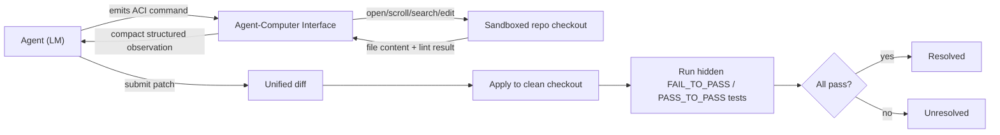

# Breakdown - SWE-bench and SWE-agent

> SWE-bench (Jimenez et al., Princeton, 2023) turned "can an agent fix a real bug" into a number: 2,294 real GitHub issue-and-PR pairs from 12 popular Python repos, graded by whether a generated patch makes the repo's own hidden tests pass. SWE-agent (Yang et al. 2024) is the reference agent that shipped alongside it, and its real contribution wasn't a smarter prompt — it was the Agent-Computer Interface (ACI), a purpose-built command set that showed interface design moves the score more than model choice does. Both are still the default coding-agent yardstick as of 2026, though the benchmark's own credibility took a serious hit along the way (dated below).

## The headline numbers
- 2,294 task instances across 12 repos (Django, sympy, scikit-learn, matplotlib, and others); each pairs a closed GitHub issue with the PR that fixed it and that PR's own test diff.
- Grading is execution-based, not similarity-based: a patch is **resolved** only if every `FAIL_TO_PASS` test (failed before the fix, must pass after) and every `PASS_TO_PASS` test (must not regress) passes.
- Best model at release (2023): Claude 2 at ~1.96% resolved. SWE-agent with GPT-4 (2024) reached roughly 12-18% using the ACI on the same class of model that scored far worse against a raw shell.
- SWE-bench Verified (OpenAI, Aug 2024): a 500-instance human-filtered subset that removed underspecified issues and broken/over-strict tests from the original set.
- By 2025-26, frontier agentic systems reported 70-80%+ on Verified — but in Feb 2026 OpenAI itself stopped evaluating on Verified after auditing a subset and finding a majority of the audited tasks had flawed tests (too strict or too loose), alongside contamination fingerprints (some models could reproduce the gold patch from the task ID alone); the field shifted toward the harder **SWE-bench Pro**, where the same frontier models drop back to roughly 20-60%.
- SWE-bench sits alongside browsing, computer-use, and tool-agent-user tasks in the wider [[Reference - Agent Benchmarks]] landscape — it remains the most cited entry there specifically because it has a free, objective execution oracle that most agent domains lack.

## How it actually works
An instance gives the agent only the issue text and a sandboxed checkout of the repo at the pre-fix commit — no diff, no file hint. The agent must localize the bug, edit the right files, and emit a patch; a harness then applies that patch to a clean checkout and runs the hidden tests.

SWE-agent's insight was that a generic shell (`cat`, `sed`, `grep`) makes a language model bad at this: free-form Bash output floods the context, and small in-place edits via raw text diffs are error-prone. Instead SWE-agent built the ACI — a narrow, purpose-built command set (`open FILE`, `scroll`, `search_dir`, `edit LINE_RANGE`) where every action returns a compact, structured observation, including a re-run of the linter after every edit so a syntax error surfaces immediately instead of silently corrupting the file. This is the same [[Deep Dive - The Agent Loop]] shape — model emits an action, harness executes it, observation appends to the transcript — but with a tool surface hand-designed for the *model's* failure modes rather than a human's, in contrast to the generic tool-design guidance in [[Concept - Tool Use and Function Calling]].

## The clever parts
- **Design the interface for the model, not the human.** A human-optimized shell (arbitrary `sed`/`awk`) is a worse tool for an LM than a restricted, structured command set — fewer degrees of freedom means fewer malformed actions.
- **Feedback after every action, not just at the end.** The post-edit linter turns "did that edit break the file" from a silent failure into an immediate observation the agent can react to — a concrete instance of the general lesson in [[Concept - Reflection and Self-Correction]] that self-correction only works with an external, checkable signal.
- **Execution-graded, real issues.** No rubric, no judge model — the repo's own regression tests decide, which sidesteps the gaming that plagues [[Concept - LLM-as-Judge]]-style evals entirely.
- **Test-passing as a verifiable, binary reward.** This is exactly the kind of ground-truth signal later RL pipelines train against directly — SWE-Gym-style environments repurpose the same resolved/unresolved signal as a reward for [[Concept - GRPO and RL with Verifiable Rewards]].
- **Localization treated as a first-class subproblem.** Early failure analysis showed agents often edited the wrong file entirely; the ACI's `search_dir`/`open` commands exist specifically to make navigation a tractable, observable step instead of something buried inside one giant generation.

## What it got wrong / what's dated
Python-only and repo-specific — none of the interface lessons are validated cross-language at the same scale. Localization difficulty and edit difficulty are conflated in ways that made some "hard" instances of the original set easy and vice versa, part of why OpenAI built Verified in the first place.

The bigger problem turned out to be the benchmark's own integrity. Because these are real historical GitHub issues, they sit in the same web crawl that trains the next model generation — [[Concept - Benchmark Contamination]] in its purest form — and by early 2026 OpenAI's own audit found a majority of a sampled Verified subset had flawed hidden tests (some too strict, rejecting functionally correct patches over implementation details; some too loose, checking behavior the issue never specified), alongside evidence that some models could reproduce the gold patch from the task ID alone. OpenAI retired Verified as its primary agentic-coding eval as a result. This compounds the deeper methodological point at the heart of [[Concept - Agent Evaluation Challenges]]: "tests pass" is an outcome metric that can hide an unsafe, coincidental, or memorized path to the right answer, not a guarantee the fix is correct or maintainable. And the whole benchmark's public credibility took an earlier, sharper hit during the Devin launch controversy, where a headline SWE-bench number was shown not to match real-world reliability at all (link [[Lore - The Devin Demo and the SWE-bench Reality Gap]]).

## What to steal
Invest engineering effort in the tool/interface layer before assuming a bigger model will fix agent failures — SWE-agent's ACI beat naive-shell baselines using the *same* underlying model. Wire a verifiable check into the loop wherever one exists (tests, linters, compilers) rather than trusting the model's self-report. Treat "where is the bug" as a separable step from "how do I fix it," and instrument both. And design tool observations to be short and structured: a bloated tool result is context the agent has to pay for on every subsequent turn, which compounds badly over the kind of multi-step repo edits this benchmark demands — see [[Concept - Long-Horizon Agency and Error Compounding]] for why per-step reliability on long tool-use trajectories matters so much. Production coding agents like [[Breakdown - Claude Code]] carry the same lesson forward: deliberately narrow, high-feedback tools (Grep/Glob/Edit) over an open-ended shell. And build your own held-out, execution-graded eval on your own codebase rather than trusting a public leaderboard number at face value — the Verified retirement is the concrete argument for why.

## Connections
- [[Concept - Tool Use and Function Calling]] — ACI is a domain-specific instance of the general tool-design problem; contrast a hand-tuned command set against generic API-shaped tools.
- [[Deep Dive - The Agent Loop]] — SWE-agent's ACI loop is the same observe-act-repeat scaffold applied to a repo environment.
- [[Reference - Agent Benchmarks]] — SWE-bench/Verified is one row in the broader coding-agent benchmark landscape.
- [[Breakdown - Claude Code]] — a shipped product that inherits the "narrow, high-feedback tools beat a raw shell" lesson.
- [[Concept - GRPO and RL with Verifiable Rewards]] — test-pass/fail is exactly the verifiable reward signal RL-on-code pipelines train against.
- [[Concept - Benchmark Contamination]] — GitHub-sourced issues risk leaking into pretraining corpora, inflating scores.
- [[Concept - Agent Evaluation Challenges]] — "tests pass" is an outcome metric that can hide an unsafe, coincidental, or memorized process.
- [[Concept - LLM-as-Judge]] — execution grading is the alternative SWE-bench uses instead of a judge model, sidestepping judge-specific biases entirely.
- [[Lore - The Devin Demo and the SWE-bench Reality Gap]] — the cautionary tale of a headline SWE-bench number not matching real-world reliability.
- [[Concept - Reflection and Self-Correction]] — the linter-after-every-edit design is a working example of feedback-gated self-correction.
- [[Concept - Long-Horizon Agency and Error Compounding]] — multi-file repo fixes are exactly the long-horizon trajectories where per-step interface quality determines whether errors compound.
- [[Breakdown - SWE-bench]] — the sibling note on the benchmark's own construction, contamination scandal, and 2026 retirement of Verified; this note's focus is the agent side (SWE-agent's ACI), that one's is the benchmark side.

## Sources
- Jimenez, Yang, Wettig, Yao, Pei, Press, Narasimhan (Princeton, 2023) — "SWE-bench: Can Language Models Resolve Real-World GitHub Issues?" Introduces the 2,294-instance dataset and execution-based grading.
- Yang et al. (2024) — "SWE-agent: Agent-Computer Interfaces Enable Automated Software Engineering." Introduces the ACI and shows interface design drives score more than model choice at fixed compute.
- OpenAI (Aug 2024) — SWE-bench Verified. Human-filtered 500-instance subset addressing grading noise in the original set.
- OpenAI Frontier Evals (Feb 2026) — audit finding a majority of a sampled Verified subset had flawed tests and contamination fingerprints; announced the shift to SWE-bench Pro.
