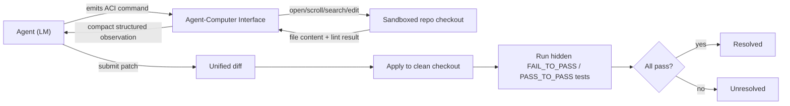

# Breakdown - SWE-bench and SWE-agent

> SWE-bench (Jimenez et al., Princeton, 2023) turned "can an agent fix a real bug" into a number: 2,294 real GitHub issue-and-PR pairs from 12 popular Python repos, graded by whether a generated patch makes the repo's own hidden tests pass. SWE-agent (Yang et al. 2024) is the reference agent released with it. Its contribution was the Agent-Computer Interface (ACI), a purpose-built command set showing that interface design moves the score more than model choice does. Both are still the default coding-agent yardstick as of 2026, although the benchmark's credibility took a serious hit along the way (see below).

## The headline numbers
- 2,294 task instances across 12 repos (Django, sympy, scikit-learn, matplotlib and others). Each pairs a closed GitHub issue with the PR that fixed it and that PR's own test diff.
- Grading runs the code; there's no similarity scoring. A patch is **resolved** only if every `FAIL_TO_PASS` test (failed before the fix, must pass after) and every `PASS_TO_PASS` test (must not regress) passes.
- Best model at release (2023): Claude 2 at ~1.96% resolved. SWE-agent with GPT-4 (2024) reached roughly 12-18% through the ACI, with the same class of model that scored far worse on a raw shell.
- SWE-bench Verified (OpenAI, Aug 2024): a 500-instance human-filtered subset without the original set's underspecified issues and broken or over-strict tests.
- By 2025-26, frontier agentic systems reported 70-80%+ on Verified. Then in Feb 2026 OpenAI itself stopped evaluating on Verified. An audit of a subset found most of the audited tasks had flawed tests (too strict or too loose), plus contamination fingerprints: some models could reproduce the gold patch from the task ID alone. The field moved to the harder **SWE-bench Pro**, where the same frontier models fall back to roughly 20-60%.
- SWE-bench sits with browsing, computer-use and tool-agent-user tasks in [[Reference - Agent Benchmarks]]. It's still the most cited of them because it has a free, objective execution oracle, which most agent domains lack.

## How it works
Each instance gives the agent only the issue text and a sandboxed checkout of the repo at the pre-fix commit. No diff, no file hint. The agent has to localize the bug, edit the right files and emit a patch. A harness applies the patch to a clean checkout and runs the hidden tests.

SWE-agent's observation was that a generic shell (`cat`, `sed`, `grep`) makes a language model bad at this. Free-form Bash output floods the context, and small in-place edits through raw text diffs go wrong easily. So SWE-agent built the ACI, a narrow command set (`open FILE`, `scroll`, `search_dir`, `edit LINE_RANGE`) where every action returns a compact, structured observation. The linter re-runs after every edit, so a syntax error shows up immediately instead of silently corrupting the file. The shape is the usual [[Deep Dive - The Agent Loop]] (model emits an action, harness executes it, observation goes into the transcript), but the tool surface is hand-designed around the *model's* failure modes instead of a human's. Compare the generic tool-design guidance in [[Concept - Tool Use and Function Calling]].

## The clever parts
- **Design the interface for the model, not the human.** For an LM, a human-optimized shell (arbitrary `sed`/`awk`) is worse than a restricted, structured command set. Fewer degrees of freedom means fewer malformed actions.
- **Feedback after every action.** The post-edit linter turns "did that edit break the file" from a silent failure into an observation the agent can react to right away. It's an example of the lesson in [[Concept - Reflection and Self-Correction]]: self-correction only works with an external, checkable signal.
- **Real issues, graded by execution.** No rubric, no judge model. The repo's own regression tests decide, which avoids the gaming that plagues [[Concept - LLM-as-Judge]]-style evals.
- **Passing tests as a verifiable binary reward.** Later RL pipelines train directly on this kind of ground-truth signal. SWE-Gym-style environments reuse the same resolved/unresolved signal as a reward for [[Concept - GRPO and RL with Verifiable Rewards]].
- **Localization as its own subproblem.** Early failure analysis showed agents often edited the wrong file entirely. The ACI's `search_dir`/`open` commands exist to make navigation a tractable, observable step instead of something buried in one giant generation.

## What it got wrong / what's dated
Python-only and repo-specific. None of the interface lessons have been validated across languages at the same scale. Localization difficulty and edit difficulty are mixed together in ways that made some "hard" instances in the original set easy and vice versa, which is part of why OpenAI built Verified.

The bigger problem was the benchmark's integrity. These are real historical GitHub issues, so they're in the same web crawl that trains the next model generation: [[Concept - Benchmark Contamination]] in its purest form. By early 2026 OpenAI's own audit found that most of a sampled Verified subset had flawed hidden tests. Some were too strict and rejected functionally correct patches over implementation details; some were too loose and checked behavior the issue never specified. There was also evidence that some models could reproduce the gold patch from the task ID alone. OpenAI retired Verified as its primary agentic-coding eval. That adds to the methodological point at the center of [[Concept - Agent Evaluation Challenges]]: "tests pass" is an outcome metric. It can hide an unsafe, coincidental or memorized route to the right answer, and it doesn't guarantee the fix is correct or maintainable. The benchmark's public credibility had already taken an earlier, sharper hit in the Devin launch controversy, where a headline SWE-bench number turned out not to match real-world reliability at all ([[Lore - The Devin Demo and the SWE-bench Reality Gap]]).

## What to steal
Put engineering effort into the tool/interface layer before assuming a bigger model will fix agent failures. SWE-agent's ACI beat naive-shell baselines with the *same* underlying model. Wire a verifiable check into the loop wherever one exists (tests, linters, compilers) instead of trusting the model's self-report. Treat "where is the bug" and "how do I fix it" as separate steps and instrument both. Keep tool observations short and structured. A bloated tool result is context the agent pays for on every later turn, and that compounds badly over the multi-step repo edits this benchmark requires ([[Concept - Long-Horizon Agency and Error Compounding]] explains why per-step reliability matters so much on long tool-use trajectories). Production coding agents like [[Breakdown - Claude Code]] carry the lesson forward with deliberately narrow, high-feedback tools (Grep/Glob/Edit) in place of an open-ended shell. Finally, build your own held-out, execution-graded eval on your own codebase instead of taking a public leaderboard number at face value. The Verified retirement is the argument for it.

## Connections
- [[Concept - Tool Use and Function Calling]] — ACI is a domain-specific instance of the general tool-design problem; contrast a hand-tuned command set against generic API-shaped tools.
- [[Deep Dive - The Agent Loop]] — SWE-agent's ACI loop is the same observe-act-repeat scaffold applied to a repo environment.
- [[Reference - Agent Benchmarks]] — SWE-bench/Verified is one row in the broader coding-agent benchmark landscape.
- [[Breakdown - Claude Code]] — a shipped product that inherits the "narrow, high-feedback tools beat a raw shell" lesson.
- [[Concept - GRPO and RL with Verifiable Rewards]] — test-pass/fail is exactly the verifiable reward signal RL-on-code pipelines train against.
- [[Concept - Benchmark Contamination]] — GitHub-sourced issues risk leaking into pretraining corpora, inflating scores.
- [[Concept - Agent Evaluation Challenges]] — "tests pass" is an outcome metric that can hide an unsafe, coincidental, or memorized process.
- [[Concept - LLM-as-Judge]] — execution grading is the alternative SWE-bench uses instead of a judge model, sidestepping judge-specific biases entirely.
- [[Lore - The Devin Demo and the SWE-bench Reality Gap]] — the cautionary tale of a headline SWE-bench number not matching real-world reliability.
- [[Concept - Reflection and Self-Correction]] — the linter-after-every-edit design is a working example of feedback-gated self-correction.
- [[Concept - Long-Horizon Agency and Error Compounding]] — multi-file repo fixes are exactly the long-horizon trajectories where per-step interface quality determines whether errors compound.
- [[Breakdown - SWE-bench]] — the sibling note on the benchmark's own construction, contamination scandal, and 2026 retirement of Verified; this note's focus is the agent side (SWE-agent's ACI), that one's is the benchmark side.

## Sources
- Jimenez, Yang, Wettig, Yao, Pei, Press, Narasimhan (Princeton, 2023) — "SWE-bench: Can Language Models Resolve Real-World GitHub Issues?" Introduces the 2,294-instance dataset and execution-based grading.
- Yang et al. (2024) — "SWE-agent: Agent-Computer Interfaces Enable Automated Software Engineering." Introduces the ACI and shows interface design drives score more than model choice at fixed compute.
- OpenAI (Aug 2024) — SWE-bench Verified. Human-filtered 500-instance subset addressing grading noise in the original set.
- OpenAI Frontier Evals (Feb 2026) — audit finding a majority of a sampled Verified subset had flawed tests and contamination fingerprints; announced the shift to SWE-bench Pro.
