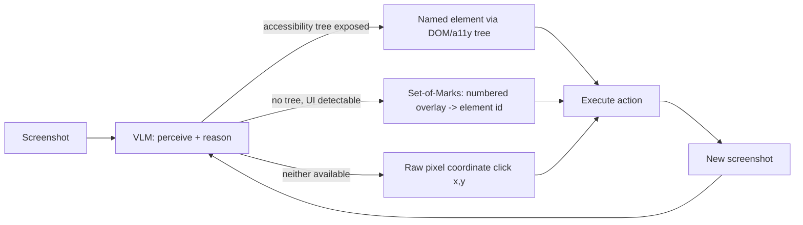

> **One-paragraph hook:** Give an LLM a browser or a desktop in place of a tool schema and the interface becomes the hard part. The model gets a bitmap instead of a clean function to call, and before it can do anything it has to work out which fourteen pixels are the "Submit" button.

## The mechanism

It's a perceive-act loop. The agent looks at a screenshot and emits a GUI action (`click(x, y)`, `type`, `scroll`, a keypress). The harness runs it against the real interface, and a new screenshot comes back. Anthropic's Computer Use (Oct 2024) and OpenAI's Operator/CUA (2025) are the reference systems. Structurally it's the usual [[Deep Dive - The Agent Loop]] (observe, decide, act, repeat until a stop condition), with pixel coordinates and GUI primitives as the action space in place of typed tool calls.

The bottleneck is grounding: mapping rendered pixels to the *right* click coordinate. A model can reason perfectly about the next step ("click the login button") and still fail the task if its coordinate lands a few pixels off. A misclick doesn't simply fail. It can trigger a different, unintended UI transition that the agent then has to reason its way out of. Three techniques help:

- **Set-of-Marks prompting.** Overlay numbered labels on detected UI elements and have the model name one ("click element 7") instead of predicting a raw coordinate. A continuous regression problem becomes a discrete selection problem, which models handle much more reliably.
- **The accessibility/DOM tree as the action target**, when the application exposes one. UI elements become structured, named data instead of pixels, which is cheaper and immune to rendering drift.
- **Pure-vision grounding**, the fallback when neither is available, and the current capability frontier.

## In practice

Capability is measured on a specific set of benchmarks, all listed in [[Reference - Agent Benchmarks]]: OSWorld (real, sandboxed desktop tasks), WebArena/VisualWebArena and WebVoyager (browser tasks), and ScreenSpot (grounding accuracy alone, separate from task planning). The perceiving half of the loop is an ordinary [[Concept - VLM Architectures]] setup. A [[Concept - Vision Transformers]]-based encoder turns the screenshot into tokens the language model reasons over, so grounding accuracy is capped by that encoder's effective patch resolution. You can't predict a click more precisely than the granularity the image was tokenized at.

The numbers show how far from solved this is. Early Claude computer use scored roughly in the mid-teens percent on OSWorld against a human baseline of roughly 72% (late 2024). Scores improved a lot through 2025-26 but are still well below human reliability (as of 2026). Part of the gap is cost built into the setup, beyond accuracy. Every step needs a fresh high-resolution screenshot pushed through a full VLM forward pass, a heavier and slower request than a text-only tool call. The per-step economics in [[Concept - Latency, Throughput, and Cost in LLM Serving]] apply with a meaningfully bigger multiplier than a text-tool agent pays, so a 20-step GUI task is slower and more expensive per step than the equivalent text-agent trajectory.

## Failure modes

- **Coordinate drift.** The click lands near the intended element but not on it, and it gets worse if the UI re-renders or shifts between the screenshot and the action.
- **Misclicks that change state.** A click one pixel row off can hit "Delete" instead of "Edit." Detection: diff the post-action screenshot against the expected UI transition. Fix: put destructive-looking actions behind an explicit confirmation step, per [[Checklist - Sandboxing an Agent]].
- **Transient states the agent can't see.** Tooltips, dropdown menus and animations that exist only briefly don't show up in a static screenshot, so the agent reasons about stale UI state.
- **Screenshot-loop latency and cost stacking.** Every step pays a full vision-model round trip, and per [[Concept - Long-Horizon Agency and Error Compounding]], more steps mean more independent chances for grounding errors to compound over the run. The latency-compounding and cost-blowup entries in [[Gotchas - Agents in Production]] apply here, amplified by the per-step screenshot cost.

## The non-obvious

Use the accessibility tree over vision whenever it's exposed. It turns a fuzzy regression problem (predict the right pixel) into an exact-match problem (name the right element), and rendering drift can't touch it. That's also why pure-vision grounding is both the capability frontier *and* the main source of errors. A large share of the software worth automating (legacy desktop applications, canvas-rendered UI, DRM-protected video players, custom-drawn widgets) exposes no usable accessibility tree, so pixel grounding is the only option for the applications that are hardest to automate any other way. The easy cases got easy because accessibility trees exist. The hard cases stay hard because they don't.

## Connections

- [[Concept - VLM Architectures]] — the perceiving half of the loop is a standard vision-language model; grounding accuracy is bounded by how well it localizes elements in the first place.
- [[Concept - Vision Transformers]] — the underlying vision encoder that tokenizes the screenshot; its patch resolution directly limits click-coordinate precision.
- [[Deep Dive - The Agent Loop]] — computer use is the same observe-act loop with a GUI-specific action space substituted for structured tool calls.
- [[Reference - Agent Benchmarks]] — OSWorld, ScreenSpot, and WebVoyager are the concrete benchmarks the numbers above are drawn from.
- [[Concept - Long-Horizon Agency and Error Compounding]] — grounding errors are a per-step failure probability, and GUI tasks tend to need many steps, so p^n decay applies directly.
- [[Checklist - Sandboxing an Agent]] — computer-use agents have real, often irreversible write access to a live UI, making isolation and confirmation gates non-optional.
- [[Gotchas - Agents in Production]] — latency compounding and cost blowup, already general agent failure modes, are amplified here by the per-step screenshot round trip.
- [[Concept - Latency, Throughput, and Cost in LLM Serving]] — each screenshot-in/action-out step is a heavier, slower request than a text tool call, and that per-request cost math is what makes long GUI tasks expensive.

## Sources
- Anthropic (Oct 2024) — Computer Use (public beta). Reference system for the screenshot-perceive, coordinate-click action loop and the source of the OSWorld numbers cited above.
- OpenAI (2025) — Operator / Computer-Using Agent (CUA). A second reference system for the same action space.
- Xie et al. (2024) — *OSWorld: Benchmarking Multimodal Agents for Open-Ended Tasks in Real Computer Environments.* Source of the real-desktop-task benchmark and the human-baseline comparison.
- Yang et al. (2023) — *Set-of-Mark Prompting Unleashes Extraordinary Visual Grounding in GPT-4V.* Source of the numbered-overlay grounding technique.
