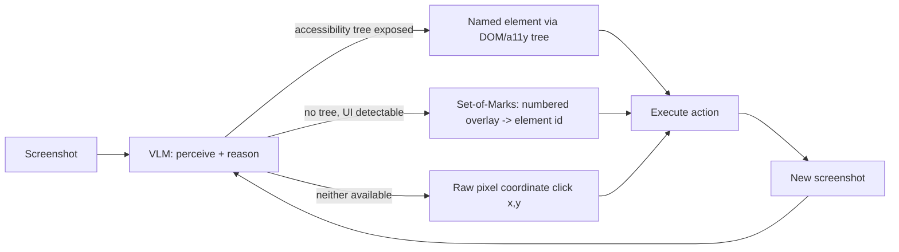

> **One-paragraph hook:** Give an LLM a browser or a desktop instead of a tool schema, and the interface itself becomes the hard part — the model doesn't get a clean function to call, it gets a bitmap, and it has to figure out which fourteen pixels correspond to the "Submit" button before it can act on anything.

## The mechanism

The setup is a perceive-act loop: the agent observes a screenshot, emits a GUI action — `click(x, y)`, `type`, `scroll`, a keypress — the harness executes it against the real interface, and a new screenshot comes back. Anthropic's Computer Use (Oct 2024) and OpenAI's Operator/CUA (2025) are the reference systems for this shape. Structurally it's the same [[Deep Dive - The Agent Loop]] — observe, decide, act, repeat until a stop condition — with the action space specialized to pixel coordinates and GUI primitives instead of typed tool calls.

The bottleneck is grounding: mapping rendered pixels to the *correct* click coordinate. A model can reason perfectly about what needs to happen next ("click the login button") and still fail the task entirely if its coordinate prediction lands a few pixels off, because a misclick doesn't just fail silently — it can trigger a different, unintended UI transition that the agent then has to reason its way out of. Three techniques address this:

- **Set-of-Marks prompting** — overlay numbered labels on detected UI elements and have the model name an element ("click element 7") rather than predict a raw coordinate. This converts a continuous regression problem into a discrete selection problem, which models are substantially more reliable at.
- **The accessibility/DOM tree as the action target**, when the application exposes one — treat UI elements as structured, named data instead of pixels, which is cheaper and immune to rendering drift.
- **Pure-vision grounding**, the fallback when neither of the above is available — and the current capability frontier.

## In practice

Capability is measured on a specific set of benchmarks, cataloged in full in [[Reference - Agent Benchmarks]]: OSWorld (real, sandboxed desktop tasks), WebArena/VisualWebArena and WebVoyager (browser tasks), and ScreenSpot (grounding accuracy in isolation, decoupled from task planning). The perceiving half of the loop is an ordinary [[Concept - VLM Architectures]] setup — a [[Concept - Vision Transformers]]-based encoder turns the screenshot into tokens the language model reasons over, and grounding accuracy is directly bounded by that encoder's effective patch resolution: you cannot predict a click coordinate more precisely than the granularity at which the image was tokenized.

The numbers illustrate how far this still is from solved: early Claude computer use scored roughly in the mid-teens percent on OSWorld against a roughly 72% human baseline (late 2024); scores improved considerably through 2025-26 but remain well below human reliability (as of 2026). Part of the gap is structural cost, not just accuracy — each step requires a fresh high-resolution screenshot processed through a full VLM forward pass, which is a heavier, slower request than a text-only tool call, so the per-step economics described in [[Concept - Latency, Throughput, and Cost in LLM Serving]] apply with a meaningfully larger multiplier than a text-tool-call agent pays; a 20-step GUI task is both slower and more expensive per step than the equivalent text-agent trajectory.

## Failure modes

- **Coordinate drift.** The predicted click lands near but not on the intended element, and drift compounds if the UI re-renders or shifts between when the screenshot was taken and when the action executes.
- **Misclicks triggering unintended state changes.** A click one pixel row off can hit "Delete" instead of "Edit." Detection: diff the post-action screenshot against the expected UI transition; fix: gate destructive-looking actions behind an explicit confirmation step, per [[Checklist - Sandboxing an Agent]].
- **Inability to perceive transient states.** Tooltips, dropdown menus, and animations that exist only briefly aren't captured by a static screenshot, so the agent reasons about stale UI state it can no longer see.
- **Screenshot-loop latency and cost stacking.** Every step pays a full vision-model round trip, and — per [[Concept - Long-Horizon Agency and Error Compounding]] — more steps means more independent grounding-error opportunities compounding across the run; [[Gotchas - Agents in Production]]'s latency-compounding and cost-blowup entries apply here in an amplified form specific to the per-step screenshot cost.

## The non-obvious

Prefer the accessibility tree over vision whenever it's exposed — it turns a fuzzy regression problem (predict the right pixel) into an exact-match problem (name the right element), and it's immune to rendering drift entirely. But this is exactly why pure-vision grounding remains both the capability frontier *and* the dominant error source at the same time: a large fraction of real-world software worth automating — legacy desktop applications, canvas-rendered UI, DRM-protected video players, custom-drawn widgets — exposes no usable accessibility tree at all, so pixel grounding is the only option for precisely the applications that are hardest to automate any other way. The easy cases got easy because accessibility trees exist; the hard cases stay hard because they don't.

## Connections

- [[Concept - VLM Architectures]] — the perceiving half of the loop is a standard vision-language model; grounding accuracy is bounded by how well it localizes elements in the first place.
- [[Concept - Vision Transformers]] — the underlying vision encoder that tokenizes the screenshot; its patch resolution directly limits click-coordinate precision.
- [[Deep Dive - The Agent Loop]] — computer use is the same observe-act loop with a GUI-specific action space substituted for structured tool calls.
- [[Reference - Agent Benchmarks]] — OSWorld, ScreenSpot, and WebVoyager are the concrete benchmarks the numbers above are drawn from.
- [[Concept - Long-Horizon Agency and Error Compounding]] — grounding errors are a per-step failure probability, and GUI tasks tend to need many steps, so p^n decay applies directly.
- [[Checklist - Sandboxing an Agent]] — computer-use agents have real, often irreversible write access to a live UI, making isolation and confirmation gates non-optional.
- [[Gotchas - Agents in Production]] — latency compounding and cost blowup, already general agent failure modes, are amplified here by the per-step screenshot round trip.
- [[Concept - Latency, Throughput, and Cost in LLM Serving]] — each screenshot-in/action-out step is a heavier, slower request than a text tool call, and that per-request cost math is what makes long GUI tasks expensive.

## Sources
- Anthropic (Oct 2024) — Computer Use (public beta). Reference system for the screenshot-perceive, coordinate-click action loop and the source of the OSWorld numbers cited above.
- OpenAI (2025) — Operator / Computer-Using Agent (CUA). A second reference system for the same action space.
- Xie et al. (2024) — *OSWorld: Benchmarking Multimodal Agents for Open-Ended Tasks in Real Computer Environments.* Source of the real-desktop-task benchmark and the human-baseline comparison.
- Yang et al. (2023) — *Set-of-Mark Prompting Unleashes Extraordinary Visual Grounding in GPT-4V.* Source of the numbered-overlay grounding technique.
