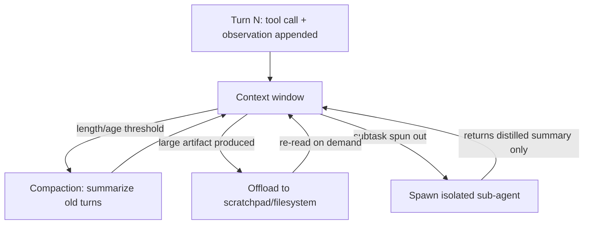

> **One-paragraph hook:** An agent's transcript never shrinks by itself. Every tool call, observation and turn adds tokens, and past a certain length the context window, more than the model's raw capability, limits how long and how well a task can run.

## The mechanism

An agentic run appends a message every turn, so the transcript only grows for the whole life of the task. Two costs follow. Quality drops: long transcripts trigger [[Concept - Context Rot]] and lost-in-the-middle effects, where information buried mid-transcript gets less effective attention than what's at the start or end. And dollar cost scales with history length, because every later model call re-processes the accumulated transcript. Context engineering manages what's *currently loaded* in the window over a run. That's a separate concern from [[Concept - Agent Memory Systems]], the durable external store an agent writes to deliberately. A fact can sit in long-term memory and still be missing from the window when it's needed, and something can be in the window without ever being written to memory.

Four techniques do most of the work:

- **Compaction.** Periodically summarize old turns to free window space. The risk cuts both ways: compact too aggressively and you drop a fact the agent needs ten turns later; too conservatively and you're back to the growth problem.
- **Offload to the environment.** Write notes, plans or intermediate artifacts to a scratchpad or filesystem and re-read them when needed, instead of carrying everything in context for the rest of the run.
- **Sub-agent context isolation.** Hand a subtask to a worker with its own clean window via [[Pattern - Orchestrator-Worker Agents]], and have it return a distilled summary instead of its full trace, so the orchestrator's transcript stays small.
- **Just-in-time retrieval.** Pull only the currently relevant slice of history or documents into the window when needed, reusing [[Deep Dive - RAG Architectures]] machinery with an agent-generated query in place of a user-typed one.

A fifth, cheaper habit compounds with all four: **tool-result hygiene**. Truncate or paginate large tool outputs before they enter the window, so one verbose API response doesn't silently eat the budget meant for reasoning.

Under all of this sits a constraint that looks optional and isn't: **cache-friendly layout**. A stable, append-only prefix is what keeps [[Concept - Prompt Caching]] and the underlying [[Concept - KV Cache]] reuse hot across turns. Reordering or editing an early message invalidates the cached prefix for every token after it, and reprocessing from scratch frequently costs more than the tokens any of the techniques above were trying to save.

## In practice

Anthropic's guidance ("Effective context engineering for AI agents," 2025) arrives at the same four techniques from production experience: note-taking to files as offload, sub-agent architectures for isolation, and compaction at clean episode boundaries instead of mid-turn. [[Breakdown - Claude Code]] has the same shape, with a persistent scratchpad file doing the offload job so an ever-growing todo list doesn't have to live only in the transcript. [[Lore - Agent Prompt-Engineering Folklore]] has a sharper, more contested version from practitioners building long-running agents like Manus. The folklore, weakly sourced but widely repeated, says *restoring* the full stable tool-definition prefix every turn wins in practice over adding or removing tools mid-run to save tokens, because the cache-invalidation cost of a shifting prefix outweighs the savings of a smaller one.

## Failure modes

- **Over-compaction amnesia.** Summarization drops a fact the agent needs later. The symptom is the agent asking again for information it was already given, or retrying an action it already learned doesn't work.
- **Cache invalidation from reordering.** Editing or reordering early messages, not only deleting them, breaks the prompt-caching prefix match for every token after them, and latency and cost spike. Detection: watch cache-hit rate or time-to-first-token for spikes that line up with a code path that mutates history in place.
- **Irrelevant history drowning the signal.** Unrelated early turns dilute the model's attention to what matters now, and it gets worse as raw window length grows. It's the same mechanism [[Concept - Context Rot]] documents.
- **Silent compounding over long runs.** Unmanaged, a dropped or drowned fact isn't a one-time cost. It's the quiet, undetected error that [[Concept - Long-Horizon Agency and Error Compounding]] describes compounding across every later step of a long task, since the agent can't notice a fact is missing until it acts on the gap.

## The non-obvious

Append-only transcript design is a hard economic constraint, not a style preference. Prompt caching keys on an exact-prefix token match, so any edit to an earlier message, even one changed character, invalidates the cache for every token after it. That reprocessing frequently costs more than the tokens saved by "cleaning up" the transcript in place. So production context engineering treats "append a compacted summary and mark the old span dead" as strictly better than "rewrite history in place", even when the two prompts look about the same to a human reader. For the model, the economics aren't close.

## Connections

- [[Concept - Context Rot]] — the degradation mechanism context engineering exists to fight; the window growing and the window still working are two different questions.
- [[Concept - Agent Memory Systems]] — the durable external store an agent writes to on purpose, distinct from what's currently loaded into the window at any given turn.
- [[Concept - Prompt Caching]] — a stable, append-only transcript is what keeps the cached prefix hot; any in-place edit is a direct cost.
- [[Concept - KV Cache]] — prompt caching is the API-level surface over the same underlying KV cache reuse the serving engine performs.
- [[Pattern - Orchestrator-Worker Agents]] — sub-agent context isolation is this note's answer to giving a subtask a clean window without growing the orchestrator's own transcript.
- [[Deep Dive - RAG Architectures]] — just-in-time retrieval repurposes RAG machinery to pull only currently relevant history or documents into the window.
- [[Lore - Agent Prompt-Engineering Folklore]] — practitioner-level lessons (Manus, Claude Code) on what actually breaks context management in production, beyond the textbook techniques.
- [[Concept - Long-Horizon Agency and Error Compounding]] — an over-compacted or drowned fact is exactly the kind of silent error this note's failure modes feed into compounding.
- [[Breakdown - Claude Code]] — a concrete shipped system whose scratchpad-file design instantiates the offload technique described above.

## Sources
- Anthropic (2025) — "Effective context engineering for AI agents." Production guidance on compaction, offload, and sub-agent isolation, converging on the techniques described here.
- folklore, weakly sourced: Manus engineering lessons on context management (stable prefixes over dynamic tool pruning) circulating in agent-building practitioner circles through 2025.
