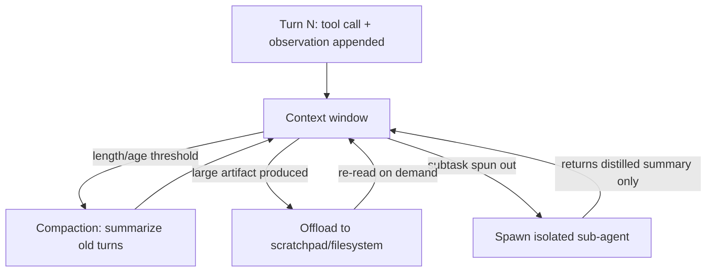

> **One-paragraph hook:** An agent's transcript never shrinks on its own. Every tool call, every observation, every turn appends more tokens, and past a certain length the context window — not the model's raw capability — becomes the actual bottleneck on how long and how well a task can run.

## The mechanism

The core problem is structural: an agentic run appends a message every turn, so the transcript is monotonically growing for the entire lifetime of the task. Two costs follow directly. Quality degrades — long transcripts trigger [[Concept - Context Rot]] and lost-in-the-middle effects, where information buried mid-transcript gets less effective attention than information at the start or end. And dollar cost scales with history length, since every subsequent model call re-processes the accumulated transcript. Context engineering is the discipline of managing what's *currently loaded* in the window across a run; it is a different concern from [[Concept - Agent Memory Systems]], which is the durable external store an agent writes to on purpose — a fact can live in long-term memory and still not be in the window when it's needed, and something can be in the window without ever being written to memory.

Four techniques do most of the work:

- **Compaction** — periodically summarizing old turns to reclaim window space. The risk is asymmetric: compact too aggressively and you drop a fact the agent needs ten turns later; compact too conservatively and you're back to the original growth problem.
- **Offload to the environment** — writing notes, plans, or intermediate artifacts to a scratchpad or filesystem and re-reading them on demand, instead of carrying everything in-context for the rest of the run.
- **Sub-agent context isolation** — handing a subtask to a worker with its own clean window via [[Pattern - Orchestrator-Worker Agents]], and having that worker return a distilled summary rather than its full trace, so the orchestrator's own transcript stays small.
- **Just-in-time retrieval** — pulling only the currently relevant slice of history or documents into the window on demand, reusing [[Deep Dive - RAG Architectures]] machinery but with an agent-generated query instead of a user-typed one.

A fifth, cheaper habit compounds with all four: **tool-result hygiene** — truncating or paginating large tool outputs before they enter the window at all, so a single verbose API response doesn't silently eat the budget meant for reasoning.

Layered under all of this is a constraint that is easy to treat as a nice-to-have and is actually load-bearing: **cache-friendly layout**. Keeping a stable, append-only prefix is what lets [[Concept - Prompt Caching]] and the underlying [[Concept - KV Cache]] reuse stay hot across turns — reordering or editing an early message invalidates the cached prefix for every token after it, and reprocessing from scratch is frequently more expensive than the extra tokens any of the above techniques were trying to save.

## In practice

Anthropic's own guidance on this ("Effective context engineering for AI agents," 2025) converges on the same four techniques above from direct production experience: note-taking to files as offload, sub-agent architectures for isolation, and compaction at clean episode boundaries rather than mid-turn. The same shape shows up in [[Breakdown - Claude Code]]'s design, where a persistent scratchpad file plays the offload role instead of keeping an ever-growing todo list purely in the transcript. [[Lore - Agent Prompt-Engineering Folklore]] carries the sharper, more contested version of this lesson from practitioners building long-running agents like Manus: the folklore, weakly sourced but widely repeated, is that *restoring* a full stable tool-definition prefix on every turn — rather than dynamically adding or removing tools mid-run to save tokens — wins in practice, because the cache-invalidation cost of a shifting prefix outweighs the token savings of a smaller one.

## Failure modes

- **Over-compaction amnesia.** Summarization drops a fact the agent needs later; symptom is the agent re-asking for information already given, or retrying an action it already tried and learned doesn't work.
- **Cache invalidation from reordering.** Editing or reordering early messages — not just deleting them — busts the prompt-caching prefix match for every token downstream, spiking both latency and cost. Detection: watch cache-hit-rate or time-to-first-token metrics for spikes correlated with a specific code path that mutates history in place.
- **Irrelevant history drowning signal.** Unrelated early turns dilute the model's effective attention to what's currently relevant, and this gets worse — not better — as raw window length grows, which is the same underlying mechanism [[Concept - Context Rot]] documents.
- **Silent compounding over long runs.** Left unmanaged, a dropped or drowned fact isn't a one-time cost — it's exactly the kind of quiet, undetected error that [[Concept - Long-Horizon Agency and Error Compounding]] describes compounding across every subsequent step of a long-horizon task, since the agent has no way to notice a fact is missing until it acts on the gap.

## The non-obvious

Append-only transcript design is a hard economic constraint, not a style preference. Because prompt caching keys off an exact-prefix token match, any edit to an earlier message — even a single changed character — invalidates the cache for every token that follows it, and that reprocessing cost is frequently larger than the tokens saved by "cleaning up" the transcript in place. This is why production context engineering treats "append a compacted summary and mark the old span dead" as strictly better than "rewrite history in place," even when the two produce visually similar prompts to a human reading the transcript — the model-facing economics of the two approaches are not close.

## Connections

- [[Concept - Context Rot]] — the degradation mechanism context engineering exists to fight; the window growing and the window still working are two different questions.
- [[Concept - Agent Memory Systems]] — the durable external store an agent writes to on purpose, distinct from what's currently loaded into the window at any given turn.
- [[Concept - Prompt Caching]] — a stable, append-only transcript is what keeps the cached prefix hot; any in-place edit is a direct cost.
- [[Concept - KV Cache]] — prompt caching is the API-level surface over the same underlying KV cache reuse the serving engine performs.
- [[Pattern - Orchestrator-Worker Agents]] — sub-agent context isolation is this note's answer to giving a subtask a clean window without growing the orchestrator's own transcript.
- [[Deep Dive - RAG Architectures]] — just-in-time retrieval repurposes RAG machinery to pull only currently relevant history or documents into the window.
- [[Lore - Agent Prompt-Engineering Folklore]] — practitioner-level lessons (Manus, Claude Code) on what actually breaks context management in production, beyond the textbook techniques.
- [[Concept - Long-Horizon Agency and Error Compounding]] — an over-compacted or drowned fact is exactly the kind of silent error this note's failure modes feed into compounding.
- [[Breakdown - Claude Code]] — a concrete shipped system whose scratchpad-file design instantiates the offload technique described above.

## Sources
- Anthropic (2025) — "Effective context engineering for AI agents." Production guidance on compaction, offload, and sub-agent isolation, converging on the techniques described here.
- folklore, weakly sourced: Manus engineering lessons on context management (stable prefixes over dynamic tool pruning) circulating in agent-building practitioner circles through 2025.
