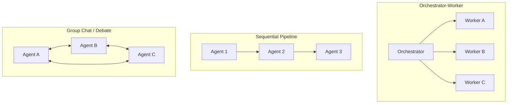

> **One-paragraph hook:** Splitting a task across multiple LLM agents looks like free parallelism until you price it: Anthropic measured roughly 15x the token spend of a single chat interaction for its multi-agent research system. Multi-agent orchestration is a real technique for a narrow class of problems, not a default upgrade over a well-built single agent — the topology you pick and the write-conflicts you don't anticipate determine whether that 15x buys you anything.

## The mechanism

A multi-agent system is defined by two choices: **topology** (who talks to whom) and **communication mechanism** (how they exchange information). The common topologies:

**Orchestrator + workers** (link [[Pattern - Orchestrator-Worker Agents]]) is a lead agent that decomposes a task at runtime and spawns subagents, each with an isolated context window, then synthesizes their outputs — effectively map-reduce over LLM calls. **Hierarchical trees** generalize this to multiple levels. **Sequential pipelines** pass a single artifact through a fixed chain of specialist agents. **Group chat / debate** puts several agents in a shared conversation and lets them converge (or not) through discussion. **Free-form networks** allow arbitrary agent-to-agent messaging with no fixed structure — the most flexible and the hardest to reason about or debug.

Communication happens through one of three mechanisms: a **shared scratchpad/blackboard** all agents read and write, **explicit message passing** between named agents, or **handoffs** — one agent transferring control of the entire conversation to another, the pattern OpenAI's Swarm (and its successor, the Agents SDK) built around. Handoffs are cheap to reason about because only one agent is "live" at a time; shared blackboards are cheap to implement but invite write-conflicts the moment two agents update the same field.

## In practice

Multi-agent orchestration earns its cost on tasks that are genuinely **parallelizable and separable** — where subtasks don't need to share mutable state and each worker benefits from a clean, uncontaminated context window rather than inheriting the whole run's history. Anthropic's internal research-agent evaluation found the multi-agent architecture beat a single agent by roughly 90% on the eval, driven almost entirely by breadth: many independent sub-questions researched in parallel, each in its own context, then synthesized. The same report found token volume alone explained about 80% of the variance in performance across configurations — multi-agent systems are, mechanically, a way of buying capability by spending tokens, not a free architectural upgrade. [[Breakdown - Anthropic's Multi-Agent Research System]] is the full walkthrough of that system.

The corollary is that multi-agent orchestration is the wrong default for **write-heavy, coherent-artifact tasks** — writing a single codebase, editing one document — where agents end up needing to see each other's in-progress state to avoid contradicting one another, at which point you've reinvented a single shared context with extra latency and cost stacked on top.

## Failure modes

**Coordination overhead** dominates once agent count grows past a handful: every synthesis step, every handoff, every round of debate costs a full model call, and latency stacks sequentially unless the topology is explicitly parallel.

**Error propagation across agents**: a wrong fact or a bad decision made by one agent gets treated as ground truth by downstream agents that have no way to independently verify it, so errors compound across the boundary instead of being caught.

**Diffusion of responsibility**: when no single agent owns the final correctness check, subtle errors slip through — everyone assumed someone else validated the claim.

**Write-conflicts**: multiple agents editing shared state (a shared file, a shared plan, a shared memory store) produce inconsistent results that no synthesis step can cleanly merge after the fact, because the conflict happened at write time, not at read time. This is the concrete failure behind Cognition's widely-cited "Don't Build Multi-Agents" (2025) argument: coordination and shared-context fragility make multi-agent systems worse than a single well-engineered agent for tasks that require a coherent, consistent output.

## The non-obvious

Evaluation is where multi-agent systems quietly become much harder to trust than the single-agent case. Non-determinism compounds across every agent in the pipeline, and long, branching trajectories make it genuinely ambiguous which agent's decision caused a downstream failure — the same run-to-run variance problem covered in [[Concept - Agent Evaluation Challenges]], multiplied by the number of independently-sampling agents in the system. Teams that ship multi-agent systems successfully budget for this: they don't just measure end-task success, they trace and audit which agent contributed what, because a system that "works" in aggregate can still be silently compensating for one consistently-wrong worker.

The research lineage predates the current agent-framework wave by years and is worth knowing: multi-agent debate (Du et al. 2023) showed several LLM instances critiquing each other's answers improves factuality and reasoning over a single instance; CAMEL demonstrated role-played agent-to-agent conversation for autonomous cooperation; both prefigure the "society of specialized agents" framing that later got rebranded as agentic orchestration. The mechanism — multiple independent samples cross-checking each other — is closer to ensembling than to genuine division of labor, and it's worth asking which of the two you're actually building before reaching for a heavy framework (link [[Concept - Task Decomposition and Planning]] for the decomposition step that precedes any of this).

## Connections
- [[Pattern - Orchestrator-Worker Agents]] — the concrete, most common topology this note surveys the alternatives against.
- [[Decision - Single-Agent vs Multi-Agent]] — the go/no-go decision framework: read this before adopting any topology described here.
- [[Breakdown - Anthropic's Multi-Agent Research System]] — the real system behind the ~90%-improvement and ~15x-token numbers cited above.
- [[Concept - Context Engineering for Agents]] — context isolation across workers is the main mechanical reason multi-agent beats single-agent when it does.
- [[Concept - Agent Evaluation Challenges]] — non-determinism and long trajectories make multi-agent runs specifically harder to score than single-agent ones.
- [[Concept - Cost Engineering for LLM Applications]] — the ~15x token multiplier is a budget decision, not just an architecture decision.
- [[Concept - Task Decomposition and Planning]] — orchestration is downstream of decomposition; a bad decomposition produces bad worker assignments regardless of topology.
- [[Concept - LLM-as-Judge]] — synthesis and debate topologies often use one agent to judge or merge others' outputs, inheriting judge biases.

## Sources
- Anthropic (2025) — "How we built our multi-agent research system." Source of the ~90% improvement over single-agent and the ~15x / ~80%-variance token-cost figures.
- Du et al. (2023) — "Improving Factuality and Reasoning in Language Models through Multiagent Debate." Multiple LLM instances critique each other's answers to improve output quality.
- Cognition (2025) — "Don't Build Multi-Agents." Argues shared-context fragility and coordination failures make multi-agent systems worse than a single strong agent for coherent build/write tasks.
