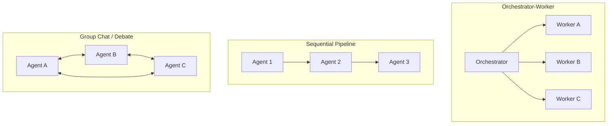

> **One-paragraph hook:** Splitting a task across several LLM agents looks like free parallelism until you price it. Anthropic measured roughly 15x the token spend of a single chat interaction for its multi-agent research system. Multi-agent orchestration is a real technique for a narrow class of problems. It isn't a default upgrade over a well-built single agent, and the topology you choose plus the write conflicts you fail to anticipate decide whether that 15x buys you anything.

## The mechanism

Two choices define a multi-agent system: **topology** (who talks to whom) and **communication mechanism** (how they share information). The common topologies:

**Orchestrator + workers** ([[Pattern - Orchestrator-Worker Agents]]): a lead agent breaks the task down at runtime and spawns subagents, each with an isolated context window, then synthesizes their outputs. Effectively map-reduce over LLM calls. **Hierarchical trees** extend this to several levels. **Sequential pipelines** pass one artifact through a fixed chain of specialist agents. **Group chat / debate** puts several agents in a shared conversation and lets them converge (or not) by discussion. **Free-form networks** allow arbitrary agent-to-agent messages with no fixed structure. They're the most flexible and the hardest to reason about or debug.

Communication uses one of three mechanisms: a **shared scratchpad/blackboard** every agent reads and writes, **explicit message passing** between named agents, or **handoffs**, where one agent hands control of the whole conversation to another. OpenAI's Swarm (and its successor, the Agents SDK) is built around handoffs. They're easy to reason about because only one agent is "live" at a time. Shared blackboards are easy to implement but invite write conflicts as soon as two agents update the same field.

## In practice

Multi-agent orchestration pays for itself on tasks that really are **parallelizable and separable**: subtasks share no mutable state, and each worker benefits from a clean context window instead of inheriting the whole run's history. Anthropic's internal research-agent eval found the multi-agent architecture beat a single agent by roughly 90%, driven almost entirely by breadth, with many independent sub-questions researched in parallel, each in its own context, then synthesized. The same report found token volume alone explained about 80% of the performance variance across configurations. Mechanically, multi-agent systems buy capability by spending tokens; the architecture itself doesn't come free. [[Breakdown - Anthropic's Multi-Agent Research System]] walks through the full system.

It follows that multi-agent is the wrong default for **write-heavy, coherent-artifact tasks** like writing one codebase or editing one document. There, agents need to see each other's in-progress state to avoid contradicting each other, and at that point you've rebuilt a single shared context with extra latency and cost on top.

## Failure modes

**Coordination overhead** dominates once you have more than a handful of agents. Every synthesis step, handoff and debate round costs a full model call, and latency stacks up sequentially unless the topology is explicitly parallel.

**Error propagation across agents.** A wrong fact or bad decision from one agent becomes ground truth for downstream agents that can't independently check it, so errors compound across the boundary instead of getting caught.

**Diffusion of responsibility.** When no single agent owns the final correctness check, subtle errors slip through. Everyone assumed someone else validated the claim.

**Write conflicts.** Several agents editing shared state (a shared file, plan or memory store) produce inconsistent results that no synthesis step can cleanly merge afterward, because the conflict happened at write time. This is the failure behind Cognition's widely cited "Don't Build Multi-Agents" (2025) argument: coordination and shared-context fragility make multi-agent systems worse than one well-engineered agent for tasks that need a coherent, consistent output.

## The non-obvious

Evaluation is where multi-agent systems get much harder to trust than single agents. Non-determinism compounds across every agent in the pipeline, and long, branching trajectories make it unclear which agent's decision caused a downstream failure. It's the run-to-run variance problem from [[Concept - Agent Evaluation Challenges]], multiplied by the number of independently sampling agents. Teams that ship multi-agent systems successfully budget for this. They trace and audit which agent contributed what, beyond measuring end-task success, because a system that "works" in aggregate can be silently compensating for one worker that's consistently wrong.

The research lineage predates the current agent-framework wave by years. Multi-agent debate (Du et al. 2023) showed that several LLM instances critiquing each other's answers improves factuality and reasoning over one instance. CAMEL showed role-played agent-to-agent conversation for autonomous cooperation. Both anticipate the "society of specialized agents" idea later rebranded as agentic orchestration. The mechanism, independent samples cross-checking each other, is closer to ensembling than to real division of labor. Ask which of the two you're building before reaching for a heavy framework ([[Concept - Task Decomposition and Planning]] covers the decomposition step that comes before any of this).

## Connections
- [[Pattern - Orchestrator-Worker Agents]] — the concrete, most common topology this note surveys the alternatives against.
- [[Decision - Single-Agent vs Multi-Agent]] — the go/no-go decision framework: read this before adopting any topology described here.
- [[Breakdown - Anthropic's Multi-Agent Research System]] — the real system behind the ~90%-improvement and ~15x-token numbers cited above.
- [[Concept - Context Engineering for Agents]] — context isolation across workers is the main mechanical reason multi-agent beats single-agent when it does.
- [[Concept - Agent Evaluation Challenges]] — non-determinism and long trajectories make multi-agent runs specifically harder to score than single-agent ones.
- [[Concept - Cost Engineering for LLM Applications]] — the ~15x token multiplier is a budget decision, not just an architecture decision.
- [[Concept - Task Decomposition and Planning]] — orchestration is downstream of decomposition; a bad decomposition produces bad worker assignments regardless of topology.
- [[Concept - LLM-as-Judge]] — synthesis and debate topologies often use one agent to judge or merge others' outputs, inheriting judge biases.

## Sources
- Anthropic (2025) — "How we built our multi-agent research system." Source of the ~90% improvement over single-agent and the ~15x / ~80%-variance token-cost figures.
- Du et al. (2023) — "Improving Factuality and Reasoning in Language Models through Multiagent Debate." Multiple LLM instances critique each other's answers to improve output quality.
- Cognition (2025) — "Don't Build Multi-Agents." Argues shared-context fragility and coordination failures make multi-agent systems worse than a single strong agent for coherent build/write tasks.
