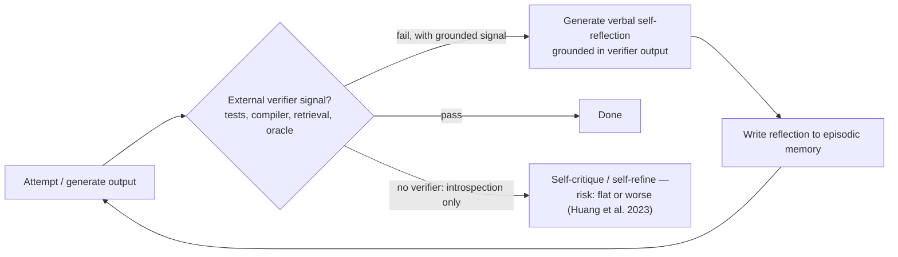

> **One-paragraph hook:** An agent that fails a task can try again. If trying again just means thinking harder about the same information, it usually re-derives the same wrong answer, now with more confidence. Reflection turns a failure into a training signal without touching any weights, but it only works when something *outside* the model tells it that it failed.

## The mechanism

Reflexion (Shinn et al. 2023) sits directly on [[Concept - The ReAct Pattern]]. The agent runs a normal Thought/Action/Observation trajectory, and an evaluator scores the outcome (task success/failure, or a scalar environment reward). Then, with no gradient update anywhere in the loop, a separate self-reflection step turns the (trajectory, evaluation) pair into a short natural-language lesson ("I searched the wrong aisle for the mug; try the cabinet next"). The lesson goes into an episodic memory buffer and gets prepended to the *next* attempt's context. The agent learns across episodes through text alone; the weights never change.

Self-Refine (Madaan et al. 2023) is the single-episode version: generate an output, generate feedback on it, generate a revision, and repeat until a stop criterion or budget is hit. No cross-episode memory, just iterative refinement within one problem. CRITIC (Gou et al. 2023) adds an external tool to the critique step. Instead of asking the model to introspect on whether its claim is right, it has the model call a search engine, calculator or code interpreter to check the claim before revising.

The key limit on all of this is Huang et al. (2023), *Large Language Models Cannot Self-Correct Reasoning Yet*. When a model critiques and fixes its own reasoning with **no external ground-truth signal**, accuracy is flat or worse than not self-correcting at all. The reason is simple. The critic shares weights and training distribution with the generator, so its confidence that a "corrected" answer is right doesn't track whether it is. The model grades its own homework with the same blind spots that produced the wrong answer.

## In practice

Empirically, everything comes down to grounded vs. introspective reflection. In the Reflexion paper, GPT-4 with reflection reached roughly 91% pass@1 on HumanEval against roughly 80% for the same model without it. That's a real gain, and it happens because HumanEval gives the reflection step an actual pass/fail unit-test verdict to reflect on, beyond the model's own opinion of its code. Purely introspective self-correction on open-ended reasoning (grade-school math, commonsense QA) is different: Huang et al. found accuracy flat to negative, because there's no unit test for "is this the right answer to a word problem" other than re-running the reasoning that got it wrong.

That's why the trained version of self-correction looks different from the prompted version described here. [[Concept - GRPO and RL with Verifiable Rewards]] takes the same verifiable pass/fail signal and turns it into a reward that updates weights directly, where Reflexion writes a lesson into a memory buffer. [[Concept - Trained vs Prompted Agents]] draws the line between "the model was trained to self-correct" and "the model is prompted to reflect at inference time", and Reflexion and Self-Refine both sit firmly on the prompted side. The reflection text is also [[Concept - Chain-of-Thought and Why It Works]] applied after the fact, reasoning tokens meant to diagnose instead of solve. It inherits CoT's two-sided nature: those tokens can diagnose an error or rationalize it, and rationalizing is the failure Huang et al. document.

You can see the clean, verifier-grounded version in [[Breakdown - SWE-bench and SWE-agent]], where a failing unit test after each patch attempt gives the agent an external, non-introspective signal. The Agent-Computer Interface's per-edit feedback provides the same kind of grounding CRITIC gets from tool calls, applied to code editing. Measuring whether any of it helped is its own hard problem. [[Concept - Agent Evaluation Challenges]] notes that non-deterministic multi-attempt trajectories need pass^k-style reliability metrics, since a reflection loop that "fixes" a task on one seed and not another looks like noise if you only sample once.

The workflow-level form of grounded reflection is the evaluator-optimizer building block in [[Pattern - Agentic Workflow Building Blocks]]. One LLM generates, a second pass critiques against explicit criteria, and the loop repeats until acceptance. By that pattern's own rule of thumb, it only helps when the evaluator has real signal to check against, the same condition Huang et al. found from the other direction.

## Failure modes

- **Rationalizing reflections.** The reflection model shares weights and blind spots with the generator, so its "critique" can talk itself into the original wrong answer being fine. Detection: score reflection rounds against a held-out labeled sample and look for flat or oscillating accuracy instead of steady improvement.
- **Oscillation.** Rounds flip between two candidate answers and never converge. Detection: diff outputs round over round. Cap at 2-3 rounds if improvement isn't monotonic, since further rounds cost money and add no signal.
- **Cost and latency compounding.** Every reflection round is a full extra generation, often with an extra tool call for grounding, so token cost and end-to-end latency grow roughly linearly with round count. It multiplies the base agent loop's per-turn cost; the extra quality isn't free.
- **Reflecting on the wrong failure.** If the evaluator signal is noisy or mis-specified (a flaky test, a bad reward function), the reflection step faithfully learns the wrong lesson. Grounded reflection is only as good as the ground truth behind it.

## The non-obvious

"Just ask the model to double-check its work" is the most over-applied and least effective pattern in agent design, because it *feels* like it should help: more thinking, more passes, surely better. Huang et al.'s result says otherwise. Without an external oracle, more introspective passes buy more confident text, not more correct text. So name the verifier before you add a reflection step: a compiler exit code, a test suite, a retrieved fact, a human approval gate. If you can't name one, the loop is more likely to produce eloquent, confident wrongness than to fix anything.

## Connections

- [[Concept - The ReAct Pattern]] — Reflexion extends ReAct's within-episode Thought/Observation grounding into an inter-episode memory of what failed and why.
- [[Pattern - Agentic Workflow Building Blocks]] — the evaluator-optimizer building block is the workflow-level version of grounded reflection, with the same "only helps with real signal" caveat.
- [[Concept - GRPO and RL with Verifiable Rewards]] — the trained analogue: the same verifiable signal becomes a weight-updating reward instead of a memory-buffer lesson.
- [[Concept - Trained vs Prompted Agents]] — draws the boundary between prompted, memory-based reflection (this note) and self-correction baked into the weights via RL.
- [[Concept - Chain-of-Thought and Why It Works]] — reflection text is retrospective CoT, and inherits CoT's capacity to either diagnose or rationalize.
- [[Breakdown - SWE-bench and SWE-agent]] — the concrete, verifier-grounded instance of reflection: a failing test gives the agent a real signal to reflect against.
- [[Concept - Long-Horizon Agency and Error Compounding]] — reflection's real job in a long-running agent is to break p^n error compounding by catching a wrong belief before it poisons every subsequent step, but only a grounded reflection can actually detect the error rather than confirm it.
- [[Concept - Agent Evaluation Challenges]] — measuring whether reflection helped requires pass^k-style reliability metrics across multiple runs, not a single sample.

## Sources
- Shinn et al. (2023) — *Reflexion: Language Agents with Verbal Reinforcement Learning.* Verbal, inter-episode self-reflection memory built on ReAct; reports the HumanEval/ALFWorld gains cited above.
- Madaan et al. (2023) — *Self-Refine: Iterative Refinement with Self-Feedback.* Single-episode generate-feedback-revise loop with no cross-episode memory.
- Gou et al. (2023) — *CRITIC: Large Language Models Can Self-Correct with Tool-Interactive Critiquing.* Grounds the critique step in external tool calls (search, code execution) rather than introspection.
- Huang et al. (2023) — *Large Language Models Cannot Self-Correct Reasoning Yet.* The load-bearing negative result: intrinsic self-correction without an external signal is flat or harmful.
