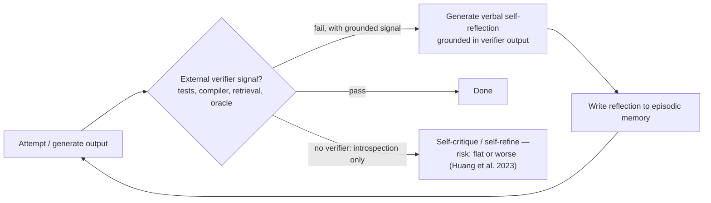

> **One-paragraph hook:** An agent that fails a task can try again — but if "trying again" just means thinking harder about the same information, it usually re-derives the same wrong answer with more confidence attached. Reflection turns a failure into a training signal without touching any weights, but the mechanism only works when something *outside* the model's own head tells it that it actually failed.

## The mechanism

Reflexion (Shinn et al. 2023) is built directly on top of [[Concept - The ReAct Pattern]]: an agent runs a normal Thought/Action/Observation trajectory, an evaluator scores the outcome (task success/failure, or a scalar environment reward), and — with no gradient update anywhere in the loop — a separate self-reflection step converts the (trajectory, evaluation) pair into a short natural-language lesson ("I searched the wrong aisle for the mug; try the cabinet next") that gets appended to an episodic memory buffer and prepended to the *next* attempt's context. The agent is learning across episodes purely through text, not weights.

Self-Refine (Madaan et al. 2023) is the single-episode version of the same idea: generate an output, generate feedback on that same output, generate a revision, and iterate until a stop criterion or budget is hit — no cross-episode memory, just iterative refinement within one problem instance. CRITIC (Gou et al. 2023) adds an external-tool leg to the critique step itself: instead of asking the model to introspect on whether its own claim is right, it has the model call a search engine, calculator, or code interpreter to check the claim before revising.

The critical limit on all of this is Huang et al. (2023), *Large Language Models Cannot Self-Correct Reasoning Yet*: when a model is asked to critique and fix its own reasoning with **no external ground-truth signal**, accuracy is flat or actively worse than not self-correcting at all. The mechanism is straightforward — the critique model shares weights and training distribution with the generator, so its confidence that a "corrected" answer is now right doesn't track whether it actually is; the model is grading its own homework with the same blind spots that produced the wrong answer in the first place.

## In practice

The gap between "grounded" and "introspective" reflection is the whole story empirically. Reflexion (as reported in the paper) pushed GPT-4 + reflection to roughly 91% pass@1 on HumanEval versus roughly 80% for the same model without it — a real gain, and one that lands specifically because HumanEval hands the reflection step a genuine pass/fail unit-test verdict to reflect against, not just the model's own opinion of its code. Contrast that with purely introspective self-correction on open-ended reasoning tasks (grade-school math, commonsense QA), where Huang et al. found accuracy flat-to-negative, because there is no unit test for "is this the right answer to a word problem" beyond re-running the same reasoning that produced the wrong answer.

This is exactly why the trained analogue of self-correction looks different from the prompted version described here. [[Concept - GRPO and RL with Verifiable Rewards]] takes the same verifiable pass/fail signal and turns it into a reward that updates weights directly, rather than a lesson written into a memory buffer; [[Concept - Trained vs Prompted Agents]] is the note that draws the line between "the model was trained to self-correct" and "the model is prompted to reflect at inference time" — Reflexion and Self-Refine both live firmly on the prompted side of that line. The reflection text itself is also a special case of [[Concept - Chain-of-Thought and Why It Works]] applied retrospectively — reasoning tokens whose job is to diagnose rather than solve — and it inherits CoT's double-edged property: those tokens can genuinely diagnose an error or can rationalize one, which is precisely the failure Huang et al. document.

The clean, verifier-grounded version of reflection is visible concretely in [[Breakdown - SWE-bench and SWE-agent]], where a failing unit test after each patch attempt gives the agent an external, non-introspective signal to reflect against — the Agent-Computer Interface's per-edit feedback is functionally the same grounding CRITIC provides via tool calls, applied to code editing specifically. And measuring whether any of this actually helped is its own hard problem: [[Concept - Agent Evaluation Challenges]] notes that non-deterministic multi-attempt trajectories need pass^k-style reliability metrics rather than a single run, because a reflection loop that "fixes" a task on one seed and not another looks like noise if you only sample once.

The workflow-level formalization of grounded reflection is the evaluator-optimizer building block in [[Pattern - Agentic Workflow Building Blocks]]: one LLM generates, a second pass critiques against explicit criteria, and the loop iterates until acceptance — which only helps, per that pattern's own rule of thumb, when the evaluator has real signal to check against, the same condition Huang et al. isolated from the other direction.

## Failure modes

- **Rationalizing reflections.** The reflection model shares weights and blind spots with the generator, so its "critique" can talk itself into the original wrong answer being fine. Detection: score reflection rounds against a held-out labeled sample and watch for flat or oscillating accuracy rather than monotonic improvement.
- **Oscillation.** Successive rounds flip between two candidate answers instead of converging on one. Detection: diff outputs round over round; cap at 2-3 rounds if there's no monotonic improvement, since further rounds are cost with no signal.
- **Cost and latency compounding.** Every reflection round is a full extra generation, often with an extra tool call for grounding, so token cost and end-to-end latency scale roughly linearly with round count — this is a multiplier on top of the base agent loop's own per-turn cost, not free extra quality.
- **Reflecting on the wrong failure.** If the evaluator signal is noisy or mis-specified (a flaky test, a bad reward function), the reflection step faithfully learns the wrong lesson — grounded reflection is only as good as the ground truth it's grounded in.

## The non-obvious

The instinct to "just ask the model to double-check its work" is the single most over-applied and under-effective pattern in agent design, precisely because it *feels* like it should help — more thinking, more passes, surely better. Huang et al.'s result is the correction: without an external oracle, more introspective passes buy you more confident text, not more correct text. The practical discipline this implies is to name the verifier before adding a reflection step at all — a compiler exit code, a test suite, a retrieved fact, a human approval gate — and if you can't name one, the reflection loop is more likely to produce eloquent, confident wrongness than to fix anything.

## Connections

- [[Concept - The ReAct Pattern]] — Reflexion extends ReAct's within-episode Thought/Observation grounding into an inter-episode memory of what failed and why.
- [[Pattern - Agentic Workflow Building Blocks]] — the evaluator-optimizer building block is the workflow-level version of grounded reflection, with the same "only helps with real signal" caveat.
- [[Concept - GRPO and RL with Verifiable Rewards]] — the trained analogue: the same verifiable signal becomes a weight-updating reward instead of a memory-buffer lesson.
- [[Concept - Trained vs Prompted Agents]] — draws the boundary between prompted, memory-based reflection (this note) and self-correction baked into the weights via RL.
- [[Concept - Chain-of-Thought and Why It Works]] — reflection text is retrospective CoT, and inherits CoT's capacity to either diagnose or rationalize.
- [[Breakdown - SWE-bench and SWE-agent]] — the concrete, verifier-grounded instance of reflection: a failing test gives the agent a real signal to reflect against.
- [[Concept - Long-Horizon Agency and Error Compounding]] — reflection's real job in a long-running agent is to break p^n error compounding by catching a wrong belief before it poisons every subsequent step, but only a grounded reflection can actually detect the error rather than confirm it.
- [[Concept - Agent Evaluation Challenges]] — measuring whether reflection helped requires pass^k-style reliability metrics across multiple runs, not a single sample.

## Sources
- Shinn et al. (2023) — *Reflexion: Language Agents with Verbal Reinforcement Learning.* Verbal, inter-episode self-reflection memory built on ReAct; reports the HumanEval/ALFWorld gains cited above.
- Madaan et al. (2023) — *Self-Refine: Iterative Refinement with Self-Feedback.* Single-episode generate-feedback-revise loop with no cross-episode memory.
- Gou et al. (2023) — *CRITIC: Large Language Models Can Self-Correct with Tool-Interactive Critiquing.* Grounds the critique step in external tool calls (search, code execution) rather than introspection.
- Huang et al. (2023) — *Large Language Models Cannot Self-Correct Reasoning Yet.* The load-bearing negative result: intrinsic self-correction without an external signal is flat or harmful.
