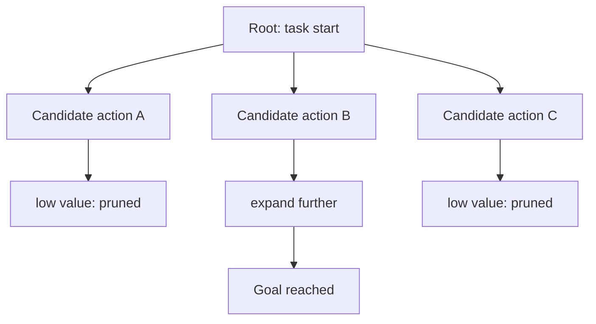

# Concept - Search and Backtracking in Agents

> **One-paragraph hook:** Greedy [[Concept - The ReAct Pattern]]-style agents commit to one action per step and live with the result. Deliberate search lets an agent generate several candidate next moves, evaluate them, and back out of the ones that look bad. The price is running the model many more times per task, which is why almost nobody ships it as an external harness anymore.

## The mechanism

Picture an agent's trajectory as a tree. Each node is a partial state (the transcript so far), each edge a candidate next thought or action, and the goal is a path to a successful terminal state without being stuck with the first path explored. Tree of Thoughts (Yao et al. 2023) does this explicitly for reasoning tasks. At each node the model generates several candidate next "thoughts", a value function (often the model rating each candidate itself, or a learned scorer) scores them, and a classical search algorithm (BFS keeping the top-k branches, or DFS with pruning) picks which to expand and which to drop. Language Agent Tree Search, LATS (Zhou et al. 2023), extends this to full agent trajectories with tool use. It runs Monte Carlo Tree Search over ReAct-style nodes, combining the acting step, a learned or self-generated value estimate per branch, and Reflexion-style verbal feedback (see [[Concept - Reflection and Self-Correction]]) fed into later expansions. RAP (Reasoning via Planning) is a related planner that uses the LM itself as both world model and search policy.

It maps directly onto classical search:

| Search concept | Agent instantiation |
|---|---|
| State | the trajectory so far (transcript + environment state) |
| Expansion | candidate next thoughts/actions, sampled from the model |
| Evaluation | a value function — self-eval, a learned scorer, or an environment reward/test result |
| Backtracking | abandon low-value branches, resume expansion from a better ancestor |

This strictly generalizes the linear planning in [[Concept - Task Decomposition and Planning]]. The agent keeps several live hypotheses and prunes them as evidence arrives, where linear planning commits to one plan or one action per turn.

## In practice

Production agents mostly skip explicit search because of cost. Even a shallow tree, with a handful of candidates per node and a few levels of depth, multiplies LLM calls by 10-100x over one greedy pass, since each candidate may need its own rollout to be evaluated. The token bill grows combinatorially with tree width and depth (tracked under [[Concept - Cost Engineering for LLM Applications]]). For most tasks, one strong path plus a lightweight reflection step (per [[Concept - Reflection and Self-Correction]]) recovers most of the benefit for a fraction of the cost. So search shows up mainly in research and benchmark-chasing, not deployed products. It's the same cost-vs-capability tradeoff that governs [[Concept - Multi-Agent Orchestration]]'s fan-out, applied to branches of one task instead of parallel subagents.

Search pays for itself where the evaluation signal is cheap and reliable and the search space is small enough to handle: math and puzzle tasks with a checkable answer, or code generation with a fast test suite. There the value function is a real pass/fail check instead of a fuzzy self-rating, which echoes the verifiable-reward theme in [[Concept - GRPO and RL with Verifiable Rewards]].

## Failure modes

Search guided by a bad value function is worse than no search. It burns 10-100x the tokens carefully exploring branches that were never going to work. A self-eval value function also inherits the self-correction limit ([[Concept - Reflection and Self-Correction]]): a model that can't reliably tell its own reasoning is wrong can't reliably score one branch above another either. Search can also thrash between branches with nearly equal scores without converging. Deep trees hit the same context-length and cost pressure as any long-horizon run, and [[Concept - Long-Horizon Agency and Error Compounding]] explains why the tree's *depth* is where per-step error compounds.

## The non-obvious

The frontier has moved toward internalizing search instead of bolting it on from outside. Reasoning models like the o-series and DeepSeek-R1 ([[Concept - Reasoning Training and Long Chain-of-Thought]]) are RL-trained to produce long chains of thought, building on the mechanism in [[Concept - Chain-of-Thought and Why It Works]], that implicitly backtrack, reconsider and self-correct *inside one generation stream*. They get much of the benefit of an external Tree-of-Thoughts search with no explicit tree, no separate value function and no 10-100x multiplier of discrete LLM calls. It's the [[Concept - Trained vs Prompted Agents]] shift one level down: training teaches the model to deliberate internally, and the token cost lands in one longer generation instead of many short, separately billed ones. So the case for building a LATS-style search harness keeps weakening as reasoning-model context lengths and training recipes improve. Agent builders' folklore (folklore, weakly sourced: see [[Lore - Agent Prompt-Engineering Folklore]] on think-before-acting tricks) holds that a well-prompted single pass on a strong reasoning model now beats a naively implemented external search harness on a weaker model, for a fraction of the engineering and token cost.

## Connections
- [[Concept - Task Decomposition and Planning]] — search is the branching generalization of the linear plan-then-execute approach.
- [[Concept - The ReAct Pattern]] — the greedy single-path baseline that search explicitly generalizes away from.
- [[Concept - Trained vs Prompted Agents]] — the frontier alternative to external search: train the deliberation into the model instead.
- [[Concept - GRPO and RL with Verifiable Rewards]] — verifiable rewards are what make both RL training and search's value functions trustworthy rather than fuzzy self-ratings.
- [[Concept - Reflection and Self-Correction]] — search's value function inherits the same self-correction limits when it relies on the model judging itself.
- [[Concept - Chain-of-Thought and Why It Works]] — the reasoning substrate that both explicit search and internalized long-CoT search build on.
- [[Concept - Cost Engineering for LLM Applications]] — the 10-100x token multiplier is the concrete line item that kills most production search deployments.
- [[Concept - Reasoning Training and Long Chain-of-Thought]] — how RL training internalizes search-like backtracking into a single generation stream.
- [[Lore - Agent Prompt-Engineering Folklore]] — practitioner lore on when explicit deliberation prompting earns its cost versus when it's cargo cult.

## Sources
- Yao et al. (2023) — Tree of Thoughts: Deliberate Problem Solving with Large Language Models. Introduces the BFS/DFS-over-thoughts framing with self-eval value functions.
- Zhou et al. (2023) — Language Agent Tree Search (LATS). MCTS over ReAct trajectories combining acting, value estimation, and reflection.
- Hao et al. (2023) — Reasoning via Planning (RAP). Repurposes the LM as both world model and search policy.
