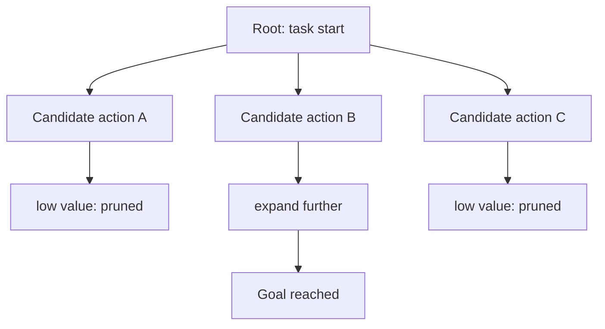

# Concept - Search and Backtracking in Agents

> **One-paragraph hook:** Greedy [[Concept - The ReAct Pattern]]-style agents commit to one action per step and live with the consequences; deliberate search lets an agent generate several candidate next moves, evaluate them, and back out of the ones that look bad — at the cost of running the model many times more per task, which is exactly why almost nobody ships it as an external harness anymore.

## The mechanism

Frame an agent's trajectory as a tree: each node is a partial state (the transcript so far), each edge is a candidate next thought or action, and the goal is to find a path to a successful terminal state without necessarily committing to the first path explored. Tree of Thoughts (Yao et al. 2023) makes this explicit for reasoning tasks — at each node the model generates several candidate next "thoughts," a value function (often the model self-evaluating each candidate, or a learned scorer) rates them, and a classical search algorithm (BFS keeping the top-k branches, or DFS with pruning) decides which to expand and which to abandon. Language Agent Tree Search — LATS (Zhou et al. 2023) — extends this to full agent trajectories with tool use: it runs Monte Carlo Tree Search over ReAct-style nodes, combining the acting step, a learned or self-generated value estimate for each branch, and Reflexion-style verbal feedback (see [[Concept - Reflection and Self-Correction]]) fed back into later expansions. RAP (Reasoning via Planning) is a related planner that repurposes the LM itself as both the world model and the search policy.

The mechanism maps cleanly onto classical search:

| Search concept | Agent instantiation |
|---|---|
| State | the trajectory so far (transcript + environment state) |
| Expansion | candidate next thoughts/actions, sampled from the model |
| Evaluation | a value function — self-eval, a learned scorer, or an environment reward/test result |
| Backtracking | abandon low-value branches, resume expansion from a better ancestor |

This is a strict generalization of the linear planning covered in [[Concept - Task Decomposition and Planning]]: instead of committing to one plan or one action per turn, the agent maintains multiple live hypotheses and prunes as evidence comes in.

## In practice

The dominant reason production agents skip explicit search is cost: expanding even a shallow tree with a handful of candidates per node and a few levels of depth multiplies LLM calls by 10-100x over a single greedy pass, since each candidate itself may need a further rollout to be evaluated — a token bill that scales combinatorially with tree width and depth, tracked under [[Concept - Cost Engineering for LLM Applications]]. For most tasks a single strong path plus a lightweight reflection step (per [[Concept - Reflection and Self-Correction]]) recovers most of the benefit at a fraction of the cost, which is why search shows up mostly in research settings and benchmark-chasing rather than deployed products — it is the same cost-vs-capability tradeoff that governs [[Concept - Multi-Agent Orchestration]]'s fan-out, just applied to branches of a single task instead of parallel subagents.

Where search does pay for itself is exactly where the evaluation signal is cheap and reliable and the search space is small enough to be tractable — math and puzzle tasks with a checkable answer, or code-generation tasks with a fast test suite, where a value function isn't a fuzzy self-rating but a real pass/fail check, echoing the verifiable-reward theme in [[Concept - GRPO and RL with Verifiable Rewards]].

## Failure modes

A search guided by a bad value function is worse than no search at all — it burns 10-100x the tokens meticulously exploring branches that were never going to work, and a self-eval value function inherits the same blind spots as the self-correction limit ([[Concept - Reflection and Self-Correction]]): a model that can't reliably tell its own reasoning is wrong can't reliably score a candidate branch as better or worse either. Search can also thrash between near-equally-scored branches without converging, and deep trees hit the same context-length and cost pressure that governs long-horizon runs generally — see [[Concept - Long-Horizon Agency and Error Compounding]] for why the *depth* dimension of this tree is exactly where per-step error compounds.

## The non-obvious

The frontier trend has been to internalize search rather than bolt it on externally. Reasoning models — the o-series and DeepSeek-R1 (link [[Concept - Reasoning Training and Long Chain-of-Thought]]) — are RL-trained to produce long chains of thought, building on the base mechanism in [[Concept - Chain-of-Thought and Why It Works]], that implicitly backtrack, reconsider, and self-correct *within a single generation stream*, getting much of the benefit of an external Tree-of-Thoughts search without an explicit tree, a separate value function, or a 10-100x multiplier of discrete LLM calls. This is the same [[Concept - Trained vs Prompted Agents]] shift playing out one level down: instead of scaffolding deliberation on top of the model via an external search algorithm, training teaches the model to deliberate internally, and the token cost gets absorbed into one longer generation rather than many short, separately-billed ones. Practically, this means the ROI calculation on "do I build a LATS-style search harness" keeps shrinking as reasoning-model context lengths and training recipes improve — folklore among agent builders (folklore, weakly sourced: see [[Lore - Agent Prompt-Engineering Folklore]] on think-before-acting tricks) holds that a well-prompted single pass on a strong reasoning model now beats a naively-implemented external search harness on a weaker model, at a fraction of the engineering and token cost.

## Connections
- [[Concept - Task Decomposition and Planning]] — search is the branching generalization of the linear plan-then-execute approach.
- [[Concept - The ReAct Pattern]] — the greedy single-path baseline that search explicitly generalizes away from.
- [[Concept - Trained vs Prompted Agents]] — the frontier alternative to external search: train the deliberation into the model instead.
- [[Concept - GRPO and RL with Verifiable Rewards]] — verifiable rewards are what make both RL training and search's value functions trustworthy rather than fuzzy self-ratings.
- [[Concept - Reflection and Self-Correction]] — search's value function inherits the same self-correction limits when it relies on the model judging itself.
- [[Concept - Chain-of-Thought and Why It Works]] — the reasoning substrate that both explicit search and internalized long-CoT search build on.
- [[Concept - Cost Engineering for LLM Applications]] — the 10-100x token multiplier is the concrete line item that kills most production search deployments.
- [[Concept - Reasoning Training and Long Chain-of-Thought]] — how RL training internalizes search-like backtracking into a single generation stream.
- [[Lore - Agent Prompt-Engineering Folklore]] — practitioner lore on when explicit deliberation prompting earns its cost versus when it's cargo cult.

## Sources
- Yao et al. (2023) — Tree of Thoughts: Deliberate Problem Solving with Large Language Models. Introduces the BFS/DFS-over-thoughts framing with self-eval value functions.
- Zhou et al. (2023) — Language Agent Tree Search (LATS). MCTS over ReAct trajectories combining acting, value estimation, and reflection.
- Hao et al. (2023) — Reasoning via Planning (RAP). Repurposes the LM as both world model and search policy.
