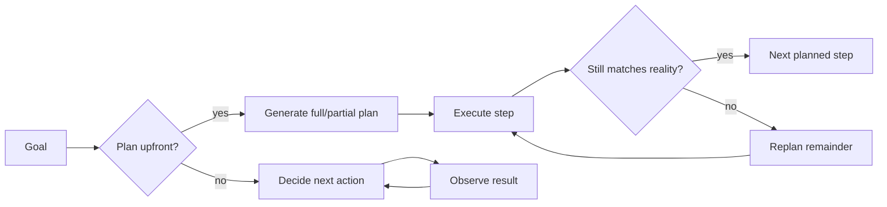

> **One-paragraph hook:** An agent that picks its next action one step at a time is cheap to reason about and reacts well to surprises, but it's blind: it can't tell you the shape of the whole task before it starts. An agent that plans everything upfront is efficient and inspectable, but its plan is a bet that the world won't surprise it. Task decomposition and planning decides which bet you're making, and most production agent failures trace back to picking the wrong one.

## The mechanism

There are two regimes for turning a goal into executed steps. **Plan-then-execute** produces a full plan upfront, an ordered or partially ordered list of subtasks, before any of it runs. **Interleaved** planning (the [[Concept - The ReAct Pattern]] regime) picks only the next action each turn, based on the latest observation. An upfront plan costs one planning call and then $N$ cheap execution calls. Interleaved execution implicitly re-derives the plan every turn, which means more LLM calls but instant adaptation to anything the original plan didn't foresee. Plan-then-execute bets that the task's structure is knowable in advance; interleaved bets that it isn't.

Several named methods sit inside plan-then-execute, each trading some adaptivity for some efficiency:

- **Least-to-Most prompting** and **Plan-and-Solve** break a problem into an explicit ordered sequence of sub-questions before solving any of them, so later sub-answers build on earlier ones without re-deriving them.
- **ReWOO** (Reasoning WithOut Observation) plans *all* tool calls upfront in one shot before running any of them. That cuts token cost sharply compared with ReAct's interleaved re-reasoning, but a later call can't adapt to an earlier result.
- **LLMCompiler** goes further. It builds an explicit task DAG (a dependency graph, which is more than a list) and runs independent nodes in parallel. It reports roughly 1.8–3.7x latency speedup over sequential execution by exploiting subtasks that don't depend on each other.
- **Router-style planning** (the HuggingGPT pattern) treats the plan as a dispatch problem. A planner LLM decides which tool or specialist model handles each subtask; it doesn't plan the subtasks' content.
- **Hierarchical planning** decomposes lazily. A high-level plan comes first, and each step gets its own sub-plan only when execution reaches it. It's a middle ground that avoids committing to detail the agent may never need.

**Replanning** is what makes plan-then-execute work outside toy problems: notice that the current plan no longer fits observed reality, and regenerate the rest instead of pushing through a plan built on stale assumptions.

## In practice

Which regime to use depends on task structure, not task size. A task with clear, stable structure benefits from planning. "Refactor this function, run the tests, fix whatever the tests reveal" has a knowable shape even though the fix is unknown, because the skeleton (edit → test → fix loop) stays put while the details change. A very reactive, uncertain environment punishes planning. Browsing the live web, where each page's content and links are unknown until fetched, means any plan written before the first page load is a plan for a world that doesn't exist. [[Pattern - Orchestrator-Worker Agents]] is decomposition in multi-agent form: a lead agent splits the goal into subtasks for isolated-context workers and synthesizes their results, trading token cost for parallelism and clean context. The prompt-chaining and routing patterns in [[Pattern - Agentic Workflow Building Blocks]] are planning's fixed-workflow special case. When the decomposition is plannable and *always the same*, hardcode it instead of asking the model to replan it every run.

## Failure modes

- **Over-planning.** An elaborate, deeply nested plan that looks great on paper dies at the first tool result that contradicts its assumptions. The plan's specificity is what makes it brittle. Detection: a plan with many rigid steps and no replanning trigger is a smell before it ever fails.
- **Plans that ignore observed failures.** The execution loop keeps working through the original step list after a step has clearly failed, because nothing routes a bad observation back to "should the plan change?" Fix: an explicit replanning check after each step, not only after the whole plan finishes.
- **Dependency errors when parallelizing.** LLMCompiler-style DAG execution is only as correct as the dependency edges the planner inferred. Miss one and two steps run concurrently when the second needed the first's output. You get a race instead of a clean error.

## The non-obvious

The real cost of plan-then-execute is less the extra planning call than this: a wrong upfront plan stays invisible until execution reaches the step that exposes it. An interleaved agent's implicit plan gets re-checked every turn for free. So the efficiency win from planning (fewer LLM calls, a cheaper token bill, per [[Concept - Cost Engineering for LLM Applications]]) is really a bet that you judged the task's stability correctly. Teams that pick plan-then-execute because it's cheaper, without checking whether the task is stable, get the failure modes above instead of the savings.

## Connections

- [[Concept - The ReAct Pattern]] — the interleaved regime this note contrasts plan-then-execute against; ReAct decides one action at a time instead of committing to a full plan.
- [[Deep Dive - The Agent Loop]] — the general loop scaffolding that either an interleaved decision or a planned-step execution runs inside.
- [[Concept - Search and Backtracking in Agents]] — deliberate tree search over actions is planning taken further: exploring and backtracking among *multiple* candidate plans instead of committing to one.
- [[Pattern - Orchestrator-Worker Agents]] — the multi-agent instantiation of decomposition, where subtasks from the plan become isolated-context worker assignments.
- [[Pattern - Agentic Workflow Building Blocks]] — prompt chaining and routing are the fixed-code special case of planning, used when the decomposition never needs to change run to run.
- [[Concept - Chain-of-Thought and Why It Works]] — the reasoning substrate a planner LLM uses to produce and justify a decomposition.
- [[Concept - Multi-Agent Orchestration]] — once a plan has genuinely independent subtasks, the orchestration topology question of how to run them concurrently takes over.
- [[Concept - What Is an LLM Agent]] — the decision heuristic "hardcode the steps if you can, plan/interleave only if you can't" is the same reliability-tax logic that note applies to choosing an agent over a workflow at all.
- [[Concept - Cost Engineering for LLM Applications]] — plan-then-execute methods like ReWOO exist specifically to cut the token bill that interleaved re-reasoning accumulates.

## Sources
- Zhou et al. (2022) — *Least-to-Most Prompting Enables Complex Reasoning in Large Language Models.* Ordered sub-question decomposition.
- Xu et al. (2023) — *ReWOO: Decoupling Reasoning from Observations for Efficient Augmented Language Models.* Plans all tool calls upfront to cut token cost versus interleaved ReAct.
- Kim et al. (2023) — *An LLM Compiler for Parallel Function Calling* (LLMCompiler). Task-DAG planning with parallel execution, reporting the 1.8–3.7x latency speedup over sequential tool calling.
