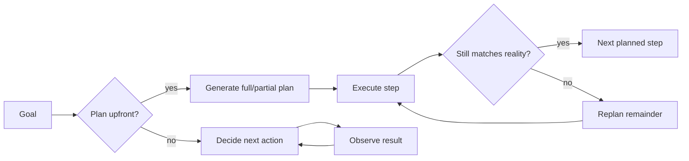

> **One-paragraph hook:** An agent that decides its next action one step at a time is cheap to reason about and reactive to surprises, but it's also blind — it can't tell you the shape of the whole task before it starts. An agent that plans the whole thing upfront is efficient and inspectable, but the plan is a bet that the world won't surprise it. Task decomposition and planning is the design axis that decides which bet you're making, and most production agent failures trace back to picking the wrong one.

## The mechanism

There are two regimes for turning a goal into executed steps. **Plan-then-execute** produces a full plan upfront — an ordered or partially-ordered list of subtasks — before any of it runs. **Interleaved** planning (the [[Concept - The ReAct Pattern]] regime) decides only the next action at each turn, using the latest observation as input. The tradeoff is structural: an upfront plan costs one planning call and then $N$ cheap execution calls, while interleaved execution re-derives "what's the plan" implicitly on every single turn, which is more LLM calls but adapts instantly to a surprise the original plan didn't anticipate. Plan-then-execute is a bet that the task's structure is knowable in advance; interleaved is a bet that it isn't.

Several named methods sit inside plan-then-execute, each trading a different amount of adaptivity for a different amount of efficiency:

- **Least-to-Most prompting** and **Plan-and-Solve** decompose a problem into an explicit ordered sub-question sequence before solving any of it, so later sub-answers can build on earlier ones without re-deriving them.
- **ReWOO** (Reasoning WithOut Observation) plans *all* tool calls upfront, in one shot, before executing any of them — cutting token cost sharply versus ReAct's interleaved re-reasoning, at the price of being unable to adapt a later call based on an earlier result.
- **LLMCompiler** goes further: it builds an explicit task DAG (a dependency graph, not just a list) and executes independent nodes in parallel rather than serially, reporting roughly 1.8–3.7x latency speedup versus sequential execution by exploiting subtasks that don't actually depend on each other.
- **Router-style planning** (the HuggingGPT pattern) treats the plan as a dispatch problem: a planner LLM decides which tool or specialist model handles each subtask, rather than planning the content of the subtasks themselves.
- **Hierarchical planning** decomposes lazily: a high-level plan is produced first, and each step is only broken down into its own sub-plan on demand, when execution actually reaches it — a middle ground that avoids committing to detail the agent may never need.

**Replanning** is the robustness lever that makes plan-then-execute viable outside of toy problems: detecting that the current plan no longer fits observed reality, and regenerating the remainder rather than plowing through a plan built on stale assumptions.

## In practice

The decision of which regime to use tracks task structure, not task size. A task with clear, stable structure — "refactor this function, run the tests, fix any failures the tests reveal" has a knowable shape even though the fix content is unknown — benefits from planning because the plan skeleton (edit → test → fix-loop) doesn't change even when the details do. A highly reactive, uncertain environment — browsing the live web where each page's content and links are unknown until fetched — punishes planning, because any plan written before the first page load is a plan for a world that turns out not to exist. [[Pattern - Orchestrator-Worker Agents]] is the multi-agent expression of decomposition: instead of one agent executing a plan serially, a lead agent decomposes the goal into subtasks assigned to isolated-context workers and synthesizes their results, trading token cost for parallelism and context cleanliness. [[Pattern - Agentic Workflow Building Blocks]]'s prompt-chaining and routing patterns are the fixed-workflow special case of planning: when the decomposition is not just plannable but *always the same*, you hardcode it into code instead of asking the model to replan it every run.

## Failure modes

- **Over-planning.** An elaborate, deeply nested plan that looks great on paper dies on contact with the first tool result that doesn't match its assumptions, because the plan's specificity is exactly what makes it brittle to deviation. Detection: a plan with many rigid steps and no replanning trigger is a smell before it ever fails.
- **Plans that ignore observed failures.** The execution loop keeps marching through the original step list even after a step has clearly failed, because nothing in the architecture routes a bad observation back into "should the plan change." Fix: an explicit replanning check after each step, not just after the whole plan completes.
- **Dependency errors when parallelizing.** LLMCompiler-style DAG execution is only as correct as the dependency edges the planner inferred; a missed dependency means two steps run concurrently when the second actually needed the first's output, producing a race rather than a clean error.

## The non-obvious

The real cost of plan-then-execute isn't the extra planning call — it's that a wrong upfront plan is invisible until execution reaches the step that exposes it, whereas an interleaved agent's "plan" is implicitly re-validated every single turn for free. This means the efficiency win from planning (fewer LLM calls, cheaper token bill, per [[Concept - Cost Engineering for LLM Applications]]) is really a bet that you've correctly judged the task's structural stability — and teams that reach for plan-then-execute because it's cheaper, without checking whether the task is actually stable, get the failure mode above instead of the savings.

## Connections

- [[Concept - The ReAct Pattern]] — the interleaved regime this note contrasts plan-then-execute against; ReAct decides one action at a time instead of committing to a full plan.
- [[Deep Dive - The Agent Loop]] — the general loop scaffolding that either an interleaved decision or a planned-step execution runs inside.
- [[Concept - Search and Backtracking in Agents]] — deliberate tree search over actions is planning taken further: exploring and backtracking among *multiple* candidate plans instead of committing to one.
- [[Pattern - Orchestrator-Worker Agents]] — the multi-agent instantiation of decomposition, where subtasks from the plan become isolated-context worker assignments.
- [[Pattern - Agentic Workflow Building Blocks]] — prompt chaining and routing are the fixed-code special case of planning, used when the decomposition never needs to change run to run.
- [[Concept - Chain-of-Thought and Why It Works]] — the reasoning substrate a planner LLM uses to produce and justify a decomposition.
- [[Concept - Multi-Agent Orchestration]] — once a plan has genuinely independent subtasks, the orchestration topology question of how to run them concurrently takes over.
- [[Concept - What Is an LLM Agent]] — the decision heuristic "hardcode the steps if you can, plan/interleave only if you can't" is the same reliability-tax logic that note applies to choosing an agent over a workflow at all.
- [[Concept - Cost Engineering for LLM Applications]] — plan-then-execute methods like ReWOO exist specifically to cut the token bill that interleaved re-reasoning accumulates.

## Sources
- Zhou et al. (2022) — *Least-to-Most Prompting Enables Complex Reasoning in Large Language Models.* Ordered sub-question decomposition.
- Xu et al. (2023) — *ReWOO: Decoupling Reasoning from Observations for Efficient Augmented Language Models.* Plans all tool calls upfront to cut token cost versus interleaved ReAct.
- Kim et al. (2023) — *An LLM Compiler for Parallel Function Calling* (LLMCompiler). Task-DAG planning with parallel execution, reporting the 1.8–3.7x latency speedup over sequential tool calling.
