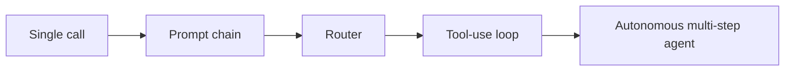

> **One-paragraph hook:** Every framework calls itself "agentic," which has made the word nearly useless. Start from the one distinction that matters: in a workflow, your code decides what happens next; in an agent, the model decides. Who owns the control flow determines everything downstream about cost, debuggability, and how badly things can go wrong.

## The mechanism

Anthropic's "Building Effective Agents" (Dec 2024) draws the line this way. **Workflows** are systems where LLMs and tools are orchestrated through predefined code paths. **Agents** are systems where the LLM dynamically directs its own process and tool usage, keeping control over how it does the task. A workflow calls the model at fixed points in a fixed graph. An agent puts the model in the driver's seat of a loop and lets it decide, turn by turn, what to do next, including when to stop.

An agent isn't one clever prompt. It needs five components:

1. **A model** capable of reasoning and structured output.
2. **A tool set**: functions the model can invoke to affect or observe the world (see [[Concept - Tool Use and Function Calling]]).
3. **A loop**: a harness that calls the model repeatedly, executes whatever it requests, and feeds the result back in (internals in [[Deep Dive - The Agent Loop]]).
4. **A termination condition**. Something has to decide when the loop stops: the model emitting a final answer, a budget running out, or a human stepping in.
5. **Accumulated context/memory**, the transcript so far, which lets turn *n* build on turn *n-1*.

Take away any one and you no longer have an agent. A model with tools but no loop is a single tool-augmented call. A loop with no termination condition is a runaway process. Tools with no accumulated context make a stateless function server.

Between "one prompt" and "fully autonomous agent" sits an **autonomy ladder**. Each rung trades predictability for flexibility:

A single call gets one shot and no branching. A prompt chain (see [[Pattern - Agentic Workflow Building Blocks]]) is a fixed sequence of calls with code between them. A router uses one LLM call to classify and dispatch to a handler. A tool-use loop lets the model call tools inside a tightly bounded task. A fully autonomous agent picks its own plan, tools and stopping point over an open-ended number of turns. Nothing on the left is "worse." It's more constrained, and constraint is what makes a system debuggable.

## In practice

The heuristic that holds up in production: **use an agent only when the task is open-ended and the steps can't be hardcoded in advance.** If you can write the steps down before runtime, write them down as a prompt chain or a router and don't hand the sequencing to the model at inference time. Document summarization, structured extraction and single-hop Q&A are workflows dressed up as agent demos in most marketing material; they don't need a loop. Open-ended research, multi-step coding tasks with unknown scope, and "figure out how to accomplish X given these tools" do belong to agents, because the number and order of steps depend on what the agent finds along the way.

It matters for cost too. An autonomous agent doing an equivalent task typically burns far more tokens than a workflow, because it re-reasons about the next move on every turn instead of following a precomputed path (see [[Concept - Cost Engineering for LLM Applications]]). A workflow that works is almost always cheaper, faster and easier to debug than an agent that works. The only reason to give up that control is a task that can't be predetermined.

## Failure modes

The core cost of autonomy: **every extra decision the model makes is another chance to be wrong**, and those chances multiply. If one step succeeds with probability $p$, an $n$-step autonomous run succeeds with probability on the order of $p^n$ (worked through in [[Concept - Long-Horizon Agency and Error Compounding]]). So loosely scoped agents that look impressive in a 3-step demo degrade sharply once the task runs 15-20 steps. Nobody bounded the loop, and nobody gave the model a way to notice it had gone off track.

In practice you see agents given too much latitude on hardcodable tasks produce inconsistent results run to run, burn unpredictable amounts of token budget, and resist testing because the path to the answer isn't fixed. Detection is usually after the fact: someone notices the p95 latency or cost on a "simple" feature is 10x what a workflow would have cost. That alone tells you autonomy was reached for too early.

## The non-obvious

The reliability tax is the dominant design consideration. Teams that ship agents successfully make "does this need to be an agent at all" the first design question, before any implementation, and the honest answer is "no" far more often than agent-framework marketing suggests. The cautionary tale is [[Lore - The AutoGPT Explosion]]. AutoGPT and BabyAGI went viral in early 2023 as the first fully autonomous "give it a goal and walk away" agents. They were captivating in demos and nearly useless in practice, because 2023-era models didn't have a high enough per-step success rate to survive dozens of unsupervised steps. The lesson outlives that model generation: pull the autonomy lever only as far as your model's reliability and your task's tolerance for error support.

## Connections
- [[Deep Dive - The Agent Loop]] — the internal mechanics of the loop this note only sketches: the observe-think-act cycle, termination logic, and context growth.
- [[Concept - Tool Use and Function Calling]] — the mechanism by which an agent actually acts on the world; without it there is nothing for the loop to execute.
- [[Pattern - Agentic Workflow Building Blocks]] — the constrained compositions (chaining, routing, parallelization) you should reach for before escalating to a full agent.
- [[Lore - The AutoGPT Explosion]] — the historical proof case for the reliability tax: high ambition, low per-step success rate, mostly failed runs.
- [[Concept - Chain-of-Thought and Why It Works]] — the reasoning substrate an agent's "thought" step draws on before it acts.
- [[Concept - Cost Engineering for LLM Applications]] — autonomy multiplies token spend, which is why the decision to use an agent is also a budget decision.
- [[Concept - Long-Horizon Agency and Error Compounding]] — the $p^n$ math that formalizes why long autonomous runs decay in reliability.
- [[Reference - Agent Framework Landscape]] — once you've decided you actually need an agent, this is where you'd shop for the runtime to build it in.

## Sources
- Anthropic (Dec 2024) — "Building Effective Agents." Defines the workflow-vs-agent distinction used throughout this note and the taxonomy of composition patterns.
- Significant Gravitas / Toran Bruce Richards (2023) — AutoGPT. The archetype fully-autonomous agent whose public failures shaped the industry's current caution around unconstrained autonomy.
