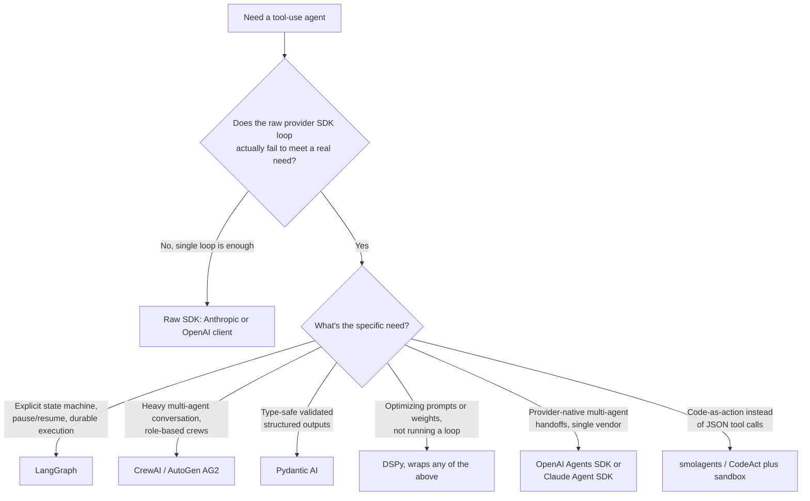

# Decision - Choosing an Agent Framework

> The question is whether to build your tool-use agent directly on a provider SDK or adopt a framework, and if a framework, which one. **Default for the 80% case (as of 2026):** start on the raw provider SDK with a single-tool-loop agent (see [[Playbook - Building a Tool-Use Agent from Scratch]]). Adopt a framework only when a specific, named need shows up.

## Decision flow

## Tradeoff matrix

| Option | Control granularity | Time-to-first-agent | Debuggability | Streaming + human-in-the-loop | State/checkpoint persistence | Vendor lock-in |
|---|---|---|---|---|---|---|
| Raw provider SDK | Full: you own every line | Minutes to hours | Highest, no abstraction to peel back | Manual, but simple to add | Manual (roll your own) | Low, but tied to one provider's tool-call wire format |
| LangGraph | High: explicit graph/state machine | Hours to a day | Good, once you learn the graph model | Built-in interrupt/resume nodes | Built-in checkpointers (durable execution) | Low (multi-provider) |
| OpenAI Agents SDK / Claude Agent SDK | Medium: framework owns handoffs and guardrails | Minutes | Medium | Built-in for the native use case | Partial | High (provider-native) |
| CrewAI / AutoGen (AG2) | Medium: role/conversation abstractions | Minutes to hours | Lower; multi-agent chat logs are harder to trace | Varies by version | Varies | Low |
| Pydantic AI | Medium: validation-first wrapper | Minutes | Good, type errors surface early | Built-in | Partial | Low |
| DSPy | Orthogonal: compiles prompts, isn't a runtime loop | Hours (setup plus an optimization run) | Different axis entirely | N/A | N/A | Low |

The table is a summary. [[Reference - Agent Framework Landscape]] has the full per-framework feature matrix; it churns quarterly, so check there for current specifics.

## The details that flip the decision

**You need to pause and resume, or replay a run.** If the agent has to survive a process restart mid-task (long-running approvals, multi-day workflows), durable execution is mandatory and the [[Deep Dive - The Agent Loop|raw loop]]'s in-memory message list is the wrong foundation. Go to LangGraph or a Temporal-style durable-execution layer, whatever the team size.

**The task is code-as-action.** When the work is naturally "write and run a snippet" instead of "call a discrete tool" (data analysis, multi-step file manipulation), smolagents-style CodeAct cuts round-trips dramatically. It also requires a real sandbox, which makes it a security decision as well as a framework one (see [[Checklist - Sandboxing an Agent]]).

**Regulators or auditors need full trace control.** Some environments (finance, health) require every prompt and decision to be reconstructable, with no framework state management obscuring it. That pushes you back toward the thin raw-API stack even at larger team scale.

**You've proven a need for multi-agent parallelism.** Framework choice should follow [[Decision - Single-Agent vs Multi-Agent]], never trigger it. Don't reach for CrewAI/AutoGen until that decision is made on its own merits.

**The team is already deep in one provider's ecosystem.** If you're all-in on Claude or OpenAI and don't need portability, the provider-native SDK's built-in handoffs and guardrails remove glue code you'd otherwise write yourself in LangGraph.

**Anti-pattern:** adopting a heavy multi-agent framework to make up for a single agent that doesn't work yet. Framework overhead won't fix a weak tool set, a bad system prompt, or missing [[Concept - LLM Observability and Tracing|observability]]. It adds a debugging layer on top of the same problem.

## Connections
- [[Reference - Agent Framework Landscape]] -- the descriptive feature matrix this decision's tradeoff table distills; check it for current specifics.
- [[Decision - Single-Agent vs Multi-Agent]] -- settle this decision *before* letting it silently drive your framework choice.
- [[Playbook - Building a Tool-Use Agent from Scratch]] -- the concrete first step for the raw-SDK default branch.
- [[Concept - Multi-Agent Orchestration]] -- the coordination mechanisms a multi-agent framework choice is actually buying you.
- [[Concept - LLM Observability and Tracing]] -- a need most frameworks under-deliver on and worth evaluating independently of the framework itself.
- [[Concept - Cost Engineering for LLM Applications]] -- framework overhead (extra abstraction calls, retries) shows up directly in the token bill; budget it before committing.
- [[Deep Dive - Agentic Coding in Production]] -- a concrete domain, coding agents, where this exact framework-vs-raw-SDK decision has played out at production scale.
- [[Deep Dive - The Agent Loop]] -- the underlying loop every option in this decision is ultimately running, one way or another.
- [[Checklist - Sandboxing an Agent]] -- the runtime hardening the code-as-action branch of the flowchart depends on.

## Sources
- Anthropic -- "Building Effective Agents" (Dec 2024). The workflow/agent distinction and "use the simplest pattern that works" principle behind this decision's raw-SDK default.
- Anthropic -- "How we built our multi-agent research system" (2025). The multi-agent win rate and token-cost multiplier informing the framework tradeoffs for orchestration-heavy use cases.
- Cognition -- "Don't Build Multi-Agents" (2025). The counter-evidence behind this decision's anti-pattern warning against reaching for a multi-agent framework prematurely.
