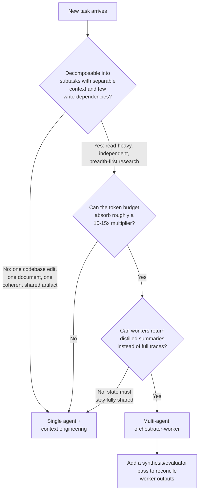

# Decision - Single-Agent vs Multi-Agent

> The decision is whether a task should run inside one [[Concept - What Is an LLM Agent|agent]] with a big context window or be split across a team of coordinating agents ([[Concept - Multi-Agent Orchestration]]) — and the default for the 80% case is **single agent, plus aggressive context engineering, until you have concrete evidence of independent, read-heavy parallelism that a bigger context window can't absorb.**

## Decision flow

## Tradeoff matrix

| Dimension | Single-agent | Multi-agent (orchestrator-worker) |
|---|---|---|
| Token cost | 1x baseline | ~15x a single chat interaction (Anthropic-measured, 2025) |
| Context ceiling | Bound by one window; degrades via context rot on long runs | Each worker gets an isolated window, sidestepping the single-window ceiling |
| Execution | Serial | Parallel across workers |
| Coordination failure surface | None — no peer to desync from | Duplicated work, write-conflicts, diffusion of responsibility |
| Evaluability | One trajectory, easier to reproduce and score | Non-deterministic multi-trajectory; harder to reproduce and attribute failure |
| Best-fit task shape | Write-heavy, single coherent artifact | Read-heavy, decomposable, independent subtasks |
| Measured outcome (2025) | — | ~90% win over single-agent on Anthropic's internal research eval; ~80% of the performance variance explained by token volume alone |

## The details that flip the decision

**The pivotal evidence pair.** [[Breakdown - Anthropic's Multi-Agent Research System]] reports the multi-agent architecture — a [[Pattern - Orchestrator-Worker Agents|lead agent spawning worker subagents]] — beating a single agent by roughly 90% on an internal research eval, but that win is concentrated in exactly one task shape: many independent sub-questions, each answerable in isolation, then synthesized. Cognition's "Don't Build Multi-Agents" (2025) argues the opposite for coherent build/write tasks: shared context and fragile coordination make multi-agent systems *worse* than a single well-engineered agent. Both are correct; they're measuring different task shapes, not contradicting each other.

**The write-conflict problem is the real dividing line**, not task size. Two agents independently editing the same file, plan, or memory store produce a state no synthesizer can cleanly merge after the fact — the conflict happens at write time, and by the time a synthesis step runs, the damage is already committed. A task that looks "big enough to parallelize" but requires a single coherent output (one PR, one document, one plan) still belongs to a single agent.

**Cost is a gate, not a footnote.** [[Concept - Cost Engineering for LLM Applications|Multi-agent spend]] compounds turn count by worker count; a 15x token bill has to buy a matching capability gain or it is just a more expensive way to fail the same task. Before reaching for orchestration, exhaust [[Concept - Context Engineering for Agents|context engineering]] — compaction, scratchpad offload, just-in-time retrieval — inside a single agent; it's cheaper and the failure modes are far easier to debug.

**Evaluation gets harder, not easier, as you add agents.** Non-determinism compounds across every independently-sampling agent in the system, and when a multi-step run fails it's often ambiguous which agent's decision caused it. This is the same run-to-run [[Concept - Statistical Rigor in Model Evaluation|variance problem]] evaluation methodology already has to control for, multiplied by agent count — teams that ship multi-agent systems successfully trace and audit per-agent contribution, not just end-task success.

**Framework choice follows this decision, not the other way around.** [[Decision - Choosing an Agent Framework]] assumes you already know whether you're building one agent or a coordinated set; picking a heavy multi-agent framework before proving a single agent can't do the job is the most common version of this decision being made backwards.

## Connections

- [[Concept - Multi-Agent Orchestration]] — the topology and communication-mechanism survey this decision chooses whether to enter.
- [[Pattern - Orchestrator-Worker Agents]] — the concrete blueprint to implement once this decision resolves toward multi-agent.
- [[Breakdown - Anthropic's Multi-Agent Research System]] — the real system and eval behind the ~90%-improvement, ~15x-token figures cited above.
- [[Concept - Context Engineering for Agents]] — the cheaper lever to exhaust inside a single agent before reaching for orchestration.
- [[Concept - Cost Engineering for LLM Applications]] — the budget math that turns "multi-agent is more capable" into "multi-agent has to justify its bill."
- [[Decision - Choosing an Agent Framework]] — the downstream tooling decision that depends on this one already being resolved.
- [[Concept - Statistical Rigor in Model Evaluation]] — why multi-agent trajectories are harder to reproduce and score than single-agent ones.

## Sources

- Anthropic (2025) — "How we built our multi-agent research system." Source of the ~90% eval improvement and the ~15x token / ~80% variance-explained figures.
- Cognition (2025) — "Don't Build Multi-Agents." The counter-case: shared-context fragility and coordination failure for coherent build/write tasks.
